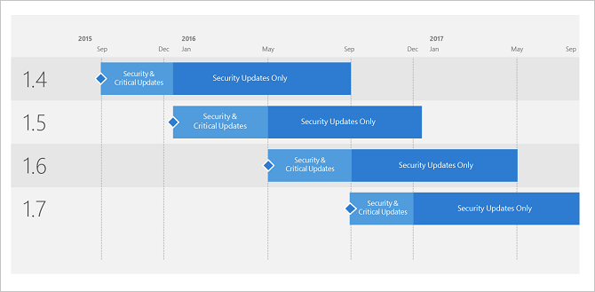

---
# required metadata

title: Advanced Threat Analytics versions | Microsoft Docs
description: Explains the different support options for Microsoft Advanced Threat Analytics (ATA) versions.
author: rkarlin
ms.author: rkarlin
manager: mbaldwin
ms.date: 6/13/2017
ms.topic: article
ms.prod:
ms.service: advanced-threat-analytics
ms.technology:
ms.assetid: a8afbd91-c888-4dfc-94ab-72e38745163e

# optional metadata

#ROBOTS:
#audience:
#ms.devlang:
ms.reviewer: bennyl
ms.suite: ems
#ms.tgt_pltfrm:
#ms.custom:

---
*Applies to: Advanced Threat Analytics version 1.8*

# Support for Microsoft Advanced Threat Analytics (ATA) versions

Microsoft plans to release ATA updates a few times a year with each update version supported for 12 months from its general availability (GA) release date. Technical support will be provided for the entire 12 months. However, our support structure is now dynamic, evolving into two distinct servicing phases that depend on the availability of the latest version.

-	Security and Critical Updates servicing phase - When running the latest version of ATA, you will receive both Security and Critical updates.

-	Security Updates (Only) servicing phase - After a new ATA version is released, support for older versions will be reduced to Security updates only, for the remainder of the 12-month support lifecycle (shown in the following example of versions servicing support).
 

> [!Note]
> The latest ATA version is always in the Security and Critical Updates servicing phase. This means that if you encounter a code defect that warrants a critical update, you must have the latest current branch version installed to receive a fix. All other supported versions will only be eligible to receive security updates. All support ends after the 12-month lifecycle for a version has expired. At that time, customers must update to a supported version.

## Version History

|VERSION|BUILD NUMBER|AVAILABILITY DATE| SUPPORT END DATE|
|----|----|----|----|
|1.4|1.4.2457|31-AUG-2015|30-AUG-2016|
|1.5|1.5.2946|17-DEC-2015|16-DEC-2016|
|1.6|1.6.4103|05-MAY-2016|04-MAY-2017|
|1.6.1|1.6.4317|15-JUN-2016|14-JUN-2017|
|1.7|1.7.5402|31-AUG-2016|30-AUG-2017|
|1.7.1|1.7.5647|06-OCT-2016|05-OCT-2017|
|1.7.2|1.7.5757|15-NOV-2016|14-NOV-2017|

## See Also
[Check out the ATA forum!](https://social.technet.microsoft.com/Forums/security/home?forum=mata)
