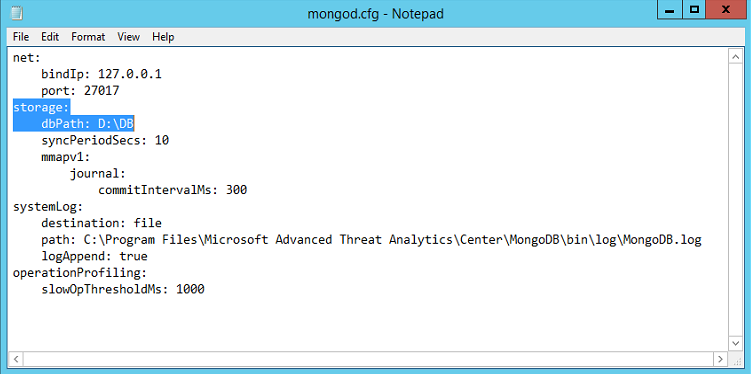

---
# required metadata

title: ATA Database Management | Microsoft Advanced Threat Analytics
description: Procedures to help you move, backup, or restore the ATA database.
keywords:
author: rkarlin
manager: stevenpo
ms.date: 04/28/2016
ms.topic: article
ms.prod: identity-ata
ms.service: advanced-threat-analytics
ms.technology: security
ms.assetid: 1d27dba8-fb30-4cce-a68a-f0b1df02b977

# optional metadata

#ROBOTS:
#audience:
#ms.devlang:
ms.reviewer: bennyl
ms.suite: ems
#ms.tgt_pltfrm:
#ms.custom:

---

# ATA Database Management
If you need to move, backup or restore the ATA database, use these procedures for working with MongoDB.

## Backing up the ATA database
Refer to the [relevant MongoDB documentation](http://docs.mongodb.org/manual/administration/backup/).

## Restoring the ATA database
Refer to the [relevant MongoDB documentation](http://docs.mongodb.org/manual/administration/backup/).

## Moving the ATA database to another drive

1.  Stop the **Microsoft Advanced Threat Analytics Center** service.

2.  Stop the **MongoDB** service.

3.  Open the Mongo configuration file located by default at: C:\Program Files\Microsoft Advanced Threat Analytics\Center\MongoDB\bin\mongod.cfg.

    Find the parameter `storage: dbPath`

4.  Move the folder listed in the `dbPath` parameter to the new location.

5.  Change the `dbPath` parameter inside the mongo configuration file to the new folder path and save and close the file.

    

6.  Start the **MongoDB** service.

7.  Open a command prompt and run the Mongo shell by running `mongo.exe ATA` .

    By default, the mongo.exe is found in: C:\Program Files\Microsoft Advanced Threat Analytics\Center\MongoDB\bin

8.  Run the following command: `db.SystemProfiles.update( {_t: "CenterSystemProfile"} , {$set:{"Configuration.CenterDatabaseClientConfiguration.DataPath" : "<New DB Location>"}}) Instead of <New DB Location>` where &lt;New DB Location&gt; is the new folder path.

9.  Update HKEY_LOCAL_MACHINE\SOFTWARE\Microsoft\Microsoft Advanced Threat Analytics\Center\DatabaseDataPath to the new folder path.

9. Start the **Microsoft Advanced Threat Analytics Center** service.

## See Also
- [ATA architecture](/advanced-threat-analytics/understand/ata-architecture)
- [ATA prerequisites](/advanced-threat-analytics/plandesign/ata-prerequisites)
- [Check out the ATA forum!](https://social.technet.microsoft.com/Forums/security/en-US/home?forum=mata)
