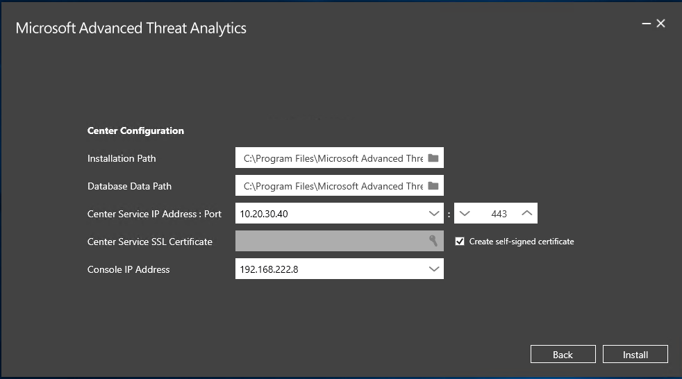

---
# required metadata

title: Install ATA - Step 1 | Microsoft Advanced Threat Analytics
description: First step to install ATA involves downloading and installing the ATA Center onto your chosen server.
keywords:
author: rkarlin
manager: stevenpo
ms.date: 04/28/2016
ms.topic: get-started-article
ms.prod: identity-ata
ms.service: advanced-threat-analytics
ms.technology: security
ms.assetid: b3cceb18-0f3c-42ac-8630-bdc6b310f1d6

# optional metadata

#ROBOTS:
#audience:
#ms.devlang:
ms.reviewer: bennyl
ms.suite: ems
#ms.tgt_pltfrm:
#ms.custom:

---

# Install ATA - Step 1

>[!div class="step-by-step"]
[« Pre-install](install-ata-preinstall.md)
[Step 2 »](install-ata-step2.md)

## Step 1. Download and Install the ATA Center
After you have verified that the server meets the requirements, you can proceed with the installation of the ATA Center.

Perform the following steps on the ATA Center server.

1.  Download ATA from the [TechNet Evaluation Center](http://www.microsoft.com/en-us/evalcenter/).

2.  Log in with a user who is a member of the local administrators group.

3.  From an elevated command prompt, run Microsoft ATA Center Setup.EXE and follow the setup wizard.

4.  On the **Welcome** page, select your language and click **Next**.

5.  Read the End User License Agreement and if you accept the terms, click **Next**.

6.  On the **Center Configuration** page, enter the following information based on your environment:

    |Field|Description|Comments|
    |---------|---------------|------------|
    |Installation Path|This is the location where the ATA Center will be installed. By default this is  %programfiles%\Microsoft Advanced Threat Analytics\Center|Leave the default value|
    |Database Data Path|This is the location where the MongoDB database files will be located. By default this is %programfiles%\Microsoft Advanced Threat Analytics\Center\MongoDB\bin\data|Change the location to a place where you have room to grow based on your sizing. **Note:** <ul><li>In production environments you should use a drive that has enough space based on capacity planning.</li><li>For large deployments the database should be on a separate physical disk.</li></ul>See [ATA capacity planning](/advanced-threat-analytics/plan-design/ata-capacity-planning) for sizing information.|
    |Database Journal Path|This is the location where the database journal files will be located. By default this is %programfiles%\Microsoft Advanced Threat Analytics\Center\MongoDB\bin\data\journal|For large deployments, the Database Journal should be on a separate physical disk from the database and the system drive. Change the location to a place where you have room for your Database Journal.|
    |ATA Center Service IP address: Port|This is the IP address that the ATA Center service will listen on for communication from the ATA Gateways.  **Default port:** 443|Click the down arrow to select the IP address to be used by the ATA Center service.  The IP address and port of the ATA Center service cannot be the same as the IP address and port of the ATA Console. Make sure to change the port of the ATA Console.|
    |ATA Center Service SSL Certificate|This is the certificate that will be used by the ATA Center service.|Click the key icon to select a certificate installed or check self-signed certificate when deploying in a lab environment.|
    |ATA Console IP address|This is the IP address that will be used by IIS for the ATA Console.|Click the down arrow to select the IP address used by the ATA Console. **Note:** Make a note of this IP address to make it easier to access the ATA Console from the ATA Gateway.|
    |ATA Console SSL certificate|This is the certificate to be used by IIS.|Click the key icon to select a certificate installed or check self-signed certificate when deploying in a lab environment.|
    

7.  Click **Install** to install ATA and its components and create the connection between the ATA Center and the ATA Console.

8.  When the installation completes, click **Launch**  to connect to the ATA Console.

    The following components are installed and configured during the installation of ATA Center:

    -   Internet Information Services (IIS)

    -   MongoDB

    -   ATA Center service and ATA Console IIS site

    -   Custom Performance Monitor data collection set

    -   Self-signed certificates (if selected during the installation)

> [!NOTE]
> To help in troubleshooting and product enhancement, it is recommended that you install MongoVue and any other MongoDB add-in, or any other third-party tool of your choice. MongoVue requires .Net Framework 3.5 to be installed.

### Validate installation

1.  Check to see that the Microsoft Advanced Threat Analytics Center service is running.

2.  On the desktop click the Microsoft Advanced Threat Analytics shortcut to connect to the ATA Console. Log in with the same user credentials that you used to install the ATA Center. The first time you log into the ATA Console you will be brought automatically to the **Domain connectivity settings** page to continue the configuration and the deployment of the ATA Gateways.

3.  Review the error file in the **Microsoft.Tri.Center-Errors.log** file which can be found in the following default location: %programfiles%\Microsoft Advanced Threat Analytics\Center\Logs.

>[!div class="step-by-step"]
[« Pre-install](install-ata-preinstall.md)
[Step 2 »](install-ata-step2.md)

## See Also

- [For support, check out our forum!](https://social.technet.microsoft.com/Forums/security/en-US/home?forum=mata)
- [Configure event collection](/advanced-threat-analytics/plan-design/configure-event-collection)
- [ATA prerequisites](/advanced-threat-analytics/plan-design/ata-prerequisites)
