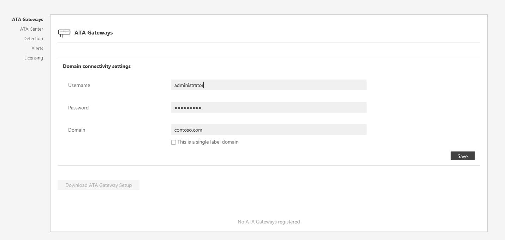

---
# required metadata

title: Install ATA - Step 2 | Microsoft Advanced Threat Analytics
description: Step two of installing ATA helps you configure the domain connectivity settings on your ATA Center server
keywords:
author: rkarlin
manager: stevenpo
ms.date: 04/28/2016
ms.topic: get-started-article
ms.prod: identity-ata
ms.service: advanced-threat-analytics
ms.technology: security
ms.assetid: e1c5ff41-d989-46cb-aa38-5a3938f03c0f

# optional metadata

#ROBOTS:
#audience:
#ms.devlang:
ms.reviewer: bennyl
ms.suite: ems
#ms.tgt_pltfrm:
#ms.custom:

---

# Install ATA - Step 2

>[!div class="step-by-step"]
[« Step 1](install-ata-step1.md)
[Step 3 »](install-ata-step3.md)

## Step 2. Configure ATA Gateway domain connectivity settings
The settings in the domain connectivity settings section apply to all ATA Gateways managed by the ATA Center.

To configure the Domain connectivity settings perform the following on the ATA Center server.

1.  Open the ATA Console and log in. For instructions see [Working with the ATA Console](../understand/working-with-ata-console.md).

2.  The first time you log into the ATA Console after the ATA Center has been installed, you will automatically be taken to the ATA Gateways configuration page. If you need to modify any of the settings afterwards, click the Settings icon and select **Configuration**.

    

3.  On the **Gateways** page, click on **Domain connectivity settings**, enter the following information and click **Save**.

    |Field|Comments|
    |---------|------------|
    |**Username** (required)|Enter the read-only user name, for example: **user1**.|
    |**Password** (required)|Enter the password for the read-only user, for example: **Pencil1**. **Note:** Make sure this password is correct. If you save the wrong password, the ATA Service will stop running on the ATA Gateway servers.|
    |**Domain** (required)|Enter the domain for the read-only user, for example, **contoso.com**. **Note:** It is important that you enter the complete FQDN of the domain where the user is located. For example, if the user’s account is in domain corp.contoso.com, you need to enter `corp.contoso.com` not contoso.com|
    

>[!div class="step-by-step"]
[« Step 1](install-ata-step1.md)
[Step 3 »](install-ata-step3.md)

## See Also

- [For support, check out our forum!](https://social.technet.microsoft.com/Forums/security/en-US/home?forum=mata)
- [Configure event collection](../plandesign/configure-event-collection.md)
- [ATA prerequisites](../plandesign/ata-prerequisites.md)
