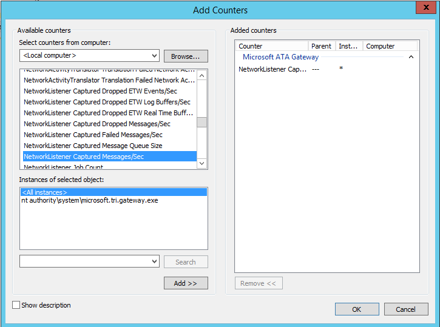

---
# required metadata

title: Install ATA - Step 5 | Microsoft Advanced Threat Analytics
description: Step five of installing ATA helps you configure settings for your ATA Gateway.
keywords:
author: rkarlin
manager: stevenpo
ms.date: 04/28/2016
ms.topic: get-started-article
ms.prod: identity-ata
ms.service: advanced-threat-analytics
ms.technology: security
ms.assetid: 2a5b6652-2aef-464c-ac17-c7e5f12f920f

# optional metadata

#ROBOTS:
#audience:
#ms.devlang:
ms.reviewer: bennyl
ms.suite: ems
#ms.tgt_pltfrm:
#ms.custom:

---

# Install ATA - Step 5

>[!div class="step-by-step"]
[« Step 4](install-ata-step4.md)
[Step 6 »](install-ata-step6.md)

## Step 5. Configure the ATA Gateway settings
After the ATA Gateway was installed, perform the following steps to configure the settings for the ATA Gateway.

1.  On the ATA Gateway machine, in the ATA Console, click on the **Configuration** and select the **ATA Gateways** page.

2.  Enter the following information.

    |Field|Description|Comments|
    |---------|---------------|------------|
    |Description|Enter a description of the ATA Gateway (optional).||
    |**Domain controllers** (required)  See below for additional information about the list of controllers.|Enter the complete FQDN of your domain controller and click the plus sign to add it to the list. For example,  **dc01.contoso.com**  |The objects in the first domain controller in the list will sync via LDAP queries. Depending on the size of the domain, this might take some time. **Note:** <ul><li>Make sure that the first domain controller is **not** read-only.    Read only domain controllers should be added only after the initial sync completes.</li></ul>|
    |**Capture Network adapters** (required)|Select the network adapters that are connected to the switch that are configured as the destination mirror port to receive the domain controller traffic.|Select the Capture network adapter.|
    

3.  Click **Save**.

    > [!NOTE]
    > It will take a few minutes for the ATA Gateway service to start the first time because it builds the cache of the network capture parsers used by the ATA Gateway.

The following information applies to the servers you enter in the **Domain Controllers** list.

-   The first domain controller in the list will be used by the ATA Gateway to sync the objects in the domain via LDAP queries. Depending on the size of the domain, this might take some time.

-   All domain controllers whose traffic is being monitored via port mirroring by the ATA Gateway must be listed in the **Domain Controllers** list. If a domain controller is not listed in the **Domain Controllers** list, detection of suspicious activities might not function as expected.

-   Make sure that the first domain controller is **not** a read-only domain controller (RODC).

    Read only domain controllers should be added only after the initial sync completes.

-   At least one domain controller in the list be a global catalog server. This will enable ATA to resolve computer and user objects in other domains in the forest.

The configuration changes will be applied to the ATA Gateway on the next scheduled sync between the ATA Gateway and the ATA Center.

### Validate installation:
To validate that the ATA Gateway has been successfully deployed, check the following:

1.  Check that the Microsoft Advanced Threat Analytics Gateway service is running. After you have saved the ATA Gateway settings, it might take a few minutes for the service to start.

2.  If the service does not start, review the “Microsoft.Tri.Gateway-Errors.log” file located in the following default folder, “%programfiles%\Microsoft Advanced Threat Analytics\Gateway\Logs”, search for entries with “transfer” or “service start”.

3.  Check the following Microsoft ATA Gateway performance counters:

    -   **NetworkListener Captured Messages / sec**: This counter tracks how many messages are being captured by the ATA per second. The value should be mid hundreds to thousands depending on the number of domain controllers being monitored and how busy each domain controller is. Single or double digit values can indicate an issue with the port mirroring configuration.

    -   **EntityTransfer Activity Transfers/Sec**: This value should be in the range of a few hundred every few seconds.

4.  If this is the first ATA Gateway installed, after a few minutes, log into the ATA Console and open the notification pane by swiping the right side of the screen open. You should see a list of **Entities Recently Learned** in the notification bar on the right side of the console.

5.  To validate that the installation completed successfully:

    In the console, search for something in the search bar, such as a user or a group on your domain.

    Open Performance Monitor. In the Performance tree, click on **Performance Monitor** and then click the plus icon to **Add a Counter**. Expand **Microsoft ATA Gateway** and scroll down to **Network Listener Captured Messages per Second** and add it. Then, make sure you see activity on the graph.

    

>[!div class="step-by-step"]
[« Step 4](install-ata-step4.md)
[Step 6 »](install-ata-step6.md)

## See Also

- [For support, check out our forum!](https://social.technet.microsoft.com/Forums/security/en-US/home?forum=mata)
- [Configure event collection](/advanced-threat-analytics/plandesign/configure-event-collection)
- [ATA prerequisites](/advanced-threat-analytics/plandesign/ata-prerequisites)
