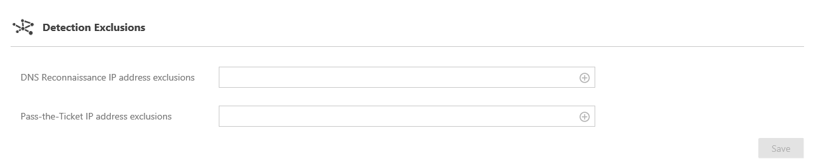

---
# required metadata

title: Install ATA | Microsoft Advanced Threat Analytics
description: In the final step of installing ATA, you configure the short-term lease subnets and the Honeytoken user.
keywords:
author: rkarlin
manager: stevenpo
ms.date: 04/28/2016
ms.topic: get-started-article
ms.prod: identity-ata
ms.service: advanced-threat-analytics
ms.technology: security
ms.assetid: 8980e724-06a6-40b0-8477-27d4cc29fd2b

# optional metadata

#ROBOTS:
#audience:
#ms.devlang:
ms.reviewer: bennyl
ms.suite: ems
#ms.tgt_pltfrm:
#ms.custom:

---

# Install ATA - Step 6

>[!div class="step-by-step"]
[« Step 5](install-ata-step5.md)

## Step 6. Configure  IP address exclusions and Honeytoken user
ATA enables the exclusion of specific IP addresses and/or IP subnets from two types of detections: DNS Reconnaissance and Pass-the-Ticket. 

The thought behind the DNS Reconnaissance exclusion by IP is that some organizations are using security scanners that use DNS as a scanning mechanism. The exclusion helps ATA to ignore those scannners, which are usually using static IP addresses.

The rational for the Pass-the-Ticket exclusion by IP is that some subnets are short-term lease, in which the IP address assignment changes very rapidly - within seconds or minutes. For example, IP addresses used for your VPNs and Wi-Fi IP addresses. 

ATA also enables the configuration of a Honeytoken user, which is used as a trap for malicious actors - any network activity associated with this (normally dormant) account will trigger an alert.

To configure the above, follow these steps:

1.  From the ATA Console on the ATA Gateway machine, click on the settings icon and select **Configuration**.

    

2.  Under **Exclusions** (in the *Detection* category), enter the following for either the DNS Reconnaissance or the Pass-the-Ticket IP addresses. Use slash notation format, for example:  `192.168.0.0/24` and click the *plus* sign.

    

3.  For the Honeytoken account SIDs, under **Settings** (in the *Detection* category), enter the SID and click the plus sign. For example: `S-1-5-21-72081277-1610778489-2625714895-10511`.

    

    > [!NOTE]
    > To find the SID for a user, search for the user in the ATA Console, and then click on the **Account Info** tab. 

4.  Click **Save**.

Congratulations, you have successfully deployed Microsoft Advanced Threat Analytics!

Check the attack time line to view detected suspicious activities and search for users or computers and view their profiles.

ATA will start scanning for suspicious activities immediately. Some activities, such as some of the suspicious behavior activities, will not be available until ATA has had time to build behavioral profiles (minimum of three weeks).

>[!div class="step-by-step"]
[« Step 5](install-ata-step5.md)

## See Also

- [Check out the ATA forum!](https://social.technet.microsoft.com/Forums/security/home?forum=mata)
- [Configure event collection](configure-event-collection.md)
- [ATA prerequisites](/advanced-threat-analytics/plan-design/ata-prerequisites)

