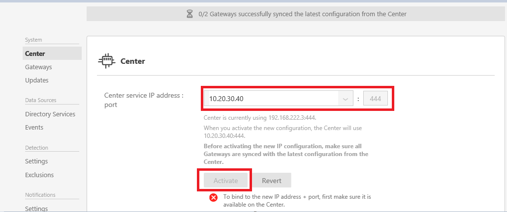

# Change ATA configuration - ATA Center IP address

>[!div class="step-by-step"]
[ATA Center certificate »](modifying-ata-config-centercert.md)

After the initial deployment, modifications to the ATA Center should be made carefully. Use the following procedures when updating the IP address and port or the certificate.

## Change the IP address used by the ATA Center server
If you need to change the ATA Center IP address and port or certificate, take the following into consideration.

The ATA Gateways locally store the IP address of the ATA Center to which they need to connect. On a regular basis, they connect to the ATA Center and pull down configuration changes. Making a change to how the ATA Gateways connect to the ATA Center is done is two stages.

-   First stage – Update the IP address and port that the ATA Center service you want the ATA Center service to use. At this point the ATA Center is still listening on the original IP address and the next time the ATA Gateway syncs its configuration it will have two IP addresses for the ATA Center. As long as the ATA Gateway can connect using the original (first) IP address it will not try the new IP address and port.

-   Second stage – After all the ATA Gateways have synced with the updated configuration, activate the new IP address and port that the ATA Center listens on. When you activate the new IP address the ATA Center service will bind to the new IP address. ATA Gateways will not be able to connect to the original address and now will attempt to connect with the second (new) IP address they have for the ATA Center. After connecting to the ATA Center with the new IP address the ATA Gateway will pull down the latest configuration and will have a single IP address for the ATA Center. (Unless you started the process again.)

> [!NOTE]
> -   If an ATA Gateway was offline during the first stage and never got the updated configuration, you will need to manually update the configuration JSON file on the ATA Gateway.
> -   If the new IP address is installed on the ATA Center server, you can select it from the list of IP addresses when making the change. However, if for some reason you cannot install the IP address on the ATA Center server you can select custom IP address and add it manually. You will not be able to activate the new IP address until the IP address is installed on the server.
> -   If you need to deploy a new ATA Gateway after activating the new IP address, you need to download the ATA Gateway Setup package again.

1.  Open the ATA Console.

2.  Select the settings option on the toolbar and select **Configuration**.

    

3.  Select **ATA Center**.

4.  Under **ATA Center Service IP address: port**, select one of the existing IP addresses or select **Add custom IP address** and enter an IP address.

5.  Click **Save**.

6.  You will see a notification of how many ATA Gateways have synced to the latest configuration.

    

7.  After all the ATA Gateways have synced, click **Activate** to activate the new IP address.

    > [!NOTE]
    > If you entered a custom IP address, you will not be to click **Activate** until you installed the IP address on the ATA Center.

8.  Ensure that all the ATA Gateways are able to sync their configurations after the change was activated. The notification bar will indicate how many ATA Gateways successfully synced their configuration.

>[!div class="step-by-step"]
[Change the ATA Center certificate »](modifying-ata-config-centercert.md)

## See Also
- [Working with the ATA Console](/advanced-threat-analytics/understand/working-with-ata-console)
- [Install ATA](install-ata.md)
- [For support, check out our forum!](https://social.technet.microsoft.com/Forums/security/en-US/home?forum=mata)
