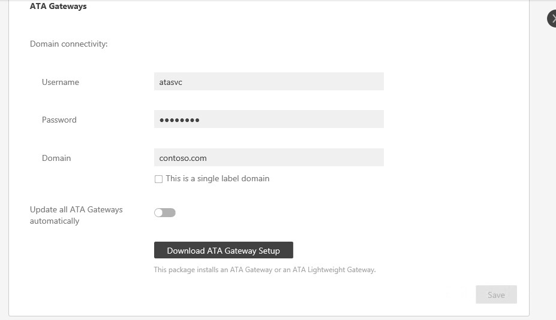

---
# required metadata

title: Change ATA configuration - domain connectivity password | Microsoft Advanced Threat Analytics
description: Describes how to change the Domain Connectivity Password on the ATA Gateway.
keywords:
author: rkarlin
manager: stevenpo
ms.date: 04/28/2016
ms.topic: article
ms.prod: identity-ata
ms.service: advanced-threat-analytics
ms.technology: security
ms.assetid: 4a25561b-a5ed-44aa-9b72-366976b3c72a

# optional metadata

#ROBOTS:
#audience:
#ms.devlang:
ms.reviewer: bennyl
ms.suite: ems
#ms.tgt_pltfrm:
#ms.custom:

---

# Change ATA configuration - domain connectivity password

>[!div class="step-by-step"]
[« IIS certificate](modifying-ata-config-iiscert.md)
[Name of the capture network adapter »](modifying-ata-config-nicname.md)

## Change the domain connectivity password
If you modify the Domain Connectivity Password, make sure that the password you enter is correct. If it is not, the ATA Service will stop running on the ATA Gateways.

If you suspect that this happened, on the ATA Gateway, look at the Microsoft.Tri.Gateway-Errors.log file for the following:
`The supplied credential is invalid.`

To correct this, follow this procedure to update the Domain Connectivity password on the ATA Gateway:

1.  Open the ATA Console on the ATA Gateway.

2.  Select the settings option on the toolbar and select **Configuration**.

    

3.  Select **ATA Gateway**.

    

4.  Under **Domain Connectivity Settings**, change the password.

5.  Click **Save**.

6.  After changing the password, manually check that the ATA Gateway service is running on the ATA Gateway servers.

>[!div class="step-by-step"]
[« IIS certificate](modifying-ata-config-iiscert.md)
[Name of the capture network adapter »](modifying-ata-config-nicname.md)

## See Also
- [Working with the ATA Console](../understand/working-with-ata-console.md)
- [Install ATA](install-ata.md)
- [For support, check out our forum!](https://social.technet.microsoft.com/Forums/security/en-US/home?forum=mata)
