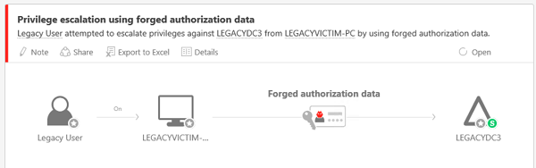
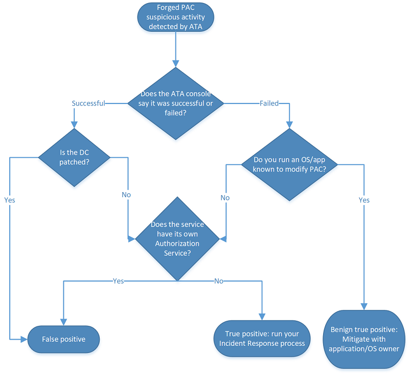
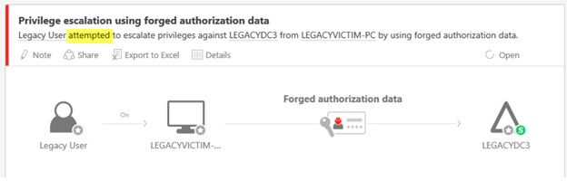

---
# required metadata

title: Detecting Forged PAC attacks | Microsoft Docs
description: This article describes the forged PAC attack and provides mitigation instructions when this threat is detected on your network.
keywords:
author: rkarlin
ms.author: rkarlin
manager: mbaldwin
ms.date: 5/9/2017
ms.topic: article
ms.prod:
ms.service: advanced-threat-analytics
ms.technology:
ms.assetid: f3db435e-9553-40a2-a2ad-278fad4f0ef5

# optional metadata

#ROBOTS:
#audience:
#ms.devlang:
ms.reviewer: bennyl
ms.suite: ems
#ms.tgt_pltfrm:
#ms.custom:

---

*Applies to: Advanced Threat Analytics version 1.7*

# Detecting Forged PAC attacks

Microsoft constantly improves its security detection capabilities and the ability to provide near-real-time, actionable intelligence to security analysts. Microsoft’s Advanced Threat Analytics (ATA) helps to lead this change. 
If ATA detects a Forged PAC suspicious activity on your network and alerts you about it, this article will help you understand and investigate it.

## What is Privileged Access Certificate (PAC)?

The Privilege Attribute Certificate (PAC) is the Data Structure in the Kerberos Ticket which holds authorization information, including group memberships, security identifiers and user profile information. In an Active Directory domain, this enables authorization data provided by the Domain Controller (DC) to be passed to other member servers and workstations for authentication and authorization purposes. In addition to membership information, the PAC includes additional credential information, profile and policy information, and supporting security metadata. 

The PAC Data Structure is used by authentication protocols (protocols that verify identities) to transport authorization information, which controls access to resources.

### PAC validation

PAC validation is a security feature to prevent an attacker from gaining unauthorized access to a system or its resources with a man-in-the-middle attack, especially in applications where user impersonation is used. Impersonation involves a trusted identity, such as a service account that is granted elevated privileges to access resources and execute tasks. PAC validation reinforces a more secure authorization environment in Kerberos authentication settings where impersonation occurs. PAC validation ensures that a user presents exact authorization data as it was granted in the [Kerberos ticket](https://blogs.msdn.microsoft.com/openspecification/2009/04/24/understanding-microsoft-kerberos-pac-validation/) and that the ticket's privileges have not been modified.
When the PAC validation occurs, the server encodes a request message containing the PAC signature type and length and transmits it to the DC. The DC decodes the request and extracts the server checksum and the KDC checksum values. If the checksum verification succeeds, the DC returns a success code to the server. An unsuccessful return code indicates that the PAC has been altered. 

When the PAC validation occurs, the server encodes a request message containing the PAC signature type and length and transmits it to the DC. The DC decodes the request and extracts the server checksum and the KDC checksum values. If the checksum verification succeeds, the DC returns a success code to the server. An unsuccessful return code indicates that the PAC has been altered. 

The Kerberos PAC content is [signed twice](http://searchwindowsserver.techtarget.com/feature/Advanced-Kerberos-topics-From-authentication-to-authorization#goTOC): 
- Once with the master key of the KDC to prevent malicious server-side services from changing authorization data
- Once with the master key of the destination resource server account to prevent a user from modifying the PAC content and adding their own authorization data

### PAC vulnerability
Security bulletins [MS14-068](https://technet.microsoft.com/library/security/MS14-068.aspx) and [MS11-013(https://technet.microsoft.com/library/security/ms11-013.aspx)] address vulnerabilities in the Kerberos KDC that might allow an attacker to manipulate the PAC field in a valid Kerberos Ticket, granting themselves additional privileges.

## Forged PAC attack

A Forged PAC is an attempt by an attacker to take advantage of these vulnerabilities to elevate their privileges in your Active Directory Forest or Domain. To perform this attack, the attacker must:
-	Have credentials to a domain user.
-	Have network connectivity to a Domain Controller that can be used to authenticate against the compromised domain credentials.
-	Have the right tools. Python Kerberos Exploitation Kit (PyKEK) is a known tool which will Forge PACs.

If the attacker has the necessary credentials and connectivity, they can then modify or forge the Privileged Access Certificate (PAC) of an existing Kerberos user logon token (TGT). The attacker changes the group membership claim to include a higher-privileged group (for example, “Domain Administrators” or “Enterprise Administrators”) and adds themselves to groups that they are not members of, such as Domain Admins. The attacker then includes the modified PAC in the Kerberos Ticket. This Kerberos Ticket is then used to request a Service ticket from an unpatched Domain Controller (DC), giving the attacker elevated permissions in the domain and authorization to perform actions they are not meant to perform. 
An attacker can present the modified user logon token (TGT) to gain access to any resource in the domain by requesting resource access tokens (TGS). This means that an attacker can bypass all configured resource ACLs which limit access on the network by spoofing authorization data (PAC) for any user in Active Directory.

## Discovering the attack
When the attacker attempts to elevate their privileges, ATA will detect it and mark it as a high severity alert.

ATA will indicate in the suspicious activity alert whether the Forged PAC was successful or if it failed. Both successful and failed alerts should be investigated, since failed attempts can still indicate an attacker’s presence in your environment.

## Investigating
After you receive the Forged PAC alert in ATA, you need to determine what needs to be done to mitigate the attack. To do this, you must first classify the alert as one of the following: 
-	True positive: A malicious action detected by ATA
-	False positive: A false alert – the Forged PAC didn’t really happen (this is likely an event that ATA mistook for a forged PAC attack)
-	Benign true positive: An action detected by ATA that is real but not malicious, such as a test by your administrator

The following chart helps determine which steps you should take:

1. First check the alert in the ATA attack timeline to see if the forged authorization attempt was successful, failed, or attempted (attempted attacks are also failed attacks). Both successful and failed attempts can result in a True Positive, but with different severities within the environment.
 
 

2.	If the detected Forged PAC attack was successful:
    -	If the DC on which the alert was raised is properly patched, it is a false positive. In this case, you should dismiss the alert and send an email notifying the ATA team at ATAeval@microsoft.com so we can continuously improve our detections. 
    -	If the DC in the alert is not properly patched:
        -	If the service listed in the alert does not have its own authorization mechanism, this is a true positive and you should run your organization’s Incident Response (IR) on the computer. 
        -	If the service listed in the alert internal authorization mechanism that requests authorization data, it might be falsely identified as a forged PAC. 

3.	If the detected attack failed:
    -	If the operating system or the application is known to modify the PAC, then this is likely a benign true positive and you should work with the application or operating system owner to fix this behavior.

    -	If the operating system or the application is not known to modify the PAC: 

        -	If the service listed does not have its own authorization service, this is a true positive, and you should run your organization’s Incident Response (IR) on the computer. Even though the attacker was not successful in elevating their privileges in the domain, you can assume there is an attacker in your network and you will want to find them as quickly as possible before they attempt other known Advanced Persistent Techniques to elevate their privileges. 
        -	If the service listed in the alert has its own authorization mechanism that requests authorization data, it might be falsely identified as a forged PAC.

Microsoft recommends using an Incident Response & Recovery team such as your Microsoft Account Team or your security partner, to help detect whether an attacker has deployed methods of persistence in your network. These can be via the use of malicious software as well as through identity breaches, such as stolen credentials and Golden Tickets.

## See Also
- [Working with suspicious activities](working-with-suspicious-activities.md)
- [Modifying ATA configuration](modifying-ata-configuration.md)
- [Check out the ATA forum!](https://social.technet.microsoft.com/Forums/security/home?forum=mata)
