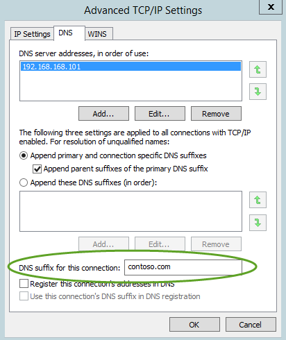

---
# required metadata

title: ATA Prerequisites | Microsoft Advanced Threat Analytics
description: Describes the requirements for a successful deployment of ATA in your environment
keywords:
author: rkarlin
manager: stevenpo
ms.date: 04/28/2016
ms.topic: get-started-article
ms.prod: identity-ata
ms.service: advanced-threat-analytics
ms.technology: security
ms.assetid: a5f90544-1c70-4aff-8bf3-c59dd7abd687

# optional metadata

#ROBOTS:
#audience:
#ms.devlang:
ms.reviewer: bennyl
ms.suite: ems
#ms.tgt_pltfrm:
#ms.custom:

---

# ATA Prerequisites
This article describes the requirements for a successful deployment of ATA in your environment.

ATA is comprised of the ATA Center, the ATA Gateway and/or the ATA Lightweight Gateway. For more information about the ATA components, see [ATA architecture](/advanced-threat-analytics/Understand/ata-architecture).

[Before you start](#before-you-start): This section lists information you should gather and accounts and network entities you should have before starting ATA installation.

[ATA Center](#ata-center-requirements): This section lists ATA Center hardware, software requirements as well as settings  you need to configure on your ATA Center server.

[ATA Gateway](#ata-gateway-requirements): This section lists ATA Gateway hardware, software requirements as well as settings  you need to configure on your ATA Gateway servers.

[ATA Lightweight Gateway](#ata-lightweight-gateway-requirements): This section lists ATA Lightweight Gateway hardware, and software requirements.

[ATA Console](#ata-console): This section lists browser requirements for running the ATA Console.

## Before you start
This section lists information you should gather and accounts and network entities you should have before starting ATA installation.

-   **Domain controllers** running Windows Server 2008 R2, Windows Server 2012, Windows Server 2012 R2.
Read only domain controllers (RODC) are supported.
Server core is not supported.

-   **User account and password** with read access to **all objects** in the domains that will be monitored.

    > [!NOTE]
    > If you have set custom ACLs on various Organizational Units (OU) in your domain, make sure that the selected user has read permissions to those OUs.

-   Have a list of all subnets used on your network for VPN and Wi-Fi, which reassign IP addresses between devices within a very short period of time (seconds or minutes).  You will want to identify these short-term lease subnets so that ATA can reduce their cache lifetime to accommodate the fast re-assignment between devices. See [Install ATA](/advanced-threat-analytics/deploy-use/install-ata) for short-term lease subnet configuration.
-    Optional: User should have read only permissions on the Deleted Objects container. This will allow ATA to detect bulk deletion of objects in the domain. For information about configuring read only permissions on the Deleted Objects container, see the **Changing permissions on a deleted object container** section in the [View or Set Permissions on a Directory Object](https://technet.microsoft.com/library/cc816824%28v=ws.10%29.aspx) topic.

-   Optional: A user account of a user who has no network activities. This account will be configured as the ATA Honeytoken user. To configure the Honeytoken user you will need the SID of the user account, not the username.

-   Optional: In addition to collecting and analyzing network traffic to and from the domain controllers, ATA can use Windows event 4776 to further enhance ATA Pass-the-Hash detection. This can be received from your SIEM or by  setting Windows Event Forwarding from your domain controller. Events collected provide ATA with additional information that is not available via the domain controller network traffic.

## ATA Center requirements
This section lists the requirements for the ATA Center.
### General
The ATA Center supports installation on a server running Windows Server 2012 R2. 
The ATA Center can be installed on a server that is a member of a domain or workgroup.

Installation of the ATA Center as a virtual machine is supported. 

If you run the ATA Center as a virtual machine, shut down the server before creating a new checkpoint to avoid potential database corruption.
### Server specifications
The ATA database requires that you disable Non-uniform memory access (NUMA).
This is done in the BIOS setting of the server.
Your system may refer to NUMA as Node Interleaving, in which case you will have to enable Node Interleaving. See your BIOS documentation for more information. 
For optimal performance, set the **Power Option** of the ATA Center to **High Performance**. 
The number of domain controllers you are monitoring and the load on each of the domain controllers dictates the server specifications needed see [ATA capacity planning](ata-capacity-planning.md) for more details.

### Time synchronization
The ATA Center server, the ATA Gateway servers and the domain controllers must have time synchronized to within 5 minutes of each other.

### Network adapters
You should have the following:
-   At least one network adapter

-   Two IP addresses (recommended but not required)

Communication between the ATA Center and the ATA Gateway is encrypted using SSL on port 443. Additionally, the ATA Console runs on IIS and is secured using SSL on port 443. **Two IP addresses** are recommended. The ATA Center service will bind port 443 to the first IP address and IIS will bind port 443 to the second IP address.

> [!NOTE]
> A single IP address with two different ports can be used, but two IP addresses are recommended.

### Ports
The following table lists the minimum ports that have to be opened for the ATA Center to work properly.

In this table, IP address 1 is bound to the ATA Center service and IP address 2 is bound to the IIS service for the ATA Console:

|Protocol|Transport|Port|To/From|Direction|IP Address|
|------------|-------------|--------|-----------|-------------|--------------|
|**SSL** (ATA Communications)|TCP|443, or configurable|ATA Gateway|Inbound|IP address 1|
|**HTTP**|TCP|80|Company Network|Inbound|IP address 2|
|**HTTPS**|TCP|443|Company Network and ATA Gateway|Inbound|IP address 2|
|**SMTP** (optional)|TCP|25|SMTP Server|Outbound|IP address 2|
|**SMTPS** (optional)|TCP|465|SMTP Server|Outbound|IP address 2|
|**Syslog** (optional)|TCP|514|Syslog server|Outbound|IP address 2|

### Certificates
Make sure the ATA Center has access to your CRL distribution point. If the ATA Gateways don't have Internet access, follow [the procedure to manually import a CRL](https://technet.microsoft.com/en-us/library/aa996972%28v=exchg.65%29.aspx), taking care to install the all the CRL distribution points for the whole chain.

To ease the installation of the ATA Center, you can install self-signed certificates during the installation of the ATA Center. Post deployment you can replace the self-signed with a certificate from an internal Certification Authority to be used by the ATA Gateway. 
The certificate's Provider Type must be Cryptographic Service Provider (CSP).

The ATA Center requires certificates for the following services:

-   Internet Information Services (IIS) – Web server certificate

-   ATA Center service – Server authentication certificate

> [!NOTE]
> If you are going to access the ATA Console from other computers, ensure that those computers trust the certificate being used by IIS otherwise you will get a warning page that there is a problem with the website's security certificate before getting to the log in page.

## ATA Gateway requirements
This section lists the requirements for the ATA Gateway.
### General
The ATA Gateway supports installation on a server running Windows Server 2012 R2.
The ATA Gateway can be installed on a server that is a member of a domain or workgroup.

Before installing ATA Gateway confirm that the following update has been installed: [KB2919355](https://support.microsoft.com/en-us/kb/2919355/).

You can check by running the following Windows PowerShell cmdlet: `[Get-HotFix -Id kb2919355]`.

For information on using virtual machines with the ATA Gateway, see [Configure port mirroring](configure-port-mirroring.md).

### Server specifications
For optimal performance, set the **Power Option** of the ATA Gateway to **High Performance**. 
An ATA Gateway can support monitoring multiple domain controllers, depending on the amount of network traffic to and from the domain controllers.
For more information, see [ATA capacity planning](ata-capacity-planning.md).

### Time synchronization
TThe ATA Center server, the ATA Gateway servers and the domain controllers must have time synchronized to within 5 minutes of each other.

### Network adapters
The ATA Gateway requires at least one Management adapter and at least one Capture adapter:

-   **Management adapter** - will be used for communications on your corporate network. This adapter should be configured with the following:

    -   Static IP address including default gateway

    -   Preferred and alternate DNS servers

    -   The **DNS suffix for this connection** should be the DNS name of the domain for each domain being monitored.

        

        > [!NOTE]
        > If the ATA Gateway is a member of the domain, this is configured automatically.

-   **Capture adapter** - will be used to capture traffic to and from the domain controllers.

    > [!IMPORTANT]
    > -   Configure port mirroring for the capture adapter as the destination of the domain controller network traffic. See [Configure port mirroring](configure-port-mirroring.md)  for additional information. Typically, you will need to work with the networking or virtualization team to configure port mirroring.
    > -   Configure a static non-routable IP address for your environment with no default gateway and no DNS server addresses. For example, 1.1.1.1/32. This will ensure that the capture network adapter can capture the maximum amount of traffic and that the management network adapter is used to send and receive the required network traffic.

### Ports
The following table lists the minimum ports that the ATA Gateway requires configured on the management adapter:

|Protocol|Transport|Port|To/From|Direction|
|------------|-------------|--------|-----------|-------------|
|LDAP|TCP and UDP|389|Domain controllers|Outbound|
|Secure LDAP (LDAPS)|TCP|636|Domain controllers|Outbound|
|LDAP to Global Catalog|TCP|3268|Domain controllers|Outbound|
|LDAPS to Global Catalog|TCP|3269|Domain controllers|Outbound|
|Kerberos|TCP and UDP|88|Domain controllers|Outbound|
|Netlogon|TCP and UDP|445|Domain controllers|Outbound|
|Windows Time|UDP|123|Domain controllers|Outbound|
|DNS|TCP and UDP|53|DNS Servers|Outbound|
|NTLM over RPC|TCP|135|All devices on the network|Outbound|
|NetBIOS|UDP|137|All devices on the network|Outbound|
|SSL|TCP|443 or as configured for the Center Service|ATA Center:  -   Center Service IP Address -   IIS IP Address|Outbound|
|Syslog (optional)|UDP|514|SIEM Server|Inbound|

> [!NOTE]
> As part of the resolution process done by the ATA Gateway, the following ports need to be open inbound on devices on the network from the ATA Gateways.
>
> -   NTLM over RPC
> -   NetBIOS

### Certificates
Make sure the ATA Center has access to your CRL distribution point. If the ATA Gateways do not have Internet access, follow the procedure to manually import a CRL, taking care to install the all the CRL distribution points for the whole chain. 
To ease installation of the ATA Center, you can install self-signed certificates during the installation of the ATA Center. Post deployment you can replace the self-signed with a certificate from an internal Certification Authority to be used by the ATA Gateway.

The certificate's Provider Type must be Cryptographic Service Provider (CSP). 
A certificate supporting **Server Authentication** is required to be installed in the Computer store of the ATA Gateway in the Local Computer store. This certificate must be trusted by the ATA Center.

## ATA Lightweight Gateway requirements
This section lists the requirements for the ATA Lightweight Gateway.
### General
The ATA Lightweight Gateway supports installation on domain controllers running Windows Server 2008 R2, Windows Server 2012, Windows Server 2012 R2.
These domain controllers can be read only domain controllers (RODC).

### Server specifications

For optimal performance, set the **Power Option** of the ATA Gateway to **High Performance**.
The ATA Lightweight Gateway can be deployed on domain controllers of various loads and sizes, depending on the amount of network traffic to and from the domain controllers and the amount of resources installed on that domain controller, for more information see [ATA capacity planning](ata-capacity-planning.md).
### Time synchronization
The ATA Center server, the ATA Gateway servers and the domain controllers must have time synchronized to within 5 minutes of each other.
### Network adapters
The ATA Lightweight Gateway monitors the local traffic on all of the domain controller's network adapters.  
After deployment, you can use the ATA Console if you ever want to modify which network adapters are monitored.

### Ports
The following table lists the minimum ports that the ATA Lightweight Gateway requires:

|Protocol|Transport|Port|To/From|Direction|
|------------|-------------|--------|-----------|-------------|
|DNS|TCP and UDP|53|DNS Servers|Outbound|
|NTLM over RPC|TCP|135|All devices on the network|Outbound|
|NetBIOS|UDP|137|All devices on the network|Outbound|
|SSL|TCP|443 or as configured for the Center Service|ATA Center:  -   Center Service IP Address -   IIS IP Address|Outbound|
|Syslog (optional)|UDP|514|SIEM Server|Inbound|

> [!NOTE]
> As part of the resolution process performed by the ATA Lightweight Gateway, the following ports need to be open inbound on devices on the network from the ATA Gateways.
>
> -   NTLM over RPC
> -   NetBIOS

### Certificates
Make sure the ATA Center has access to your CRL distribution point. If the ATA Gateways don't have Internet access, follow the procedure to manually import a CRL, taking care to install the all the CRL distribution points for the whole chain.
To ease installation of the ATA Center, you can install self-signed certificates during the installation of the ATA Center. Post deployment you can replace the self-signed with a certificate from an internal Certification Authority to be used by the ATA Gateway.
The certificate's Provider Type must be Cryptographic Service Provider (CSP). 
A certificate supporting Server Authentication is required to be installed in the Computer store of the ATA Lightweight Gateway in the Local Computer store. This certificate must be trusted by the ATA Center.

## ATA Console
Access to the ATA Console is via a browser, supporting the following:

-   Internet Explorer version 10 and above

-   Google Chrome 40 and above

-   Minimum screen width resolution of 1700 pixels

## See Also

- [ATA architecture](/advanced-threat-analytics/Understand/ata-architecture)
- [Install ATA](/advanced-threat-analytics/deploy-use/install-ata)
- [Check out the ATA forum!](https://social.technet.microsoft.com/Forums/security/en-US/home?forum=mata)

