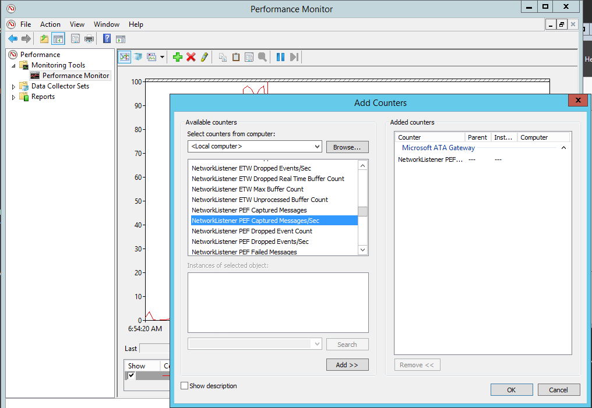

# Install ATA
The following are the steps required to get ATA deployed, configured, and running.

To configure ATA, follow these steps:

-   [Pre-installation steps](#Preinstallsteps)

-   [Step 1. Download and Install the ATA Center](#InstallATACtr)

-   [Step 2. Configure ATA Gateway domain connectivity settings](#ConfigConSettings)

-   [Step 3. Download the ATA Gateway setup package](#DownloadATA)

-   [Step 4. Install the ATA Gateway](#InstallATAGW)

-   [Step 5. Configure the ATA Gateway settings](#ConfigATAGW)

-   [Step 6. Configure short-term lease subnets and Honeytoken user](#ATAvpnHoneytokensetting)

## Pre-installation steps

1.  If you installed the ATA public preview version, see [ATA Release Notes](../Topic/ATA-Release-Notes.md) for help uninstalling the ATA Preview version.

2.  Install KB2934520 on the ATA Center server and on the ATA Gateway servers before beginning installation, otherwise the ATA installation will install this update and will require a restart in the middle of the ATA installation.

## Step 1. Download and Install the ATA Center
After you have verified that the server meets the requirements, you can proceed with the installation of the ATA Center.

Perform the following steps on the ATA Center server.

1.  Download ATA from the [TechNet Evaluation Center](http://www.microsoft.com/en-us/evalcenter/).

2.  Log in with a user who is a member of the local administrators group.

3.  From an elevated command prompt, run Microsoft ATA Center Setup.EXE and follow the setup wizard.

4.  On the **Welcome** page, select your language and click **Next**.

5.  Read the End User License Agreement and if you accept the terms, click **Next**.

6.  On the **Center Configuration** page, enter the following information based on your environment:

    |Field|Description|Comments|
    |---------|---------------|------------|
    |Installation Path|This is the location where the ATA Center will be installed. By default this is  %programfiles%\Microsoft Advanced Threat Analytics\Center|Leave the default value|
    |Database Data Path|This is the location where the MongoDB database files will be located. By default this is %programfiles%\Microsoft Advanced Threat Analytics\Center\MongoDB\bin\data|Change the location to a place where you have room to grow based on your sizing. **Note:** <ul><li>In production environments you should use a drive that has enough space based on capacity planning.</li><li>For large deployments the database should be on a separate physical disk.</li></ul>See [ATA Capacity Planning](../Topic/ATA-Capacity-Planning.md) for sizing information.|
    |Database Journal Path|This is the location where the database journal files will be located. By default this is %programfiles%\Microsoft Advanced Threat Analytics\Center\MongoDB\bin\data\journal|For large deployments, the Database Journal should be on a separate physical disk from the database and the system drive. Change the location to a place where you have room for your Database Journal.|
    |ATA Center Service IP address: Port|This is the IP address that the ATA Center service will listen on for communication from the ATA Gateways.  **Default port:** 443|Click the down arrow to select the IP address to be used by the ATA Center service.  The IP address and port of the ATA Center service cannot be the same as the IP address and port of the ATA Console. Make sure to change the port of the ATA Console.|
    |ATA Center Service SSL Certificate|This is the certificate that will be used by the ATA Center service.|Click the key icon to select a certificate installed or check self-signed certificate when deploying in a lab environment.|
    |ATA Console IP address|This is the IP address that will be used by IIS for the ATA Console.|Click the down arrow to select the IP address used by the ATA Console. **Note:** Make a note of this IP address to make it easier to access the ATA Console from the ATA Gateway.|
    |ATA Console SSL certificate|This is the certificate to be used by IIS.|Click the key icon to select a certificate installed or check self-signed certificate when deploying in a lab environment.|
    

7.  Click **Install** to install ATA and its components and create the connection between the ATA Center and the ATA Console.

8.  When the installation completes, click **Launch**  to connect to the ATA Console.

    The following components are installed and configured during the installation of ATA Center:

    -   Internet Information Services (IIS)

    -   MongoDB

    -   ATA Center service and ATA Console IIS site

    -   Custom Performance Monitor data collection set

    -   Self-signed certificates (if selected during the installation)

> [!NOTE]
> To help in troubleshooting and product enhancement, it is recommended that you install MongoVue and any other MongoDB add-in, or any other third-party tool of your choice. MongoVue requires .Net Framework 3.5 to be installed.

### Validate installation

1.  Check to see that the Microsoft Advanced Threat Analytics Center service is running.

2.  On the desktop click the Microsoft Advanced Threat Analytics shortcut to connect to the ATA Console. Log in with the same user credentials that you used to install the ATA Center. The first time you log into the ATA Console you will be brought automatically to the **Domain connectivity settings** page to continue the configuration and the deployment of the ATA Gateways.

3.  Review the error file in the **Microsoft.Tri.Center-Errors.log** file which can be found in the following default location: %programfiles%\Microsoft Advanced Threat Analytics\Center\Logs.

## Step 2. Configure ATA Gateway domain connectivity settings
The settings in the domain connectivity settings section apply to all ATA Gateways managed by the ATA Center.

To configure the Domain connectivity settings perform the following on the ATA Center server.

1.  Open the ATA Console and log in. For instructions see [Working with the ATA Console](../Topic/Working-with-the-ATA-Console.md).

2.  The first time you log into the ATA Console after the ATA Center has been installed, you will automatically be taken to the ATA Gateways configuration page. If you need to modify any of the settings afterwards, click the Settings icon and select **Configuration**.

    

3.  On the **Gateways** page, click on **Domain connectivity settings**, enter the following information and click **Save**.

    |Field|Comments|
    |---------|------------|
    |**Username** (required)|Enter the read-only user name, for example: **user1**.|
    |**Password** (required)|Enter the password for the read-only user, for example: **Pencil1**. **Note:** Make sure this password is correct. If you save the wrong password, the ATA Service will stop running on the ATA Gateway servers.|
    |**Domain** (required)|Enter the domain for the read-only user, for example, **contoso.com**. **Note:** It is important that you enter the complete FQDN of the domain where the user is located. For example, if the user’s account is in domain corp.contoso.com, you need to enter `corp.contoso.com` not contoso.com|
    

## Step 3. Download the ATA Gateway setup package
After configuring the domain connectivity settings you can download the ATA Gateway setup package.

To download the ATA Gateway package:

1.  On the ATA Gateway machine, open a browser and enter the IP address you configured in the ATA Center for the ATA Console. When the ATA Console opens, click on the settings icon and select **Configuration**.

    

2.  In the **ATA Gateways** tab, click **Download ATA Gateway Setup**.

3.  Save the package locally.

The zip file includes the following:

-   ATA Gateway installer

-   Configuration setting file with the required information to connect to the ATA Center

## Step 4. Install the ATA Gateway
Before installing the ATA Gateway, validate that port mirroring is properly configured and that the ATA Gateway can see traffic to and from the domain controllers. See [Validate Port Mirroring](../Topic/Validate-Port-Mirroring.md) for more information.

> [!IMPORTANT]
> Make sure that [KB2919355](http://support.microsoft.com/kb/2919355/) has been installed.  Run the following PowerShell cmdlet to check if the hotfix is installed:
> 
> `Get-HotFix -Id kb2919355`

Perform the following steps on the ATA Gateway server.

1.  Extract the files from the zip file.

2.  From an elevated command prompt, run Microsoft ATA Gateway Setup.exe and follow the setup wizard.

3.  On the **Welcome** page, select your language and click **Next**.

4.  Under  **ATA Gateway Configuration**, enter the following information based on your environment:

    

    |Field|Description|Comments|
    |---------|---------------|------------|
    |Installation Path|This is the location where the ATA Gateway will be installed. By default this is  %programfiles%\Microsoft Advanced Threat Analytics\Gateway|Leave the default value|
    |ATA Gateway Service SSL certificate|This is the certificate that will be used by the ATA Gateway.|Use a self-signed certificate for lab environments only.|
    |ATA Gateway Registration|Enter the Username and Password of the ATA administrator.|For the ATA Gateway to register with the ATA Center, enter the user name and password of the user who installed the ATA Center. This user must be a member of one of the following local groups on the ATA Center.  -   Administrators -   Microsoft Advanced Threat Analytics Administrators **Note:** These credentials are used only for registration and are not stored in ATA.|
    The following components are installed and configured during the installation of the ATA Gateway:

    -   KB 3047154

        > [!IMPORTANT]
        > -   Do not install KB 3047154 on a virtualization host. This may cause port mirroring to stop working properly.
        > -   Do not install Message Analyzer, Wireshark, or other network capture software on the ATA Gateway. If you need to capture network traffic, install and use Microsoft Network Monitor 3.4.

    -   ATA Gateway service

    -   Microsoft Visual C++ 2013 Redistributable

    -   Custom Performance Monitor data collection set

5.  After the installation completes, click **Launch**  to open your browser and log in to the ATA Console.

### Step 5. Configure the ATA Gateway settings
After the ATA Gateway was installed, perform the following steps to configure the settings for the ATA Gateway.

1.  On the ATA Gateway machine, in the ATA Console, click on the **Configuration** and select the **ATA Gateways** page.

2.  Enter the following information.

    |Field|Description|Comments|
    |---------|---------------|------------|
    |Description|Enter a description of the ATA Gateway (optional).||
    |**Domain controllers** (required)  See below for additional information about the list of controllers.|Enter the complete FQDN of your domain controller and click the plus sign to add it to the list. For example,  **dc01.contoso.com**  |The objects in the first domain controller in the list will sync via LDAP queries. Depending on the size of the domain, this might take some time. **Note:** <ul><li>Make sure that the first domain controller is **not** read-only.    Read only domain controllers should be added only after the initial sync completes.</li></ul>|
    |**Capture Network adapters** (required)|Select the network adapters that are connected to the switch that are configured as the destination mirror port to receive the domain controller traffic.|Select the Capture network adapter.|
    

3.  Click **Save**.

    > [!NOTE]
    > It will take a few minutes for the ATA Gateway service to start the first time because it builds the cache of the network capture parsers used by the ATA Gateway.

The following information applies to the servers you enter in the **Domain Controllers** list.

-   The first domain controller in the list will be used by the ATA Gateway to sync the objects in the domain via LDAP queries. Depending on the size of the domain, this might take some time.

-   All domain controllers whose traffic is being monitored via port mirroring by the ATA Gateway must be listed in the **Domain Controllers** list. If a domain controller is not listed in the **Domain Controllers** list, detection of suspicious activities might not function as expected.

-   Make sure that the first domain controller is **not** a read-only domain controller (RODC).

    Read only domain controllers should be added only after the initial sync completes.

-   At least one domain controller in the list be a global catalog server. This will enable ATA to resolve computer and user objects in other domains in the forest.

The configuration changes will be applied to the ATA Gateway on the next scheduled sync between the ATA Gateway and the ATA Center.

### Validate installation:
To validate that the ATA Gateway has been successfully deployed, check the following:

1.  Check that the Microsoft Advanced Threat Analytics Gateway service is running. After you have saved the ATA Gateway settings, it might take a few minutes for the service to start.

2.  If the service does not start, review the “Microsoft.Tri.Gateway-Errors.log” file located in the following default folder, “%programfiles%\Microsoft Advanced Threat Analytics\Gateway\Logs”, search for entries with “transfer” or “service start”.

3.  Check the following Microsoft ATA Gateway performance counters:

    -   **NetworkListener Captured Messages / sec**: This counter tracks how many messages are being captured by the ATA per second. The value should be mid hundreds to thousands depending on the number of domain controllers being monitored and how busy each domain controller is. Single or double digit values can indicate an issue with the port mirroring configuration.

    -   **EntityTransfer Activity Transfers/Sec**: This value should be in the range of a few hundred every few seconds.

4.  If this is the first ATA Gateway installed, after a few minutes, log into the ATA Console and open the notification pane by swiping the right side of the screen open. You should see a list of **Entities Recently Learned** in the notification bar on the right side of the console.

5.  To validate that the installation completed successfully:

    In the console, search for something in the search bar, such as a user or a group on your domain.

    Open Performance Monitor. In the Performance tree, click on **Performance Monitor** and then click the plus icon to **Add a Counter**. Expand **Microsoft ATA Gateway** and scroll down to **Network Listener Captured Messages per Second** and add it. Then, make sure you see activity on the graph.

    

### Step 6. Configure short-term lease subnets and Honeytoken user
Short-term lease subnets are subnets in which the IP address assignment changes very rapidly - within seconds or minutes. For example, IP addresses used for your VPNs and Wi-Fi IP addresses. To enter the list of short-term lease subnets used in your organization, follow these steps:

1.  From the ATA Console on the ATA Gateway machine, click on the settings icon and select **Configuration**.

    

2.  Under **Detection**, enter the following for short-term lease subnets. Enter the short-term lease subnets using slash notation format, for example:  `192.168.0.0/24` and click the plus sign.

3.  For the Honeytoken account SIDs, enter the SID for the user account that will have no network activity, and click the plus sign. For example: `S-1-5-21-72081277-1610778489-2625714895-10511`.

    > [!NOTE]
    > To find the SID for a user, run the following Windows PowerShell cmdlet `Get-ADUser UserName`.

4.  Configure exclusions: You can configure IP addresses to be excluded from specific suspicious activities. See [Working with ATA Detection Settings](../Topic/Working-with-ATA-Detection-Settings.md) for more information.

5.  Click **Save**.

Congratulations, you have successfully deployed Microsoft Advanced Threat Analytics!

Check the attack time line to view detected suspicious activities and search for users or computers and view their profiles.

Remember that it takes a minimum of three weeks for ATA to build behavioral profiles, so during the first three weeks you will not see any  suspicious behavior activities.

## See Also
[For support, check out our forum!](https://social.technet.microsoft.com/Forums/security/en-US/home?forum=mata)
 [Configure Event Collection](../Topic/Configure-Event-Collection.md)
 [ATA Prerequisites](../Topic/ATA-Prerequisites.md)

