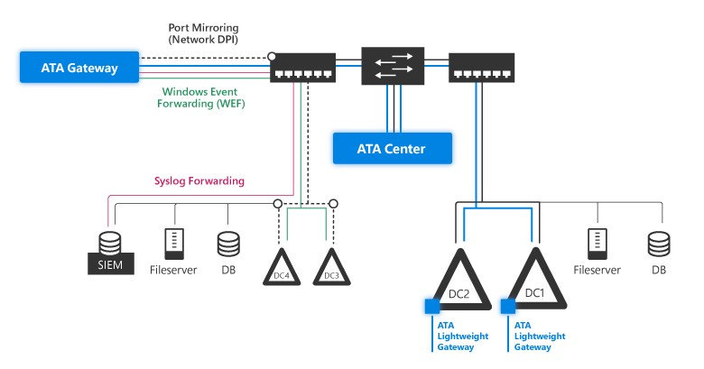

# Microsoft Advanced Threat Analytics
This article provides an introduction to Microsoft Advanced Threat Analytics (ATA).

## What is ATA?
ATA is an on-premises product that helps IT security professionals protect their enterprise from advanced targeted attacks by automatically analyzing, learning, and identifying normal and abnormal behavior among entities (users, devices, and resources).  ATA also helps identify known malicious attacks, security issues and risks using world-class, cutting edge research in behavioral analytics to help enterprises identify security breaches before they cause damage.

## What does ATA do?
ATA is comprised of two separate components that sit in your network - the ATA Center and the ATA Gateways. You use port mirroring from your domain controllers to your ATA Gateways to enable ATA to review your network traffic and perform its advanced algorithms and behavioral analytics on your traffic. Once ATA studies your "normal" network traffic, it can start alerting you when something out of the ordinary is detected. In order to provide ATA with even more information about what goes on in your network, you can also enable event forwarding from your SIEM or by using Windows Event Forwarding to the ATA Gateways as well. For more information about how ATA works inside your network, see [ATA Architecture](../Topic/ATA-Architecture.md).

## What threats does ATA look for?
ATA collects information from several data sources and analyzes, learns, and identifies normal behavior on your network, alerting you to possible security concerns, including:

-   **Reconnaissance and brute force suspicious activities:**

    -   Reconnaissance using DNS

        Reconnaissance attacks are attacks in which an attacker attempts to discover lists of machines in your organization from your domain name server, for example, performing a zone transfer on your domain name server (DNS). Ordinarily a zone transfer is performed when a DNS requests a list of IP addresses that serve a specific zone (for example, news.contoso.com). In the event of an attack, the attacker queries the DNS for the IP addresses that run your web sites. A DNS reconnaissance attack can also come in the form of a query of SRV records to get information about which IP addresses provide services, or MX records to find the IP address of the mail server.  

    -   Reconnaissance using account enumeration

        Reconnaissance attacks in which an attacker attempts to discover user names using the Kerberos protocol to discover if the users exist, even if the activity was not logged as an event on the domain controller.

    -   Brute force

        Brute-force are attacks in which attackers try guess user credentials by trying multiple users and pairing them with multiple password attempts, often using complex algorithms or dictionaries to try as many values as a system allows.

-   **Identity theft suspicious activities**:

    -   Pass the ticket

        Pass the ticket are attacks in which the attacker steals a Kerberos ticket from one computer and uses it to gain access from another computer by impersonating an entity on your network.

    -   Pass the hash

        Pass the hash are attacks in which the attacker steals the NTLM hash of an entity, and uses it to authenticate with NTLM and impersonate the entity and gain access to resources on your network.

    -   Over-pass the hash

        Over-pass the hash are attacks in which the attacker uses a stolen NTLM hash to authenticate with Kerberos, and obtain a valid Kerberos TGT ticket and authenticate as a valid user and gain access to resources on your network.

    -   Skeleton key

        Skeleton key are attacks when malware is installed on your domain controller to allow attackers to authenticate as any user while all users continue to have regular access,  in addition to the regular logons of your users.

    -   MS14-068 exploit (Forged PAC)

        Forged PAC are attacks in which the attacker plants authorization data in their valid TGT ticket  in the form of a forged authorization header which grants them additional permissions that they weren't granted by their organization.

    -   Golden ticket

        Golden ticket are attacks in which an attacker steals the KBTGT's credentials, the Kerberos Golden Ticket, which enables the attacker to create a TGT ticket offline, which can be used to gain access to resources in the network.

    -   Remote execution

        Attackers can attempt to control your network by running code remotely on your domain controller.

-   **Honey Token account suspicious activities**

    Attackers can attempts to attack your network by monitoring accounts set up for the purpose of identifying and tracking malicious activity in dummy accounts.

-   **Abnormal behavior**

    ATA uses behavioral analytics and machine learning to monitor your network constantly learning your users' normal patterns so that when something anomalous occurs, it is immediately noticed. Abnormal behavior monitors activities such as anomalous logins, abnormal resource access, abnormal working hours, unknown threats and  password sharing.

-   **Massive object deletion**

    ATA monitors your network for deletion of large number of entities from your Active Directory. The number of entities varies relative to the number of entities in your network.

-   **Security issues and risks**: ATA identifies and alerts you to known security issues, such as broken trust, weak protocols and known protocol vulnerabilities.

    -   Sensitive account exposed in plain text authentication

        If high privileged accounts' credentials are sent in plain text, ATA alerts you so that you can update the computer's configuration.

    -   Service exposing accounts in plain text authentication

        If a service on a computer is sending multiple account credentials in plain text, ATA alerts you so that you can update the service's configuration.

    -   Broken trust

        Broken trust occurs when something happens to the computer that causes it to fail at authenticating with the domain controller, for example if the computer is off line for an extended period of time, the computer ceases to be managed and policies can no longer be run on it. ATA alerts you of these situations of broken trust devices in your network.

## What next?

-   For more information about how ATA fits into your network check out:[ATA Architecture](../Topic/ATA-Architecture.md)

-   To get started deploying ATA: [ATA Deployment Guide](../Topic/ATA-Deployment-Guide.md)

## See Also
[For ATA support, check out our forum!](https://social.technet.microsoft.com/Forums/security/en-US/home?forum=mata)

