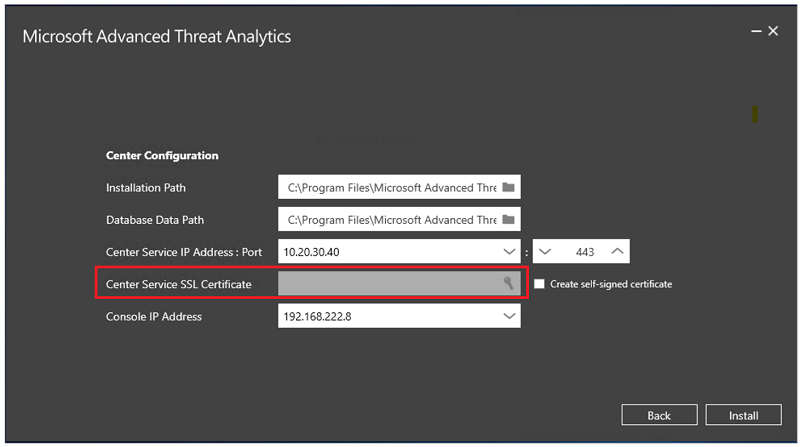

---
# required metadata

title: Disaster recovery for Advanced Threat Analytics | Microsoft Docs
description: Describes how you can quickly recover ATA functionality after disaster
keywords:
author: rkarlin
ms.author: rkarlin
manager: mbaldwin
ms.date: 02/12/2017
ms.topic: article
ms.prod:
ms.service: advanced-threat-analytics
ms.technology:
ms.assetid: 7620e171-76d5-4e3f-8b03-871678217a3a

# optional metadata

#ROBOTS:
#audience:
#ms.devlang:
ms.reviewer: bennyl
ms.suite: ems
#ms.tgt_pltfrm:
#ms.custom:

---

*Applies to: Advanced Threat Analytics version 1.7*

# ATA disaster recovery
This article describes how to quickly recover your ATA Center and restore ATA functionality when the ATA Center functionality is lost but the ATA Gateways are still working. 

>[!NOTE]
> The process described does not recover previously detected suspicious activities but does return the ATA Center to full functionality. Additionally, the learning period needed for some behavioral detections will restart, but most of the detection that ATA offers is operational after the ATA Center is restored. 

## Back up your ATA Center configuration

1. The ATA Center configuration is backed up to a file every hour. Locate the latest backup copy of the ATA Center configuration and save it on a separate computer. For a full explanation of how to locate these files, see [Export and import the ATA configuration](/advanced-threat-analytics/deploy-use/ata-configuration-file). 
2. Export the ATA Center certificate.
    1. In the certificate manager, navigate to **Certificates (Local Computer)** -> **Personal** ->**Certificates**, and select **ATA Center**.
    2. Right click **ATA Center** and select **All Tasks** followed by **Export**. 
     
    3. Follow the instructions to export the certificate, making sure to export the private key as well.
    4. Back up the exported certificate file on a separate computer.

  > [!NOTE] 
  > If you cannot export the private key, you must create a new certificate and deploy it to ATA, as described in [Change the ATA Center certificate](/advanced-threat-analytics/deploy-use/modifying-ata-config-centercert), and then export it. 

## Recover your ATA Center

1. Create a new Windows Server machine using the same IP address and computer name as the previous ATA Center machine.
4. Import the certificate you backed up, above, to the new server.
5. Follow the instructions to [Deploy the ATA Center](/advanced-threat-analytics/deploy-use/install-ata-step1) on the newly created Windows Server. There is no need to deploy the 
ATA Gateways again. When prompted for a certificate, provide the certificate you exported when backing up the ATA Center configuration. 
 
6. Import the backed up ATA Center configuration:
    1. Remove the default ATA Center System Profile document from the MongoDB: 
        1. Go to **C:\Program Files\Microsoft Advanced Threat Analytics\Center\MongoDB\bin**. 
        2. Run `mongo.exe` 
        3. Run the following command to remove the default system profile: `db.SystemProfile.remove({})`
    2. Run the command: `mongoimport.exe --db ATA --collection SystemProfile --file "<SystemProfile.json backup file>" --upsert` using the backup file from step 1. 
    For a full explanation of how to locate and import backup files, see [Export and import the ATA configuration](/advanced-threat-analytics/deploy-use/ata-configuration-file). 
    3. After importing, run this command to remove some of the default system profiles (to reset them for the new environment): `db.SystemProfile.remove({$or:[{"_t":"DetectorProfile"}, "_t":"DirectoryServicesSystemProfile"}]}) `
    4. Open the ATA Console. You should see all the ATA Gateways linked under the Configuration/Gateways tab. 
    5. Make sure to define a [**Directory services user**](/advanced-threat-analytics/deploy-use/install-ata-step2) and to choose a [**Domain controller synchronizer**](/advanced-threat-analytics/deploy-use/install-ata-step5). 

## See Also
- [ATA prerequisites](/advanced-threat-analytics/plan-design/ata-prerequisites)
- [ATA capacity planning](/advanced-threat-analytics/plan-design/ata-capacity-planning)
- [Configure event collection](/advanced-threat-analytics/deploy-use/configure-event-collection)
- [Configuring Windows event forwarding](/advanced-threat-analytics/deploy-use/configure-event-collection#configuring-windows-event-forwarding)
- [Check out the ATA forum!](https://social.technet.microsoft.com/Forums/security/home?forum=mata)
