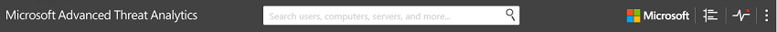
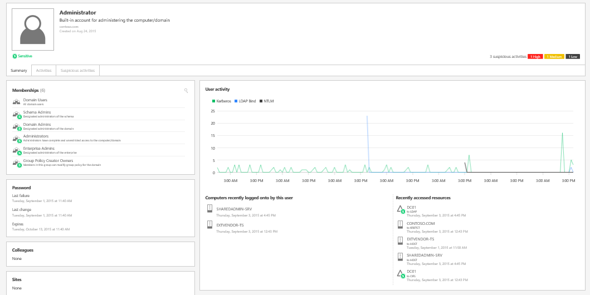
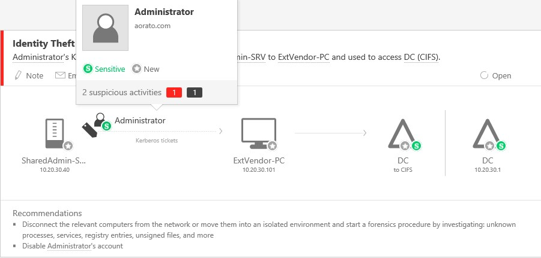

# ATA Console elements

The ATA Console provides you a quick view of all suspicious activities in chronological order and enables you to drill into details of any activity or perform actions such as adding additional notes to the activity. The console also displays alerts and notifications to highlight problems with the ATA network or new activities that are deemed suspicious.

These are the key elements of the ATA console.

## ATA Console elements

-   **Attack time line**

    This is the default page you are taken to when you log in to the ATA Console. By default, all open suspicious activities are shown on the attack time line. You can filter the attack time line to show All, Open, Dismissed or Resolved suspicious activities. You can also see the severity assigned to each activity.

    

    For more information, see [Working with suspicious activities](/ATA/DeployUse/working-with-suspicious-activities.html).

-   **Notification bar**

    When a new suspicious activity is detected, the notification bar will open automatically on the right hand side. If there are new suspicious activities since the last time you logged in, the notification bar will open after you have successfully logged in. To access it, you can click the arrow on the right at any time.

    

-   **Filtering panel**

    You can filter which suspicious activities are displayed in the attack time line or displayed in the entity profile suspicious activities tab based on Status and Severity.

-   **Search bar**

    On the top of the screen you will find a search bar. You can search for a specific user, computer or groups in ATA. To give it a try, just start typing.

    

-   **Health Center**

    The Health Center provides you with alerts when something isn't working properly in your ATA network.

    

    Any time your system encounters a problem, such as a connectivity error or a disconnected ATA Gateway, the Health Center icon will let you know by displaying a red dot. 

    Like suspicious activities, Health Center alerts can be dismissed or resolved and are categorized High, Medium or Low depending on their severity. If you resolve an alert that the ATA service detects as still active, it will automatically be moved to the Open list of alerts. If the system detects that there is no longer cause for an alert (the situation has been fixed), it will automatically be moved to the resolved list.

-   **User and computer profiles**

    ATA builds a profile for each user and computer in the domain. In the user profile ATA displays general information about the user, such as group membership, recent logins, and recently accessed resources.

    

    In the computer profile, ATA displays general information about the computer, such as recently logins and recently accessed resources.

    

    ATA provides additional information on the following pages: Summary, Activities, and Suspicious activities.

> [!NOTE]
> A profile that ATA has not been able to fully resolve will be identified with half-filled circle icon next to it.

-   **Mini profile**

    Anywhere in the console where there is a single entity presented, such as a user or computer, if you hover your mouse over the entity, a mini profile will automatically open displaying the following information if available:

    

    -   Name

    -   Picture

    -   Email

    -   Telephone

    -   Number of suspicious activities by severity

    >[!div class="step-by-step"]
    **Working with ATA console**
    [Previous](https://docsmsftstage.azurewebsites.net/ATA/Understand/working-with-ata-console.html)

## See Also
[For support, check out our forum!](https://social.technet.microsoft.com/Forums/security/en-US/home?forum=mata)
