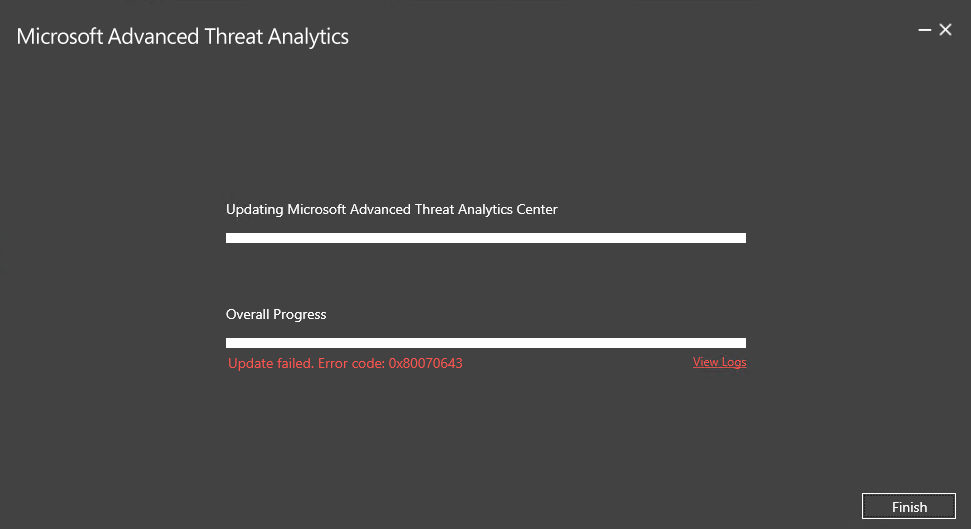
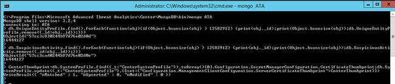

---
# required metadata

title: What's new in ATA version 1.7 | Microsoft ATA
description: Lists what was new in ATA version 1.7 along with known issues
keywords:
author: rkarlin
manager: mbaldwin
ms.date: 08/28/2016
ms.topic: article
ms.prod:
ms.service: advanced-threat-analytics
ms.technology:
ms.assetid: 

# optional metadata

#ROBOTS:
#audience:
#ms.devlang:
ms.reviewer: 
ms.suite: ems
#ms.tgt_pltfrm:
#ms.custom:

---

# What's new in ATA version 1.7
These release notes provide information about known issues in this version of Advanced Threat Analytics.

## What's new in the ATA 1.7 update?
The update to ATA 1.7 provides improvements in the following areas:

-   New & updated detections

-   Role-based access control

-   Support for Windows Server 2016 and Windows Server Core

-   User experience improvements

### New & updated detections

- **Reconnaissance using Directory Services Enumeration**
As part of the reconnaissance phase, attackers gather information about the entities in the network using different methods. Directory services enumeration using the SAM-R protocol enables attackers to obtain the list of users and groups in a domain and understand the interaction between the different entities. 

- **Pass-the-Hash Enhancements**
To enhance Pass-the-Hash detection, we added additional behavioral models for the authentication patterns of entities. These models enable ATA to correlate entity behavior with suspicious NTLM authentications, and differentiate real Pass-the-Hash attacks from the behavior of false positive scenarios.

- **Pass-the-Ticket Enhancements**
To successfully detect advanced attacks in general and Pass-the-Ticket in particular, the correlation between an IP address and the computer account must be accurate. This is a challenge in environments where IP addresses change rapidly by design (for example Wi-Fi networks and multiple virtual machines sharing the same host). To overcome this challenge and improve the accuracy of the Pass-the-Ticket detection, ATA’s Network Name Resolution (NNR) mechanism was improved significantly to reduce false-positives.

- **Abnormal Behavior Enhancements**
In ATA 1.7, NTLM authentication data was added as a data source for the abnormal behavior detections, providing the algorithms with broader coverage of entity behavior in the network. 

- **Unusual Protocol Implementation Enhancements**
ATA now detects unusual protocol implementation in the Kerberos protocol, along with additional anomalies in the NTLM protocol. Specifically, these new anomalies for Kerberos are commonly used in Over-pass-the-Hash attacks.

### Infrastructure

- **Role based access control**
Role-Based Access Control (RBAC) capability. ATA 1.7 includes three roles: ATA Administrator, ATA Analyst and ATA Executive.

- **Support for Windows Server 2016 and Windows Server Core**
ATA 1.7 supports the deployment of Lightweight Gateways on domain controllers running Server Core for Windows Server 2012 and Server Core for Windows Server 2012 R2. Additionally, this release supports Windows Server 2016 both for the ATA Center and ATA Gateway components.

### User Experience
- **Configuration Experience**
In this release, the ATA configuration experience was redesigned for a better user experience and to better support of environments with multiple ATA Gateways. This release also introduces the ATA Gateway update page for simpler, better management of automatic updates for the various Gateways.

## Known issues
The following known issues exist in this version.

### Gateway automatic update may fail
**Symptoms:** In environments with slow WAN links, the ATA Gateway update may reach the timeout for the update (100 seconds) and fail to complete successfully.
In the ATA Console, the ATA Gateway will have the status of "Updating (downloading package)" for a long amount of time and it eventually fails.

**Workaround:** To work around this issue, download the latest ATA Gateway package from the ATA Console, and update the ATA Gateway manually.

### Migration failure when updating from ATA 1.6
When updating to ATA 1.7, the update process may fail with the error code *0x80070643*:

This is a generic error, and may indicate several root-causes for the failure. Some of those issues can be fixed on the database level.
In order to fix the specific scenario, you will need to find the exact exception in the installation log and run a special *mongo script* to fix the issue in the database.
In order to run a *mongo script*, use the following procedure:

1.	From the **C:\Program Files\Microsoft Advanced Threat Analytics\Center\MongoDB\bin** directory execute:
**Mongo ATA**

2.	In the prompt, paste the *mongo script*, for example:

In order to locate the relevant *mongo script* for the specific issue, open the installation log file located in: **%temp%/../Microsoft Advanced Threat Analytics Center_{date_stamp}_MsiPackage.log** and look for one of the following exceptions:

| Error in MsiPackge.log                                                                                                                                                                                                                                                                       | mongo script to fix the issue                                                                                                                                                                        |
|---|---|
| System.FormatException: Size {size},is larger than MaxDocumentSize 16777216   And later:   Microsoft.Tri.Center.Deployment.Package.Actions.DatabaseActions.MigrateUniqueEntityProfiles(Boolean isPartial)                                                                                        | db.UniqueEntityProfile.find().forEach(function(obj){if(Object.bsonsize(obj) > 12582912) {print(obj._id);print(Object.bsonsize(obj));db.UniqueEntityProfile.remove({_id:obj._id});}}) |
| System.OutOfMemoryException: Exception of type 'System.OutOfMemoryException' was thrown And later: Microsoft.Tri.Center.Deployment.Package.Actions.DatabaseActions.ReduceSuspiciousActivityDetailsRecords(IMongoCollection`1 suspiciousActivityCollection, Int32 deletedDetailRecordMaxCount) | db.SuspiciousActivity.find().forEach(function(obj){if(Object.bsonsize(obj) > 500000),{print(obj._id);print(Object.bsonsize(obj));db.SuspiciousActivity.remove({_id:obj._id});}})     |
|System.Security.Cryptography.CryptographicException: Bad Length And later:  Microsoft.Tri.Center.Deployment.Package.Actions.DatabaseActions.MigrateCenterSystemProfile(IMongoCollection`1 systemProfileCollection)| CenterThumbprint=db.SystemProfile.find({_t:"CenterSystemProfile"}).toArray()[0].Configuration.SecretManagerConfiguration.CertificateThumbprint;db.SystemProfile.update({_t:"CenterSystemProfile"},{$set:{"Configuration.ManagementClientConfiguration.ServerCertificateThumbprint":CenterThumbprint}})|

  
### ATA reports too many suspicious activities of the type “*Reconnaissance using directory services enumeration*”:
 
This is most likely happening if there is some kind of network scanning tool running on all (or a lot) of client machines in the organization.
If you are seeing this problem:

1.	Please email to ATAEval at Microsoft.com any information you can find about an application that running on those machines that may explain the SAM-R activity
2.	Use the following *mongo script* to dismiss all the events on those types at once (see above how to execute the *mongo script*):

db.SuspiciousActivity.update({_t: "SamrReconnaissanceSuspiciousActivity"}, {$set: {Status: "Dismissed"}}, {multi: true})

### Users getting notification for dismissed suspicious activities:
After upgrade to v1.7, ATA may keep send notification (Email/Event logs/Etc) for suspicious activities that are in “Dismiss” status.
 
 > [!IMPORTANT]
 Automatic certificate renewal for the certificates used by ATA is not supported. The use of these certificates may cause ATA to stop functioning when the certificate is automatically renewed. 

## See Also
[Check out the ATA forum!](https://social.technet.microsoft.com/Forums/security/home?forum=mata)

[Update ATA to version 1.7 - migration guide](ata-update-1.7-migration-guide.md)

