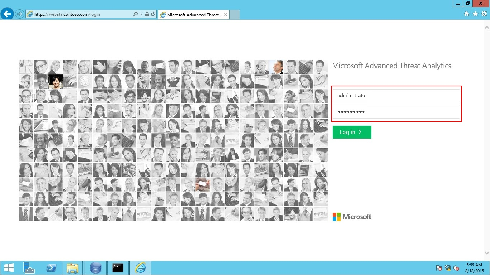

# Working with the ATA Console

Use the ATA console to monitor and respond to suspicious activity detected by ATA.

## Enabling access to the ATA Console
Any user who is a member of the local Administrators group on the ATA Center server has permission to log in to the ATA Console and manage ATA settings.
To allow a user to log in to the ATA Console without making them a local administrator, add them to the local group: **Microsoft Advanced Threat Analytics Administrators**.

## Logging into the ATA Console

1. In the ATA Center server, click the **Microsoft ATA Console**  icon on the desktop or open a browser and browse to the ATA Console.

    

> [!NOTE]
> Alternatively, you can open a browser from either the ATA Center or the ATA Gateway and browse to the IP address you configured in the ATA Center installation for the ATA Console.    

2.  Enter your username and password and click **Log in**.

    

> [!NOTE]
> You have to log in with a user who is a member of the local administrator group OR of the  Microsoft Advanced Threat Analytics Administrators group.

>[!div class="step-by-step"]
[Next](https://docsmsftstage.azurewebsites.net/ATA/Understand/ata-console-elements.html)
**ATA console elements**

## See Also
[For support, check out our forum!](https://social.technet.microsoft.com/Forums/security/en-US/home?forum=mata)
