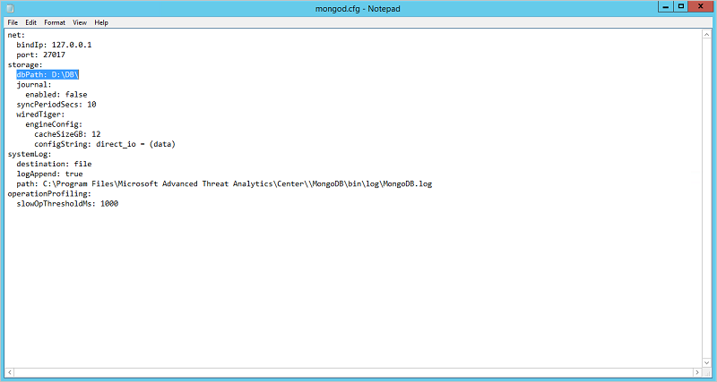

---
# required metadata

title: Advanced Threat Analytics Database Management
description: Procedures to help you move, backup, or restore the ATA database.
keywords:
author: batamig
ms.author: bagol
manager: raynew
ms.date: 01/10/2023
ms.topic: conceptual
ms.service: advanced-threat-analytics
ms.assetid: 05e49e23-6e0a-4ec0-9a63-a2093173c8a1

# optional metadata

#ROBOTS:
#audience:
#ms.devlang:
ms.reviewer: bennyl
ms.suite: ems
#ms.tgt_pltfrm:
#ms.custom:

---

# ATA Database Management

[!INCLUDE [Banner for top of topics](includes/banner.md)]

If you need to move, backup or restore the ATA database, use these procedures for working with MongoDB.

## Backing up the ATA database

Refer to the [relevant MongoDB documentation](https://www.mongodb.com/docs/manual/core/backups/).

## Restoring the ATA database

Refer to the [relevant MongoDB documentation](https://www.mongodb.com/docs/manual/core/backups/).

## Moving the ATA database to another drive

1. Stop the **Microsoft Advanced Threat Analytics Center** service.
   > [!Important]
   > Make sure the ATA Center service stopped before moving on to the next step.

1. Stop the **MongoDB** service.

1. Open the Mongo configuration file located by default at: C:\Program Files\Microsoft Advanced Threat Analytics\Center\MongoDB\bin\mongod.cfg.

   Find the parameter `storage: dbPath`

1. Move the folder listed in the `dbPath` parameter to the new location.

1. Change the `dbPath` parameter inside the mongo configuration file to the new folder path and save and close the file.

    

1. Start the **MongoDB** service.

1. Start the **Microsoft Advanced Threat Analytics Center** service.

## See Also

- [ATA architecture](ata-architecture.md)
- [ATA prerequisites](ata-prerequisites.md)
- [Check out the ATA forum!](https://social.technet.microsoft.com/Forums/security/home?forum=mata)
