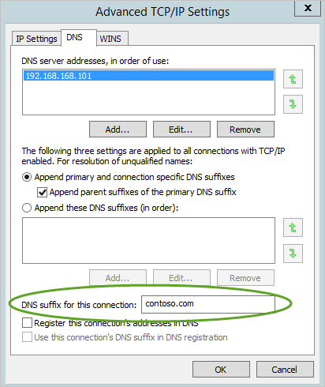

---
# required metadata

title: Advanced Threat Analytics prerequisites
description: Describes the requirements for a successful deployment of ATA in your environment
keywords:
author: batamig
ms.author: bagol
manager: raynew
ms.date: 01/10/2023
ms.topic: conceptual
ms.service: advanced-threat-analytics
ms.technology:
ms.assetid: a5f90544-1c70-4aff-8bf3-c59dd7abd687

# optional metadata

#ROBOTS:
#audience:
#ms.devlang:
ms.reviewer: bennyl
ms.suite: ems
#ms.tgt_pltfrm:
#ms.custom:

---

# ATA prerequisites

[!INCLUDE [Banner for top of topics](includes/banner.md)]

This article describes the requirements for a successful ATA deployment in your environment.

> [!NOTE]
> For information on how to plan resources and capacity, see [ATA capacity planning](ata-capacity-planning.md).

ATA is composed of the ATA Center, the ATA Gateway and/or the ATA Lightweight Gateway. For more information about the ATA components, see [ATA architecture](ata-architecture.md).

The ATA System works on active directory forest boundary and supports Forest Functional Level (FFL) of Windows 2003 and above.

[Before you start](#before-you-start): This section lists information you should gather and accounts and network entities you should have, before starting ATA installation.

[ATA Center](#ata-center-requirements): This section lists ATA Center hardware, software requirements as well as settings you need to configure on your ATA Center server.

[ATA Gateway](#ata-gateway-requirements): This section lists ATA Gateway hardware, software requirements as well as settings  you need to configure on your ATA Gateway servers.

[ATA Lightweight Gateway](#ata-lightweight-gateway-requirements): This section lists ATA Lightweight Gateway hardware, and software requirements.

[ATA Console](#ata-console): This section lists browser requirements for running the ATA Console.

## Before you start

This section lists information you should gather as well as accounts and network entities you should have before starting ATA installation.

- User account and password with read access to all objects in the monitored domains.

    > [!NOTE]
    > If you have set custom ACLs on various Organizational Units (OU) in your domain, make sure that the selected user has read permissions to those OUs.

- Do not install Microsoft Message Analyzer on an ATA Gateway or Lightweight Gateway. The Message Analyzer driver conflicts with the ATA Gateway and Lightweight Gateway drivers. If you run Wireshark on ATA Gateway, you will need to restart the Microsoft Advanced Threat Analytics Gateway Service after you have stopped the Wireshark capture. If not, the Gateway stops capturing traffic. Running Wireshark on an ATA Lightweight Gateway does not interfere with the ATA Lightweight Gateway.

- Recommended: User should have read-only permissions on the Deleted Objects container. This allows ATA to detect bulk deletion of objects in the domain. For information about configuring read-only permissions on the Deleted Objects container, see the **Changing permissions on a deleted object container** section in the [View or Set Permissions on a Directory Object](/previous-versions/windows/it-pro/windows-server-2008-R2-and-2008/cc816824(v=ws.10)) article.

- Optional: A user account of a user with no network activities. This account is configurable as an ATA Honeytoken user. To configure an account as a Honeytoken user, only the username is required. For Honeytoken configuration information, see [Configure IP address exclusions and Honeytoken user](install-ata-step7.md).

- Optional: In addition to collecting and analyzing network traffic to and from the domain controllers, ATA can use Windows events 4776, 4732, 4733, 4728, 4729, 4756 and 4757 to further enhance ATA Pass-the-Hash, Brute Force, Modification to sensitive groups and Honey Tokens detections. These events can be received from your SIEM or by setting Windows Event Forwarding from your domain controller. Events collected provide ATA with additional information that is not available via the domain controller network traffic.

## ATA Center requirements

This section lists the requirements for the ATA Center.

### General

The ATA Center supports installation on a server running Windows Server 2012 R2 Windows Server 2016 and Windows Server 2019.

 > [!NOTE]
 > The ATA Center does not support Windows Server core.

The ATA Center can be installed on a server that is a member of a domain or workgroup.

Before installing ATA Center running Windows 2012 R2, confirm that the following update has been installed: [KB2919355](https://support.microsoft.com/kb/2919355/).

You can check by running the following Windows PowerShell cmdlet: `[Get-HotFix -Id kb2919355]`.

Installation of the ATA Center as a virtual machine is supported.

### Server specifications

When working on a physical server, the ATA database necessitates that you **disable** Non-uniform memory access (NUMA) in the BIOS. Your system may refer to NUMA as Node Interleaving, in which case you have to **enable** Node Interleaving in order to disable NUMA. For more information, see your BIOS documentation. 

For optimal performance, set the **Power Option** of the ATA Center to **High Performance**. 
The number of domain controllers you are monitoring and the load on each of the domain controllers dictates the server specifications needed. For more information, see [ATA capacity planning](ata-capacity-planning.md).

For Windows Operating systems 2008R2 and 2012, Gateway is not supported in a [Multi Processor Group](/windows/win32/procthread/processor-groups) mode. For more information about multi-processor group mode, see [troubleshooting](troubleshooting-ata-known-errors.md#multi-processor-group-mode).

### Time synchronization

The ATA Center server, the ATA Gateway servers, and the domain controllers must have time synchronized to within five minutes of each other.

### Network adapters

You should have the following set:

- At least one network adapter (if using physical server in VLAN environment, it is recommended to use two network adapters)

- An IP address for communication between the ATA Center and the ATA Gateway that is encrypted using SSL on port 443. (The ATA service binds to all IP addresses that the ATA Center has on port 443.)

### Ports

The following table lists the minimum ports that have to be opened for the ATA Center to work properly.

|Protocol|Transport|Port|To/From|Direction|
|------------|-------------|--------|-----------|-------------|
|**SSL** (ATA Communications)|TCP|443|ATA Gateway|Inbound|
|**HTTP** (optional)|TCP|80|Company Network|Inbound|
|**HTTPS**|TCP|443|Company Network and ATA Gateway|Inbound|
|**SMTP** (optional)|TCP|25|SMTP Server|Outbound|
|**SMTPS** (optional)|TCP|465|SMTP Server|Outbound|
|**Syslog** (optional)|TCP/UPS/TLS (configurable)|514 (default)|Syslog server|Outbound|
|**LDAP**|TCP and UDP|389|Domain controllers|Outbound|
|**LDAPS** (optional)|TCP|636|Domain controllers|Outbound|
|**DNS**|TCP and UDP|53|DNS servers|Outbound|
|**Kerberos** (optional if domain joined)|TCP and UDP|88|Domain controllers|Outbound|
|**Windows Time** (optional if domain joined)|UDP|123|Domain controllers|Outbound|

> [!NOTE]
> LDAP is required to test the credentials to be used between the ATA Gateways and the domain controllers. The test is performed from the ATA Center to a domain controller to test the validity of these credentials, after which the ATA Gateway uses LDAP as part of its normal resolution process.

### Certificates

To install and deploy ATA more quickly, you can install self-signed certificates during installation. If you have chosen to use self-signed certificates, after the initial deployment it is recommended to replace self-signed certificates with certificates from an internal Certification Authority to be used by the ATA Center.

Make sure the ATA Center and ATA Gateways have access to your CRL distribution point. If they don't have Internet access, follow [the procedure to manually import a CRL](/previous-versions/tn-archive/aa996972(v=exchg.65)), taking care to install all the CRL distribution points for the whole chain.

The certificate must have:

- A private key
- A provider type of either Cryptographic Service Provider (CSP) or Key Storage Provider (KSP)
- A public key length of 2048 bits
- A value set for KeyEncipherment and ServerAuthentication usage flags
- KeySpec (KeyNumber) value of "KeyExchange" (AT\_KEYEXCHANGE).
    The value "Signature" (AT\_SIGNATURE) is *not* supported.
- All Gateway machines must be able to fully validate and trust the selected Center certificate.

For example, you can use the standard **Web server** or **Computer** templates.

> [!WARNING]
> The process of renewing an existing certificate is not supported. The only way to renew a certificate is by creating a new certificate and configuring ATA to use the new certificate.

> [!NOTE]
>
> - If you are going to access the ATA Console from other computers, ensure that those computers trust the certificate being used by ATA Center otherwise you get a warning page that there is a problem with the website's security certificate before getting to the log in page.
> - Starting with ATA version 1.8 the ATA Gateways and Lightweight Gateways are managing their own certificates and need no administrator interaction to manage them.

## ATA Gateway requirements

This section lists the requirements for the ATA Gateway.

### General

The ATA Gateway supports installation on a server running Windows Server 2012 R2 or Windows Server 2016 and Windows Server 2019 (including server core).
The ATA Gateway can be installed on a server that is a member of a domain or workgroup.
The ATA Gateway can be used to monitor Domain Controllers with Domain Functional Level of Windows 2003 and above.

Before installing ATA Gateway running Windows 2012 R2, confirm that the following update has been installed: [KB2919355](https://support.microsoft.com/kb/2919355/).

You can check by running the following Windows PowerShell cmdlet: `[Get-HotFix -Id kb2919355]`.

For information on using virtual machines with the ATA Gateway, see [Configure port mirroring](configure-port-mirroring.md).

> [!NOTE]
> A minimum of 5 GB of space is required and 10 GB is recommended. This includes space needed for the ATA binaries, ATA logs, and [performance logs](troubleshooting-ata-using-perf-counters.md).

### Server specifications

For optimal performance, set the **Power Option** of the ATA Gateway to **High Performance**. 
An ATA Gateway can support monitoring multiple domain controllers, depending on the amount of network traffic to and from the domain controllers.

To learn more about dynamic memory or any other virtual machine memory management feature, see [Dynamic memory](#dynamic-memory).

For more information about the ATA Gateway hardware requirements, see [ATA capacity planning](ata-capacity-planning.md).

### Time synchronization

The ATA Center server, the ATA Gateway servers, and the domain controllers must have time synchronized to within five minutes of each other.

### Network adapters

The ATA Gateway requires at least one Management adapter and at least one Capture adapter:

- **Management adapter** - used for communications on your corporate network. This adapter should be configured with the following settings:
  - Static IP address including default gateway
  - Preferred and alternate DNS servers
  - The **DNS suffix for this connection** should be the DNS name of the domain for each domain being monitored.

    

    > [!NOTE]
    > If the ATA Gateway is a member of the domain, this may be configured automatically.

- **Capture adapter** - used to capture traffic to and from the domain controllers.

    > [!IMPORTANT]
    >
    > - Configure port mirroring for the capture adapter as the destination of the domain controller network traffic. For more information, see [Configure port mirroring](configure-port-mirroring.md). Typically, you need to work with the networking or virtualization team to configure port mirroring.
    > - Configure a static non-routable IP address for your environment with no default gateway and no DNS server addresses. For example, 1.1.1.1/32. This ensures that the capture network adapter can capture the maximum amount of traffic and that the management network adapter is used to send and receive the required network traffic.

### Ports

The following table lists the minimum ports that the ATA Gateway requires configured on the management adapter:

|Protocol|Transport|Port|To/From|Direction|
|------------|-------------|--------|-----------|-------------|
|LDAP|TCP and UDP|389|Domain controllers|Outbound|
|Secure LDAP (LDAPS)|TCP|636|Domain controllers|Outbound|
|LDAP to Global Catalog|TCP|3268|Domain controllers|Outbound|
|LDAPS to Global Catalog|TCP|3269|Domain controllers|Outbound|
|Kerberos|TCP and UDP|88|Domain controllers|Outbound|
|Netlogon (SMB, CIFS, SAM-R)|TCP and UDP|445|All devices on network|Outbound|
|Windows Time|UDP|123|Domain controllers|Outbound|
|DNS|TCP and UDP|53|DNS Servers|Outbound|
|NTLM over RPC|TCP|135|All devices on the network|Both|
|NetBIOS|UDP|137|All devices on the network|Both|
|SSL|TCP|443|ATA Center|Outbound|
|Syslog (optional)|UDP|514|SIEM Server|Inbound|

> [!NOTE]
> As part of the resolution process done by the ATA Gateway, the following ports need to be open inbound on devices on the network from the ATA Gateways.
>
> - NTLM over RPC (TCP Port 135)
> - NetBIOS (UDP port 137)
> - Using the Directory service user account, the ATA Gateway queries endpoints in your organization for local admins using SAM-R (network logon) in order to build the [lateral movement path graph](use-case-lateral-movement-path.md). For more information, see [Configure SAM-R required permissions](install-ata-step9-samr.md).
> - The following ports need to be open inbound on devices on the network from the ATA Gateway:
> - NTLM over RPC (TCP Port 135) for resolution purposes
> - NetBIOS (UDP port 137) for resolution purposes

## ATA Lightweight Gateway requirements

This section lists the requirements for the ATA Lightweight Gateway.

### General

The ATA Lightweight Gateway supports installation on a domain controller running Windows Server 2008 R2 SP1 (not including Server Core), Windows Server 2012, Windows Server 2012 R2, Windows Server 2016 and Windows Server 2019 (including Core but not Nano).

The domain controller can be a read-only domain controller (RODC).

Before installing ATA Lightweight Gateway on a domain controller running Windows Server 2012 R2,
 confirm that the following update has been installed: [KB2919355](https://support.microsoft.com/kb/2919355/).

You can check by running the following Windows PowerShell cmdlet: `[Get-HotFix -Id kb2919355]`

If the installation is for Windows server 2012 R2 Server Core, the following update should also be installed:
 [KB3000850](https://support.microsoft.com/help/3000850/november-2014-update-rollup-for-windows-rt-8.1%2c-windows-8.1%2c-and-windows-server-2012-r2).

 You can check by running the following Windows PowerShell cmdlet: `[Get-HotFix -Id kb3000850]`

During installation, the .Net Framework 4.6.1 is installed and might cause a reboot of the domain controller.

> [!NOTE]
> A minimum of 5 GB of space is required and 10 GB is recommended. This includes space needed for the ATA binaries, ATA logs, and [performance logs](troubleshooting-ata-using-perf-counters.md).

### Server specifications

The ATA Lightweight Gateway requires a minimum of 2 cores and 6 GB of RAM installed on the domain controller.
For optimal performance, set the **Power Option** of the ATA Lightweight Gateway to **High Performance**.
The ATA Lightweight Gateway can be deployed on domain controllers of various loads and sizes, depending on the amount of network traffic to and from the domain controllers and the amount of resources installed on that domain controller.

To learn more about dynamic memory or any other virtual machine memory management feature, see [Dynamic memory](#dynamic-memory).

For more information about the ATA Lightweight Gateway hardware requirements, see [ATA capacity planning](ata-capacity-planning.md).

### Time synchronization

The ATA Center server, the ATA Lightweight Gateway servers, and the domain controllers must have time synchronized to within five minutes of each other.

### Network adapters

The ATA Lightweight Gateway monitors the local traffic on all of the domain controller's network adapters.

After deployment, you can use the ATA Console if you ever want to modify which network adapters are monitored.

> [!NOTE]
> The Lightweight Gateway is not supported on domain controllers running Windows 2008 R2 with Broadcom Network Adapter Teaming enabled.

### Ports

The following table lists the minimum ports that the ATA Lightweight Gateway requires:

|Protocol|Transport|Port|To/From|Direction|
|------------|-------------|--------|-----------|-------------|
|DNS|TCP and UDP|53|DNS Servers|Outbound|
|NTLM over RPC|TCP|135|All devices on the network|Both|
|NetBIOS|UDP|137|All devices on the network|Both|
|SSL|TCP|443|ATA Center|Outbound|
|Syslog (optional)|UDP|514|SIEM Server|Inbound|
|Netlogon (SMB, CIFS, SAM-R)|TCP and UDP|445|All devices on network|Outbound|

> [!NOTE]
> As part of the resolution process performed by the ATA Lightweight Gateway, the following ports need to be open inbound on devices on the network from the ATA Lightweight Gateways.
>
> - NTLM over RPC
> - NetBIOS
> - Using the Directory service user account, the ATA Lightweight Gateway queries endpoints in your organization for local admins using SAM-R (network logon) in order to build the [lateral movement path graph](use-case-lateral-movement-path.md). For more information, see [Configure SAM-R required permissions](install-ata-step9-samr.md).
> - The following ports need to be open inbound on devices on the network from the ATA Gateway:
> - NTLM over RPC (TCP Port 135) for resolution purposes
> - NetBIOS (UDP port 137) for resolution purposes

## Dynamic memory

> [!NOTE]
> When running ATA services as a virtual machine (VM) the service requires all memory be allocated to the VM, all the time.

|VM running on|Description|
|------------|-------------|
|Hyper-V|Ensure that **Enable Dynamic Memory** is not enabled for the VM.|
|VMWare|Ensure that the amount of memory configured and the reserved memory are the same, or select the following option in the VM setting – **Reserve all guest memory (All locked)**.|
|Other virtualization host|Refer to the vendor supplied documentation on how to ensure that memory is fully allocated to the VM at all times. |

If you run the ATA Center as a virtual machine, shut down the server before creating a new checkpoint to avoid potential database corruption.

## ATA Console

Access to the ATA Console is via a browser, supporting the  browsers and settings:

- Internet Explorer version 10 and above

- Microsoft Edge

- Google Chrome 40 and above

- Minimum screen width resolution of 1700 pixels

## See Also

- [ATA sizing tool](https://aka.ms/atasizingtool)
- [ATA architecture](ata-architecture.md)
- [Install ATA](install-ata-step1.md)
- [Check out the ATA forum!](https://social.technet.microsoft.com/Forums/security/home?forum=mata)
