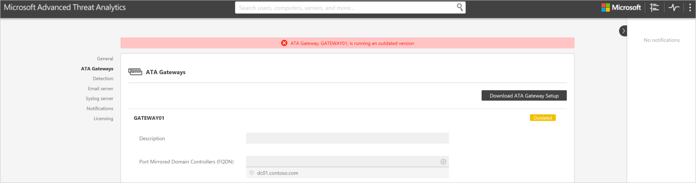
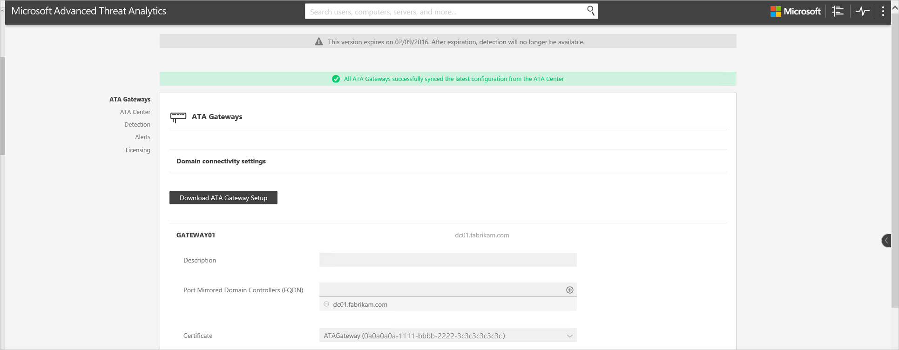

---
# required metadata

title: Advanced Threat Analytics update to 1.5 migration guide
description: Procedures to update ATA to version 1.5
keywords:
author: batamig
ms.author: bagol
manager: raynew
ms.date: 01/10/2023
ms.topic: conceptual
ms.service: advanced-threat-analytics
ms.technology:
ms.assetid: fb65eb41-b215-4530-93a2-0b8991f4e980

# optional metadata

#ROBOTS:
#audience:
#ms.devlang:
ms.reviewer: bennyl
ms.suite: ems
#ms.tgt_pltfrm:
#ms.custom:

---

# ATA update to 1.5 migration guide

The update to ATA 1.5 provides improvements in the following areas:

- Faster detection times

- Enhanced automatic detection algorithm for NAT (network address translation) devices

- Enhanced name resolution process for non-domain joined devices

- Support for data migration during product updates

- Better UI responsiveness for suspicious activities with thousands of entities involved

- Improved auto-resolution of health alerts

- Additional performance counters for enhanced monitoring and troubleshooting

## Updating ATA to version 1.5

> [!NOTE]
> If ATA is not installed in your environment, download the full version of ATA, which includes version 1.5  and follow the standard installation procedure described in [Install ATA](install-ata-step1.md).

If you already have ATA version 1.4 deployed, this procedure walks you through the steps necessary to update your installation.

Follow these steps to update to ATA version 1.5:

1. Download ATA v1.5 from VLSC or MSDN.
      > [!NOTE]
      > You can also use the updated full version of ATA to perform the update to version 1.5.

1. Update the ATA Center

1. Download the updated ATA Gateway package

1. Update the ATA Gateways

    > [!IMPORTANT]
    > Update all the ATA Gateways to make sure ATA functions properly.

### Step 1: Update the ATA Center

1. Back up your database: (optional)

    - If the ATA Center is running as a virtual machine and you want to take a checkpoint, shut down the virtual machine first.

    - If the ATA Center is running on a physical server, follow the recommended procedure to [back up MongoDB](https://www.mongodb.com/docs/manual/core/backups/).

1. Run the update file, Microsoft ATA Center Update.exe, and follow the instructions on the screen to install the update.

    1. In the **Welcome** page, select your language and select **Next**.

    2. Read the End-User License Agreement and if you accept the terms, select the checkbox, and then select **Next**.

    3. Select whether you want to run the full (default) or partial migration.

        

        - If you select **Partial** migration, any network traffic collected and forwarded Windows events analyzed by ATA are deleted and user behavioral profiles have to be relearned; this takes a minimum of three weeks. If you are running low on disk space, then it is helpful to run a **Partial** migration.

        - If you run a **Full** migration, you need additional disk space, as calculated for you on the upgrade page, and the migration may take longer, depending on the network traffic. The full migration retains all previously collected data and user behavioral profiles are maintained, meaning that it will not take additional time for ATA to learn behavior profiles and anomalous behavior can be detected immediately after update.

1. Select **Update**. Once you select **Update**, ATA is offline until the update procedure is complete.

1. After updating the ATA Center, the ATA Gateways will report that they are now outdated.

    

> [!IMPORTANT]
>
> - Update all the ATA Gateways to make sure ATA functions properly.

### Step 2: Download the ATA Gateway setup package

After configuring the domain connectivity settings, you can download the ATA Gateway setup package.

To download the ATA Gateway package:

1. Delete any previous versions of the ATA Gateway package you previously downloaded.

1. On the ATA Gateway machine, open a browser and enter the IP address you configured in the ATA Center for the ATA Console. When the ATA Console opens, select the settings icon and select **Configuration**.

    

1. In the **ATA Gateways** tab, select **Download ATA Gateway Setup**.

1. Save the package locally.

The zip file includes the following files:

- ATA Gateway installer

- Configuration setting file with the required information to connect to the ATA Center

### Step 3: Update the ATA Gateways

1. On each ATA Gateway, extract the files from the ATA Gateway package and run the file Microsoft ATA Gateway Setup.

    > [!NOTE]
    > You can also use this ATA Gateway package to install new ATA Gateways.

1. Your previous settings are preserved, but it may take a few minutes until for the service to restart.

1. Repeat this step for all other ATA Gateways deployed.

> [!NOTE]
> After successfully updating an ATA Gateway, the outdated notification for the specific ATA Gateway will go away.

You will know that all the ATA Gateways have been successfully updated when all the ATA Gateways report that they are successfully synced and the message that an updated ATA Gateway package is available is no longer displayed.

## See Also

- [Check out the ATA forum!](https://social.technet.microsoft.com/Forums/security/home?forum=mata)
