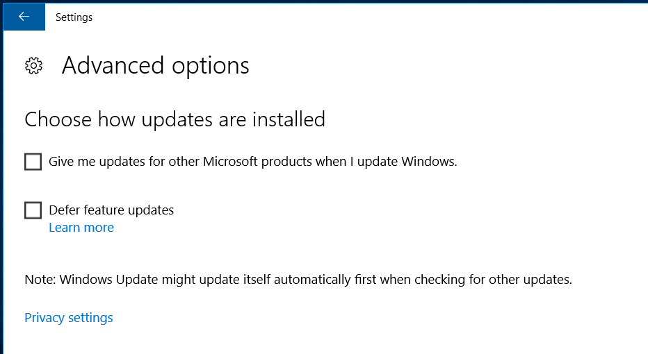
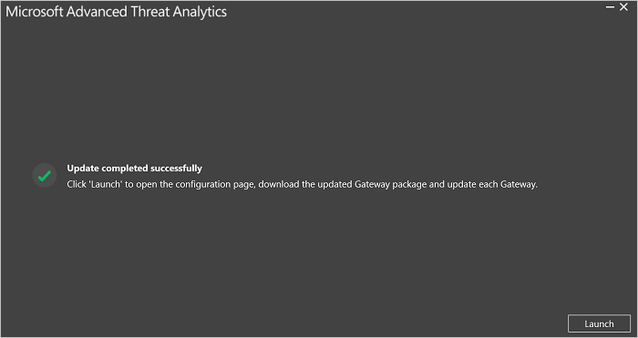

---
# required metadata

title: Advanced Threat Analytics update to 1.7 migration guide
description: Procedures to update ATA to version 1.7
keywords:
author: dcurwin
ms.author: dacurwin
manager: dcurwin
ms.date: 01/10/2023
ms.topic: conceptual
ms.prod: advanced-threat-analytics
ms.technology:
ms.assetid: 8eefcd45-7a4b-4074-ac5b-1ffc48e6654a

# optional metadata

#ROBOTS:
#audience:
#ms.devlang:
ms.reviewer: bennyl
ms.suite: ems
#ms.tgt_pltfrm:
#ms.custom:

---

# ATA update to 1.7 migration guide

The update to ATA 1.7 provides improvements in the following areas:

- New detections

- Improvements to existing detections
  

## Updating ATA to version 1.7

> [!NOTE] 
> If ATA is not installed in your environment, download the full version of ATA, which includes version 1.7 and follow the standard installation procedure described in [Install ATA](install-ata-step1.md).

If you already have ATA version 1.6 deployed, this procedure walks you through the steps necessary to update your deployment.

> [!NOTE] 
> You cannot install ATA version 1.7 directly on top of ATA version 1.4 or 1.5. You must install ATA version 1.6 first. 

Follow these steps to update to ATA version 1.7:

1.  [Download update 1.7](install-ata-step1.md#step-1-download-and-install-the-ata-center) 
In this version of, the same installation file (Microsoft ATA Center Setup.exe) is used for installing a new deployment of ATA and for upgrading existing deployments.

1. Update the ATA Center

1. Update the ATA Gateways

    > [!IMPORTANT]
    > Update all the ATA Gateways to make sure ATA functions properly.

### Step 1: Update the ATA Center

1. Back up your database: (optional)

    - If the ATA Center is running as a virtual machine and you want to take a checkpoint, shut down the virtual machine first.

    - If the ATA Center is running on a physical server, follow the recommended procedure to [back up MongoDB](https://www.mongodb.com/docs/manual/core/backups/).

1. Run the installation file, **Microsoft ATA Center Setup.exe**, and follow the instructions on the screen to install the update.

    - On the **Welcome** page, select your language and click **Next**.

    - If you didn't enable automatic updates in version 1.6, you are prompted to set ATA to use Microsoft Update for ATA to remain up-to-date.  In the Microsoft Update page, select **Use Microsoft Update when I check for updates (recommended)**.
    
     This adjusts the Windows settings to enable updates for other Microsoft products (including ATA), as seen here. 
    

    - In the **Data migration** screen, select whether you want to migrate all or partial data. If you choose to migrate only partial data, your previously captured network traffic and behavior profiles will not be migrated. This means that it takes three weeks before the abnormal behavior detection has a complete profile to enable anomalous activity detection. During those three weeks, all other ATA detections function properly. The **Partial** data migration takes much less time to install. If you select **Full** data migration, it may take a significant amount of time for the installation to complete. The estimated amount of time and the required disk space, which are listed on the **Data Migration** screen, depend on the amount of previously captured network traffic you had saved in previous versions of ATA. Before selecting **Partial** or **Full**, make sure to check these requirements.  
    
    

    - Click **Update**. After you click Update, ATA is offline until the update procedure is complete.

1. After the ATA Center update completes successfully, click **Launch** to open the **Update** screen in the ATA console for the ATA Gateways.
    

1. In the **Updates** screen, if you already set your ATA Gateways to automatically update, they update at this point, if not, click **Update** next to each ATA Gateway.
  

  
> [!IMPORTANT] 
> Update all the ATA Gateways to make sure ATA functions properly.
> The configured Syslog listener port on all Gateways will be changed to 514.
 
> [!NOTE] 
> To install new ATA Gateways, go the **Gateways** screen and click **Download Gateway Setup** to get the ATA 1.7 installation package and follow the instructions for new Gateway installation as described in [Step 4. Install the ATA Gateway](install-ata-step4.md).

## See Also

- [Check out the ATA forum!](https://social.technet.microsoft.com/Forums/security/home?forum=mata)
