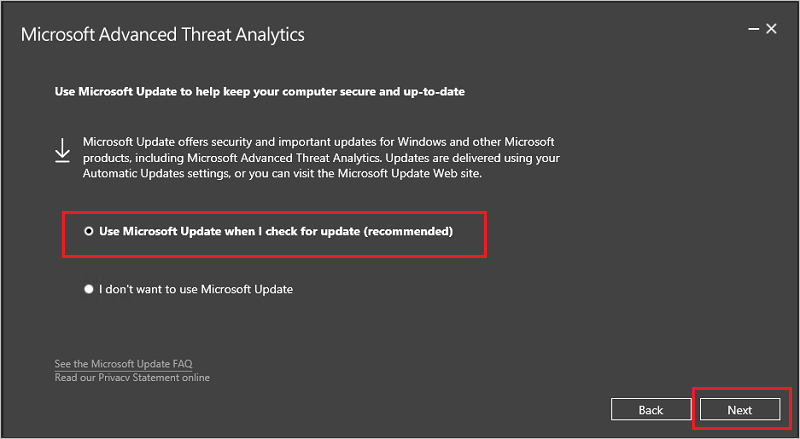
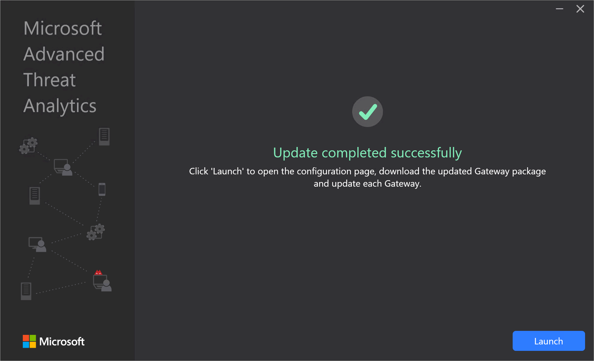
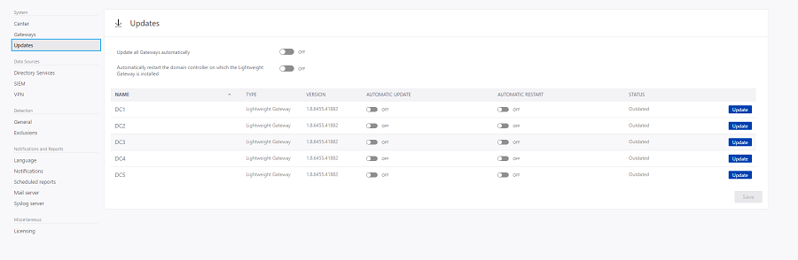

---
# required metadata

title: Advanced Threat Analytics update to 1.9 migration guide
description: Procedures to update ATA to version 1.9
keywords:
author: dcurwin
ms.author: dacurwin
manager: dcurwin
ms.date: 01/10/2023
ms.topic: conceptual
ms.service: advanced-threat-analytics
ms.technology:
ms.assetid: 2946310a-8e4e-48fc-9450-fc9647efeb22

# optional metadata

#ROBOTS:
#audience:
#ms.devlang:
#ms.tgt_pltfrm:
#ms.custom:

---

# Updating ATA to version 1.9

> [!NOTE]
> If ATA is not installed in your environment, download the full version of ATA, which includes version 1.9 and follow the standard installation procedure described in [Install ATA](install-ata-step1.md).

If you already have ATA version 1.8 deployed, this procedure walks you through the steps necessary to update your deployment.

> [!NOTE]
> Only ATA version 1.8 (1.8.6645) and ATA 1.8 update 1 (1.8.6765) can be updated to ATA version 1.9, any earlier version of ATA can't be directly updated to ATA version 1.9.

Follow these steps to update to ATA version 1.9:

1. [Download the update version of ATA 1.9 from the Download Center](https://www.microsoft.com/download/details.aspx?id=56725). 
In the migration version, the file can be used only for updating from ATA 1.8.

1. Update the ATA Center

1. Update the ATA Gateways

    > [!IMPORTANT]
    > Update all the ATA Gateways to make sure ATA functions properly.

## Step 1: Update the ATA Center

1. Back up your database: (optional)

   - If the ATA Center is running as a virtual machine and you want to take a checkpoint, shut down the virtual machine first.

   - If the ATA Center is running on a physical server, see the [Disaster recovery](disaster-recovery.md) article for information about backing up the database.

1. Run the installation file, **Microsoft ATA Center Setup.exe**, and follow the instructions on the screen to install the update.

   - On the **Welcome** page, choose your language and select **Next**.

   - If you didn't enable automatic updates in version 1.8, you are prompted to set ATA to use Microsoft Update for ATA to remain up-to-date.  In the Microsoft Update page, select **Use Microsoft Update when I check for updates (recommended)**.
     

     This adjusts the Windows settings to enable updates for  ATA.

   - The **Partial data migration** screen lets you know that previously captured network traffic, events, entities and detection related data is deleted. All detections work immediately with the exception of abnormal behavior detection, abnormal group modification, Reconnaissance using Directory Services (SAM-R), and encryption downgrade detections which take up to three weeks to build a complete profile after the required learning time.

     

   - Select **Update**. After you select **Update**, ATA is offline until the update procedure is complete.

1. After the ATA Center update completes successfully, select **Launch** to open the **Update** screen in the ATA console for the ATA Gateways.

    

1. In the **Updates** screen, if you already set your ATA Gateways to automatically update, they update at this point, if not, select **Update** next to each ATA Gateway.
  
    
  
> [!IMPORTANT]
> Update all the ATA Gateways to make sure ATA functions properly.

> [!NOTE]
> To install new ATA Gateways, go the **Gateways** screen and select **Download Gateway Setup** to get the ATA 1.9 Gateway installation package and follow the instructions for new Gateway installation as described in [Step 4. Install the ATA Gateway](install-ata-step4.md).

## See Also

- [Check out the ATA forum!](https://social.technet.microsoft.com/Forums/security/home?forum=mata)
