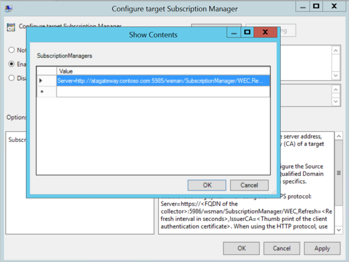
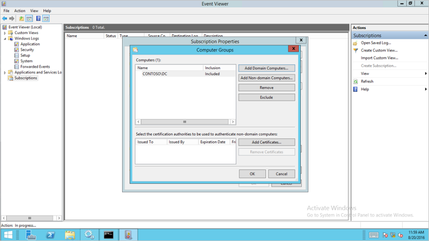

---
# required metadata

title: Configure Windows Event Forwarding in Advanced Threat Analytics
description: Describes your options for configuring Windows Event Forwarding with ATA
keywords:
author: batamig
ms.author: bagol
manager: raynew
ms.date: 01/10/2023
ms.topic: conceptual
ms.service: advanced-threat-analytics
ms.technology:
ms.assetid: 3f0498f9-061d-40e6-ae07-98b8dcad9b20

# optional metadata

#ROBOTS:
#audience:
#ms.devlang:
#ms.tgt_pltfrm:
#ms.custom:

---

# Configuring Windows Event Collection

[!INCLUDE [Banner for top of topics](includes/banner.md)]

> [!NOTE]
> For ATA versions 1.8 and higher, event collection configuration is no longer necessary for ATA Lightweight Gateways. The ATA Lightweight Gateway now read events locally, without the need to configure event forwarding.

To enhance detection capabilities, ATA needs the following Windows events: 4776, 4732, 4733, 4728, 4729, 4756, 4757, 7045. These can either be read automatically by the ATA Lightweight Gateway or in case the ATA Lightweight Gateway is not deployed, it can be forwarded to the ATA Gateway in one of two ways, by configuring the ATA Gateway to listen for SIEM events or by configuring Windows Event Forwarding.

> [!NOTE]
> If you are using Server Core, [wecutil](/windows-server/administration/windows-commands/wecutil) can be used to create and manage subscriptions to events that are forwarded from remote computers.

## WEF configuration for ATA Gateway's with port mirroring

After configuring port mirroring from the domain controllers to the ATA Gateway, use the following instructions to configure Windows Event forwarding using Source Initiated configuration. This is one way to configure Windows Event forwarding.

**Step 1: Add the network service account to the domain Event Log Readers Group.**

In this scenario, assume that the ATA Gateway is a member of the domain.

1. Open Active Directory Users and Computers, navigate to the **BuiltIn** folder and double-click **Event Log Readers**.
1. Select **Members**.
1. If **Network Service** is not listed, select **Add**, type **Network Service** in the **Enter the object names to select** field. Then select **Check Names** and select **OK** twice.

After adding the **Network Service** to the **Event Log Readers** group, reboot the domain controllers for the change to take effect.

**Step 2: Create a policy on the domain controllers to set the Configure target Subscription Manager setting.**

> [!NOTE]
> You can create a group policy for these settings and apply the group policy to each domain controller monitored by the ATA Gateway. The steps below modify the local policy of the domain controller.  

1. Run the following command on each domain controller: *winrm quickconfig*
1. From a command prompt type *gpedit.msc*.
1. Expand **Computer Configuration > Administrative Templates > Windows Components > Event Forwarding**

    

1. Double-click **Configure target Subscription Manager**.

   1. Select **Enabled**.
   2. Under **Options**, select **Show**.

   3. Under **SubscriptionManagers**, enter the following value and select **OK**: `Server=http://<fqdnATAGateway\>:5985/wsman/SubscriptionManager/WEC,Refresh=10`

        *(For example: Server=`http://atagateway9.contoso.com:5985/wsman/SubscriptionManager/WEC,Refresh=10`)*

        

   4. Select **OK**.
   5. From an elevated command prompt type *gpupdate /force*.

**Step 3: Perform the following steps on the ATA Gateway**

1. Open an elevated command prompt and type *wecutil qc*
1. Open **Event Viewer**.
1. Right-click **Subscriptions** and select **Create Subscription**.

    1. Enter a name and description for the subscription.
    2. For **Destination Log**, confirm that **Forwarded Events** is selected. For ATA to read the events, the destination log must be **Forwarded Events**.
    3. Select **Source computer initiated** and then choose **Select Computers Groups**.
        1. Select **Add Domain Computer**.
        2. Enter the name of the domain controller in the **Enter the object name to select** field. Then select **Check Names** and select **OK**.  
            
        3. Select **OK**.
    4. Select **Select Events**.
        1. Select **By log** and select **Security**.
        2. In the **Includes/Excludes Event ID** field type the event number and select **OK**. For example, type 4776, like in the following sample.

        

    5. Right-click the created subscription and select **Runtime Status** to see if there are any issues with the status.
    6. After a few minutes, check to see that the events you set to be forwarded is showing up in the Forwarded Events on the ATA Gateway.

For more information, see: [Configure the computers to forward and collect events](/previous-versions/windows/it-pro/windows-server-2008-R2-and-2008/cc748890(v=ws.11))

## See Also

- [Install ATA](install-ata-step1.md)
- [Check out the ATA forum!](https://social.technet.microsoft.com/Forums/security/home?forum=mata)
