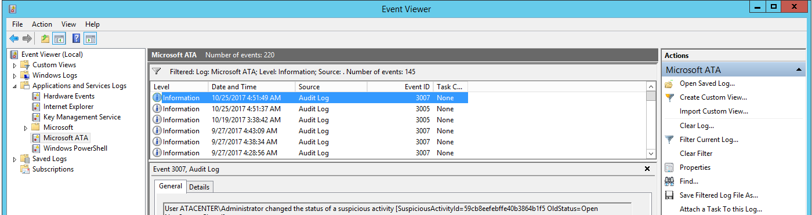

---
# required metadata

title: ATA event ID reference | Microsoft Docs 
description: Provides a list of ATA events IDs and their descriptions. 
keywords:
author: dcurwin
ms.author: dacurwin
manager: dcurwin
ms.date: 01/10/2023
ms.topic: conceptual
ms.service: advanced-threat-analytics
ms.technology:
ms.assetid: 5d639e84-2e37-43a9-9667-49be6c4fa8b7

# optional metadata

#ROBOTS:
#audience:
#ms.devlang:
ms.reviewer: arzinger

ms.suite: ems
#ms.tgt_pltfrm:
#ms.custom:

---

# ATA event ID reference

[!INCLUDE [Banner for top of topics](includes/banner.md)]

The ATA Center event viewer logs events for ATA. This article provides a list of event IDs and provides a description of each.

The events can be found here:

## ATA health events

|Event ID|Alert name|
|---------|---------------|
|1001|Center running out of disk space|
|1003|Center overloaded|
|1004|Center certificate about to expire / Center certificate expired|
|1005|MongoDB is down|
|1006|Read-only user password to expire shortly / Read-only user password expired|
|1007|Domain synchronizer not assigned|
|1008|Some or All of the capture network adapters on a Gateway are not available|
|1009|A capture network adapter on a Gateway no longer exists|
|1010|Some domain controllers are unreachable by a Gateway  /  All domain controllers are unreachable by a Gateway|
|1011|Gateway stopped communicating|
|1012|Some forwarded events are not being analyzed|
|1013|Some network traffic is not being analyzed|
|1014|Failure sending mail|
|1015|Failure connecting to the SIEM server using Syslog|
|1016|Gateway version outdated|
|1017|No traffic received from domain controller|
|1018|Gateway service failed to start|
|1019|Lightweight Gateway reached a memory resource limit|
|1020|Gateway is not processing Radius events|
|1021|Gateway is not processing Syslog events|
|1022|Geolocation service is unavailable|
 
## ATA security alert events

|Event ID|Alert name|
|---------|---------------|
|2001|Suspicion of identity theft based on abnormal behavior|
|2002|Unusual protocol implementation|
|2003|Reconnaissance using account enumeration|
|2004|Brute force attack using LDAP simple bind|
|2006|Malicious replication of Directory Services|
|2007|Reconnaissance using DNS|
|2008|Encryption downgrade activity|
|2009|Encryption downgrade activity (potential golden ticket)|
|2010|Encryption downgrade activity (potential overpass-the-hash)|
|2011|Encryption downgrade activity (potential skeleton key)|
|2012|Reconnaissance using SMB session enumeration|
|2013|Privilege escalation using forged authorization data|
|2014|Honeytoken activity|
|2016|Massive object deletion|
|2017|Identity theft using Pass-the-Hash attack|
|2018|Identity theft using Pass-the-Ticket attack|
|2019|Remote execution attempt detected|
|2020|Malicious data protection private information request|
|2021|Reconnaissance using Directory Services queries|
|2022|Kerberos Golden Ticket activity|
|2023|Suspicious authentication failures|
|2024|Abnormal modification of sensitive groups|
|2026|Suspicious service creation|

## ATA auditing events

|Event ID|Alert name|
|---------|---------------|
|3001|Change to ATA configuration|
|3002|ATA Gateway added|
|3003|ATA Gateway deleted|
|3004|ATA license activated|
|3005|Log in to ATA console|
|3006|Manual change to health activity status|
|3007|Manual change to suspicious activity status|

## See Also
- [ATA prerequisites](ata-prerequisites.md)
- [ATA capacity planning](ata-capacity-planning.md)
- [Configure event collection](configure-event-collection.md)
- [Configuring Windows event forwarding](configure-event-collection.md)
- [Check out the ATA forum!](https://social.technet.microsoft.com/Forums/security/home?forum=mata)
