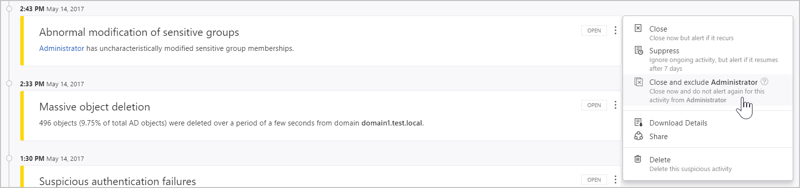
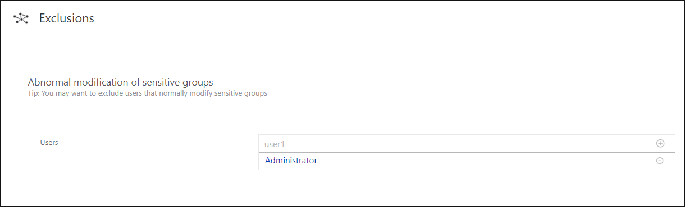

---
# required metadata

title: Excluding entities from detections in Advanced Threat Analytics
description: Describes how to stop ATA from detecting specific entity activities as suspicious
keywords:
author: batamig
ms.author: bagol
manager: raynew
ms.date: 01/10/2023
ms.topic: conceptual
ms.service: advanced-threat-analytics
ms.technology:
ms.assetid: 344c0f33-45e1-42e2-a051-f722a4504531

# optional metadata

#ROBOTS:
#audience:
#ms.devlang:
ms.reviewer: bennyl
ms.suite: ems
#ms.tgt_pltfrm:
#ms.custom:

---

# Excluding entities from detections

[!INCLUDE [Banner for top of topics](includes/banner.md)]

This article explains how to exclude entities from triggering alerts in order to minimize true benign positives but at the same time, make sure you catch the true positives. In order to keep ATA from being noisy about activities that, from specific users, may be part of your normal rhythm of business, you can quiet - or exclude - specific entities from raising alerts.

For example, if you have a security scanner that does DNS recon or an admin who remotely runs scripts on the domain controller - and these are sanctioned activities whose intent is part of the normal IT operations in your organization.

To exclude entities from raising alerts in ATA:

There are two ways in which you can exclude entities, from the suspicious activity itself, or from the **Exclusions** tab on the **Configuration** page.

- **From the suspicious activity**: In the Suspicious activity timeline, when you receive an alert on an activity for a user or computer or IP address that is allowed to perform the particular activity and may do so frequently, right-click the three dots at the end of the row for the suspicious activity on that entity, and select **Close and exclude**.   This adds the user, computer, or IP address to the exclusions list for that suspicious activity. It  closes the suspicious activity and it is no longer listed in the **Open** events list in the **Suspicious activity timeline**.

    

- **From the Configuration page**:  To review or modify any exclusions: under **Configuration**, click **Exclusions** and then select the suspicious activity, such as **Sensitive account credentials exposed**.

    

To remove an entity from the **Exclusions** configuration: click the minus next to the entity name and then click **Save** at the bottom of the page.

It is recommended that you add exclusions to detections only after you get alerts of the type and determine that they are true benign positives. 

> [!NOTE]
> For your protection, not all detections provide the possibility to set exclusions. 

Some of the detections provide tips that help you decide what to exclude. 

Each exclusion depends on the context, in some you can set users while for others you can set computers or IP addresses. 

When you have the possibility of excluding an IP address or a computer, you can exclude one or the other - you don’t need to provide both.

> [!NOTE]
> The configuration pages can only be modified by ATA admins.

## See Also
- [Check out the ATA forum!](https://social.technet.microsoft.com/Forums/security/home?forum=mata)
- [Modifying ATA configuration](modifying-ata-center-configuration.md)
