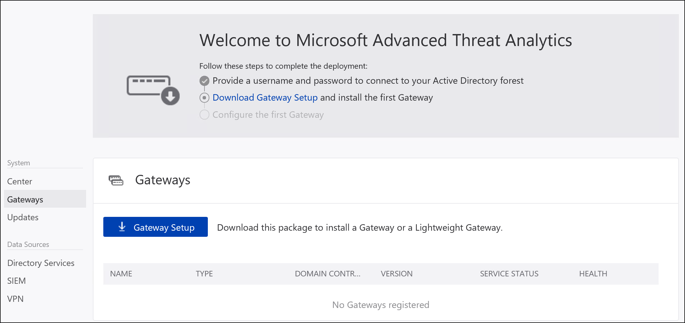

---
# required metadata

title: Install Advanced Threat Analytics - Step 3 | Microsoft Docs
description: Step three of installing ATA helps you download the ATA Gateway setup package.
keywords:
author: rkarlin
ms.author: rkarlin
manager: rkarlin
ms.date: 3/21/2018
ms.topic: conceptual
ms.prod: advanced-threat-analytics
ms.technology:
ms.assetid: 7fb024e6-297a-4ad9-b962-481bb75a0ba3

# optional metadata

#ROBOTS:
#audience:
#ms.devlang:
ms.reviewer: bennyl
ms.suite: ems
#ms.tgt_pltfrm:
#ms.custom:

---

# Install ATA - Step 3

*Applies to: Advanced Threat Analytics version 1.9*

> [!div class="step-by-step"]
> [« Step 2](install-ata-step2.md)
> [Step 4 »](install-ata-step4.md)

## Step 3. Download the ATA Gateway setup package

After configuring the domain connectivity settings, you can download the ATA Gateway setup package. The ATA Gateway can be installed on a dedicated server or on a domain controller. If you install it on a domain controller, it is installed as an ATA Lightweight Gateway. For more information on the ATA Lightweight Gateway, see [ATA Architecture](ata-architecture.md). 

Click **Download Gateway Setup** in the list of steps at the top of the page to go to the **Gateways** page.

> [!NOTE] 
> To reach the Gateway configuration screen later, click the **settings icon** (upper right corner) and select **Configuration**, then, under **System**, click **Gateways**.  

1.  Click **Gateway Setup**.
  
2.  Save the package locally.
3.  Copy the package to the dedicated server or domain controller onto which you are installing the ATA Gateway. Alternatively, you can open the ATA Console from the dedicated server or domain controller and skip this step.

The zip file includes the following files:

-   ATA Gateway installer

-   Configuration setting file with the required information to connect to the ATA Center

> [!div class="step-by-step"]
> [« Step 2](install-ata-step2.md)
> [Step 4 »](install-ata-step4.md)

## Related Videos
- [ATA Deployment Overview](https://channel9.msdn.com/Shows/Microsoft-Security/Overview-of-ATA-Deployment-in-10-Minutes)
- [Choosing the right ATA Gateway type](https://channel9.msdn.com/Shows/Microsoft-Security/ATA-Deployment-Choose-the-Right-Gateway-Type)

## See Also
- [ATA POC deployment guide](http://aka.ms/atapoc)
- [ATA sizing tool](http://aka.ms/atasizingtool)
- [Check out the ATA forum!](https://social.technet.microsoft.com/Forums/security/home?forum=mata)
- [Configure event collection](configure-event-collection.md)
- [ATA prerequisites](ata-prerequisites.md)
