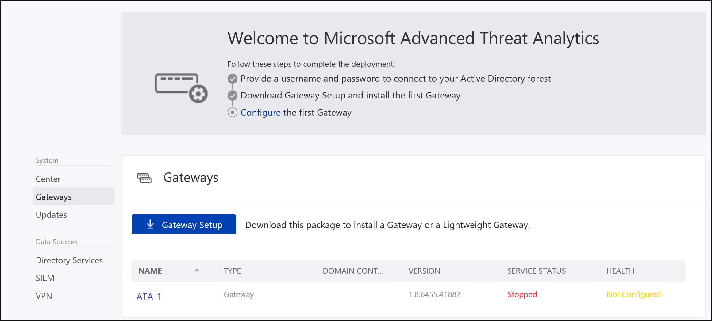
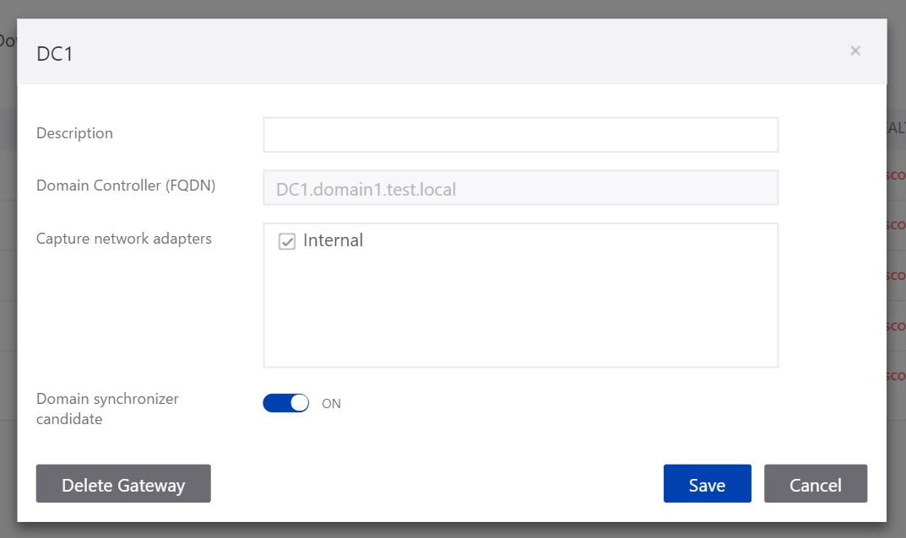

---
# required metadata

title: Install Advanced Threat Analytics - Step 5
description: Step five of installing ATA helps you configure settings for your ATA Gateway.
keywords:
author: batamig
ms.author: bagol
manager: raynew
ms.date: 01/10/2023
ms.topic: conceptual
ms.service: advanced-threat-analytics
ms.technology:
ms.assetid: 2a5b6652-2aef-464c-ac17-c7e5f12f920f

# optional metadata

#ROBOTS:
#audience:
#ms.devlang:
ms.reviewer: bennyl
ms.suite: ems
#ms.tgt_pltfrm:
#ms.custom:

---

# Install ATA - Step 5

[!INCLUDE [Banner for top of topics](includes/banner.md)]

> [!div class="step-by-step"]
> [« Step 4](install-ata-step4.md)
> [Step 6 »](install-ata-step6.md)

## Step 5: Configure the ATA Gateway settings

After the ATA Gateway was installed, perform the following steps to configure the settings for the ATA Gateway.

1. In the ATA Console, go to **Configuration** and, under **System**, select **Gateways**.

    

1. Click on the Gateway you want to configure and enter the following information:

    

    - **Description**: Enter a description for the ATA Gateway (optional).
    - **Port Mirrored Domain Controllers (FQDN)** (required for the ATA Gateway, this cannot be changed for the ATA Lightweight Gateway): Enter the complete FQDN of your domain controller and click the plus sign to add it to the list. For example,  **dc01.contoso.com**

    The following information applies to the servers you enter in the **Domain Controllers** list:

    - All domain controllers whose traffic is being monitored via port mirroring by the ATA Gateway must be listed in the **Domain Controllers** list. If a domain controller is not listed in the **Domain Controllers** list, detection of suspicious activities might not function as expected.
    - At least one domain controller in the list should be a global catalog. This enables ATA to resolve computer and user objects in other domains in the forest.

    - **Capture Network adapters** (required):
    - For an ATA Gateway on a dedicated server, select the network adapters that are configured as the destination mirror port. These receive the mirrored domain controller traffic.
    - For an ATA Lightweight Gateway, this should be all the network adapters that are used for communication with other computers in your organization.

    - **Domain synchronizer candidate**: Any ATA Gateway set to be a domain synchronizer candidate can be responsible for synchronization between ATA and your Active Directory domain. Depending on the size of the domain, the initial synchronization might take some time and is resource-intensive. By default, only ATA Gateways are set as Domain synchronizer candidates.
    It is recommended that you disable any remote site ATA Gateways from being Domain synchronizer candidates.
    If your domain controller is read-only, do not set it as a Domain synchronizer candidate. For more information, see [ATA architecture](ata-architecture.md#ata-lightweight-gateway-features).

    > [!NOTE]
    > It will take a few minutes for the ATA Gateway service to start the first time after installation because it builds the cache of the network capture parsers.
    > The configuration changes are applied to the ATA Gateway on the next scheduled sync between the ATA Gateway and the ATA Center.

1. Optionally, you can set the [Syslog listener and Windows Event Forwarding Collection](configure-event-collection.md).
1. Enable **Update ATA Gateway automatically** so that in upcoming version releases when you update the ATA Center, this ATA Gateway is automatically updated.

1. Click **Save**.

## Validate installations

To validate that the ATA Gateway has been successfully deployed, check the following steps:

1. Check that the service named **Microsoft Advanced Threat Analytics Gateway** is running. After you save the ATA Gateway settings, it might take a few minutes for the service to start.

1. If the service does not start, review the "Microsoft.Tri.Gateway-Errors.log" file located in the following default folder, "%programfiles%\Microsoft Advanced Threat Analytics\Gateway\Logs" and Check [ATA Troubleshooting](troubleshooting-ata-known-errors.md) for help.

1. If this is the first ATA Gateway installed, after a few minutes, log into the ATA Console and open the notification pane by swiping the right side of the screen open. You should see a list of **Entities Recently Learned** in the notification bar on the right side of the console.

1. On the desktop, click the **Microsoft Advanced Threat Analytics** shortcut to connect to the ATA Console. Log in with the same user credentials that you used to install the ATA Center.
1. In the console, search for something in the search bar, such as a user or a group on your domain.
1. Open Performance Monitor. In the Performance tree, click on **Performance Monitor** and then click the plus icon to **Add a Counter**. Expand **Microsoft ATA Gateway** and scroll down to **Network Listener PEF Captured Messages/Sec** and add it. Then, make sure you see activity on the graph.

    

### Set anti-virus exclusions

After installing the ATA Gateway, exclude the ATA directory from being continuously scanned by your anti-virus application. The default location in the database is: **C:\Program Files\Microsoft Advanced Threat Analytics\**.

Make sure to also exclude the following processes from AV scanning:

**Processes**  
Microsoft.Tri.Gateway.exe  
Microsoft.Tri.Gateway.Updater.exe

If you installed ATA in different directory, make sure to change the folder paths according to your installation.

> [!div class="step-by-step"]
> [« Step 4](install-ata-step4.md)
> [Step 6 »](install-ata-step6.md)

## See also

- [ATA POC deployment guide](/samples/browse/?redirectedfrom=TechNet-Gallery)
- [ATA sizing tool](https://aka.ms/atasizingtool)
- [Check out the ATA forum!](https://social.technet.microsoft.com/Forums/security/home?forum=mata)
- [Configure event collection](configure-event-collection.md)
- [ATA prerequisites](ata-prerequisites.md)
