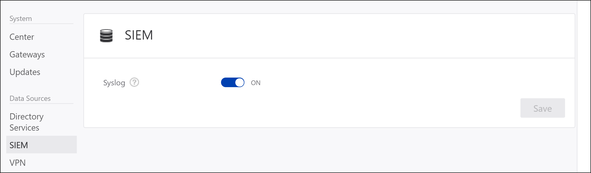

---
# required metadata

title: Install Advanced Threat Analytics - Step 6 | Microsoft Docs
description: In this step of installing ATA, you configure data sources.
keywords:
author: rkarlin
ms.author: rkarlin
manager: mbaldwin
ms.date: 07/2/2017
ms.topic: get-started-article
ms.prod:
ms.service: advanced-threat-analytics
ms.technology:
ms.assetid: 8980e724-06a6-40b0-8477-27d4cc29fd2b

# optional metadata

#ROBOTS:
#audience:
#ms.devlang:
ms.reviewer: bennyl
ms.suite: ems
#ms.tgt_pltfrm:
#ms.custom:

---

*Applies to: Advanced Threat Analytics version 1.8*

# Install ATA - Step 6

>[!div class="step-by-step"]
[« Step 5](install-ata-step5.md)

## Step 6. Configure event collection and VPN
### Configure Event Collection
To enhance detection capabilities, ATA needs the following Windows events: 4776, 4732, 4733, 4728, 4729, 4756, 4757. These can either be read automatically by the ATA Lightweight Gateway or in case the ATA Lightweight Gateway is not deployed, it can be forwarded to the ATA Gateway in one of two ways, by configuring the ATA Gateway to listen for SIEM events or by [Configuring Windows Event Forwarding](#configuring-windows-event-forwarding).

> [!NOTE]
> For ATA versions 1.8 and higher, event collection configuration is no longer necessary for ATA Lightweight Gateways. The ATA Lightweight Gateway can now read events locally, without the need to configure event forwarding.

In addition to collecting and analyzing network traffic to and from the domain controllers, ATA can use Windows event 4776 to further enhance ATA Pass-the-Hash detection. This can be received from your SIEM or by setting Windows Event Forwarding from your domain controller. Events collected provide ATA with additional information that is not available via the domain controller network traffic.

#### SIEM/Syslog
For ATA to be able to consume data from a Syslog server, you need to do the following:

-   Configure your ATA Gateway servers to listen to and accept events forwarded from the SIEM/Syslog server.
> [!NOTE]
> ATA only listens on IPv4 and not IPv6. 
-   Configure your SIEM/Syslog server to forward specific events to the ATA Gateway.

> [!IMPORTANT]
> -   Do not forward all the Syslog data to the ATA Gateway.
> -   ATA supports UDP traffic from the SIEM/Syslog server.

Refer to your SIEM/Syslog server's product documentation for information on how to configure forwarding of specific events to another server. 

> [!NOTE]
>If you do not use a SIEM/Syslog server, you can configure your Windows domain controllers to forward Windows Event ID 4776 to be collected and analyzed by ATA. Windows Event ID 4776 provides data regarding NTLM authentications.

#### Configuring the ATA Gateway to listen for SIEM events

1.  In ATA Configuration, under **Data sources** click **SIEM** and turn on **Syslog** and click **Save**.

    

2.  Configure your SIEM or Syslog server to forward Windows Event ID 4776 to the IP address of one of the ATA Gateways. For additional information on configuring your SIEM, refer to your SIEM online help or technical support options for specific formatting requirements for each SIEM server.

ATA supports SIEM events in the following formats:  

#### RSA Security Analytics
&lt;Syslog Header&gt;RsaSA\n2015-May-19 09:07:09\n4776\nMicrosoft-Windows-Security-Auditing\nSecurity\XXXXX.subDomain.domain.org.il\nYYYYY$\nMMMMM \n0x0

-   Syslog header is optional.

-   “\n” character separator is required between all fields.

-   The fields, in order, are:

    1.  RsaSA constant (must appear).

    2.  The timestamp of the actual event (make sure it’s not the timestamp of the arrival to the SIEM or when it’s sent to ATA). Preferably  in milliseconds accuracy, this is very important.

    3.  The Windows event ID

    4.  The Windows event provider name

    5.  The Windows event log name

    6.  The name of the computer receiving the event (the DC in this case)

    7.  The name of the user authenticating

    8.  The name of the source host name

    9. The result code of the NTLM

-   The order is important and nothing else should be included in the message.

#### HP Arcsight
CEF:0|Microsoft|Microsoft Windows||Microsoft-Windows-Security-Auditing:4776|The domain controller attempted to validate the credentials for an account.|Low| externalId=4776 cat=Security rt=1426218619000 shost=KKKKKK dhost=YYYYYY.subDomain.domain.com duser=XXXXXX cs2=Security cs3=Microsoft-Windows-Security-Auditing cs4=0x0 cs3Label=EventSource cs4Label=Reason or Error Code

-   Must comply with the protocol definition.

-   No syslog header.

-   The header part (the part that’s separated by a pipe) must exist (as stated in the protocol).

-   The following keys in the _Extension_ part must be present in the event:

    -   externalId = the Windows event ID

    -   rt = the timestamp of the actual event (make sure it’s not the timestamp of the arrival to the SIEM or when it’s sent to us). Preferably  in milliseconds accuracy, this is very important.

    -   cat = the Windows event log name

    -   shost = the source host name

    -   dhost = the computer receiving the event (the DC in this case)

    -   duser = the user authenticating

-   The order is not important for the _Extension_ part

-   There must be a custom key and keyLable for these two fields:

    -   “EventSource”

    -   “Reason or Error Code” = The result code of the NTLM

#### Splunk
&lt;Syslog Header&gt;\r\nEventCode=4776\r\nLogfile=Security\r\nSourceName=Microsoft-Windows-Security-Auditing\r\nTimeGenerated=20150310132717.784882-000\r\ComputerName=YYYYY\r\nMessage=

The computer attempted to validate the credentials for an account.

Authentication Package:              MICROSOFT_AUTHENTICATION_PACKAGE_V1_0

Logon Account: Administrator

Source Workstation:       SIEM

Error Code:         0x0

-   Syslog header is optional.

-   There’s a “\r\n” character separator between all required fields.

-   The fields are in key=value format.

-   The following keys must exists and have a value:

    -   EventCode = the Windows event ID

    -   Logfile = the Windows event log name

    -   SourceName = The Windows event provider name

    -   TimeGenerated = the timestamp of the actual event (make sure it’s not the timestamp of the arrival to the SIEM or when it’s sent to ATA). The format should match yyyyMMddHHmmss.FFFFFF, preferably  in milliseconds accuracy, this is very important.

    -   ComputerName = the source host name

    -   Message = the original event text from the Windows event

-   The Message Key and value MUST be last.

-   The order is not important for the key=value pairs.

#### QRadar
QRadar enables event collection via an agent. If the data is gathered using an agent, the time format is gathered without millisecond data. Because ATA necessitates millisecond data, it is necessary to set QRadar to use agentless Windows event collection. For more information, see [http://www-01.ibm.com/support/docview.wss?uid=swg21700170](http://www-01.ibm.com/support/docview.wss?uid=swg21700170 "QRadar: Agentless Windows Events Collection using the MSRPC Protocol").

    <13>Feb 11 00:00:00 %IPADDRESS% AgentDevice=WindowsLog AgentLogFile=Security Source=Microsoft-Windows-Security-Auditing Computer=%FQDN% User= Domain= EventID=4776 EventIDCode=4776 EventType=8 EventCategory=14336 RecordNumber=1961417 TimeGenerated=1456144380009 TimeWritten=1456144380009 Message=The computer attempted to validate the credentials for an account. Authentication Package: MICROSOFT_AUTHENTICATION_PACKAGE_V1_0 Logon Account: Administrator Source Workstation: HOSTNAME Error Code: 0x0

The fields needed are:

- The agent type for the collection
- The Windows event log provider name
- The Windows event log source
- The DC fully qualified domain name
- The Windows event ID

TimeGenerated is the timestamp of the actual event (make sure it’s not the timestamp of the arrival to the SIEM or when it’s sent to ATA). The format should match yyyyMMddHHmmss.FFFFFF, preferably in milliseconds accuracy, this is very important.

Message is the original event text from the Windows event

Make sure to have \t between the key=value pairs.

>[!NOTE] 
> Using WinCollect for Windows event collection is not supported.

### Configuring VPN

ATA collects VPN data that helps in profiling the locations from which computers connect to the network.

To configure VPN data, go to Configuration > VPN, and enter the Radius Account shared secret of your VPN.

To get the shared secret, refer to your VPN Documentation. 
The supported VPN servers are:

- MS-VPN
- F5-BIGIP
- Check Point
- McAfee
- Qrada
- Cisco ASA

>[!div class="step-by-step"]
[« Step 5](install-ata-step5.md)
[Step 7 »](install-ata-step7.md)

## See Also

- [Check out the ATA forum!](https://social.technet.microsoft.com/Forums/security/home?forum=mata)
- [Configure event collection](configure-event-collection.md)
- [ATA prerequisites](ata-prerequisites.md)

