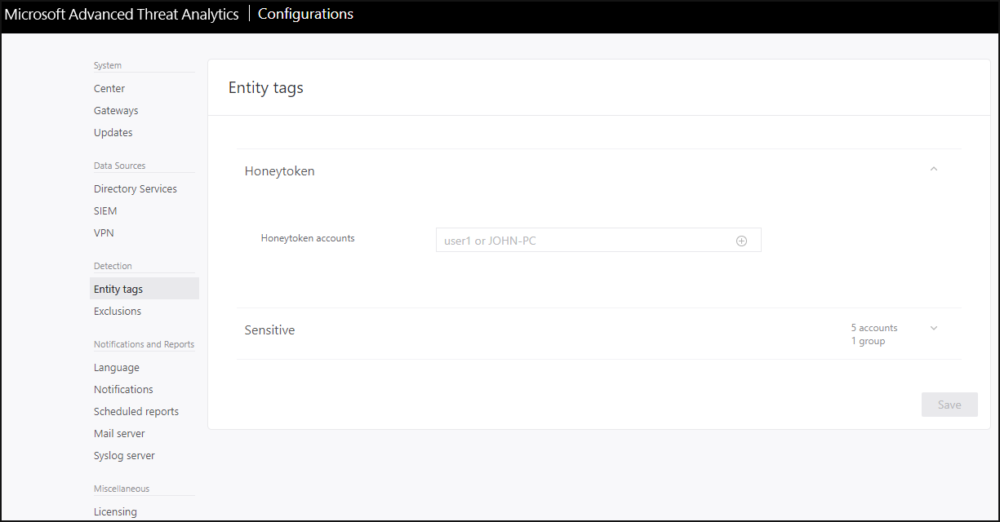
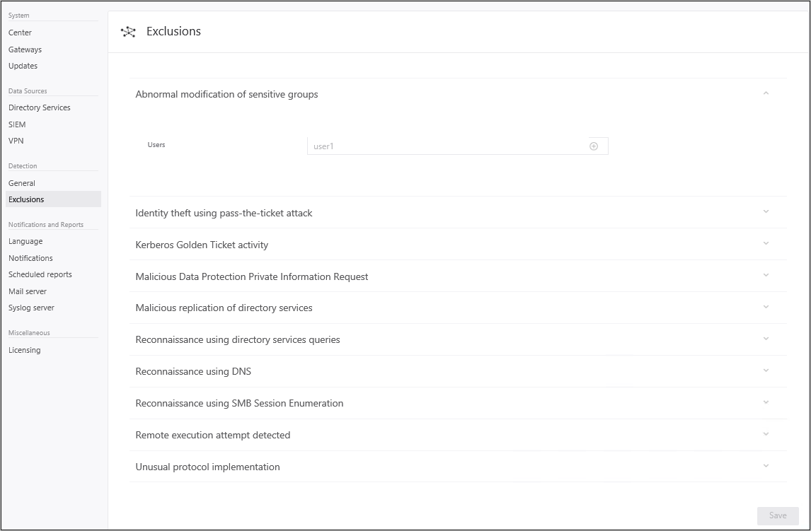

---
# required metadata

title: Install Advanced Threat Analytics - Step 8
description: In the final step of installing ATA, you configure the Honeytoken user.
keywords:
author: dcurwin
ms.author: dacurwin
manager: dcurwin
ms.date: 01/10/2023
ms.topic: conceptual
ms.service: advanced-threat-analytics
ms.technology:
ms.assetid: 8980e724-06a6-40b0-8477-27d4cc29fd2b

# optional metadata

#ROBOTS:
#audience:
#ms.devlang:
ms.reviewer: bennyl
ms.suite: ems
#ms.tgt_pltfrm:
#ms.custom:

---

# Install ATA - Step 8

[!INCLUDE [Banner for top of topics](includes/banner.md)]

> [!div class="step-by-step"]
> [« Step 7](vpn-integration-install-step.md)
> [Step 9 »](install-ata-step9-samr.md)

## Step 8. Configure IP address exclusions and Honeytoken user

ATA enables the exclusion of specific IP addresses or users from a number of detections.

For example, a **DNS Reconnaissance exclusion** could be a security scanner that uses DNS as a scanning mechanism. The exclusion helps ATA ignore such scanners. An example of a *Pass-the-Ticket* exclusion is a NAT device.

ATA also enables the configuration of a Honeytoken user, which is used as a trap for malicious actors - any authentication associated with this (normally dormant) account triggers an alert.

To configure this, follow these steps:

1. From the ATA Console, click on the settings icon and select **Configuration**.

    

1. Under **Detection**, click **Entity tags**.

1. Under **Honeytoken accounts** enter the Honeytoken account name. The Honeytoken accounts field is searchable and automatically displays entities in your network.

    

1. Click **Exclusions**. For each type of threat, enter a user account or IP address to be excluded from the detection of these threats and click the *plus* sign. The **Add entity** (user or computer) field is searchable and will autofill with entities in your network. For more information, see [Excluding entities from detections](excluding-entities-from-detections.md)

    

1. Click **Save**.

Congratulations, you have successfully deployed Microsoft Advanced Threat Analytics!

Check the attack time line to view detected suspicious activities and search for users or computers and view their profiles.

ATA starts scanning for suspicious activities immediately. Some activities, such as some of the suspicious behavior activities, is not available until ATA has had time to build behavioral profiles (minimum of three weeks).

To check that ATA is up and running and catching breaches in your network, you can check out the [ATA attack simulation playbook](https://aka.ms/ataplaybook).

> [!div class="step-by-step"]
> [« Step 7](vpn-integration-install-step.md)
> [Step 9 »](install-ata-step9-samr.md)

## See also

- [ATA POC deployment guide](/samples/browse/?redirectedfrom=TechNet-Gallery)
- [ATA sizing tool](https://aka.ms/atasizingtool)
- [Check out the ATA forum!](https://social.technet.microsoft.com/Forums/security/home?forum=mata)
- [Configure event collection](configure-event-collection.md)
- [ATA prerequisites](ata-prerequisites.md)
