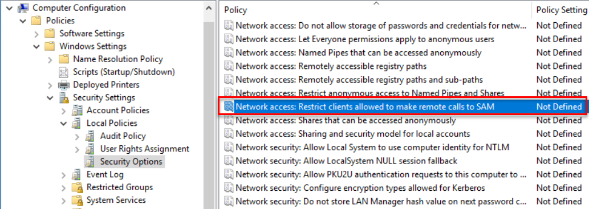
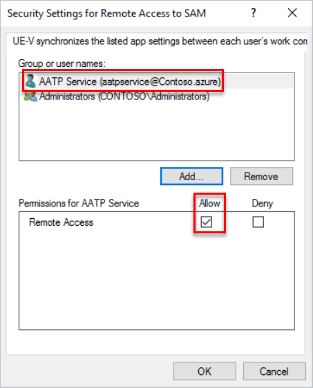
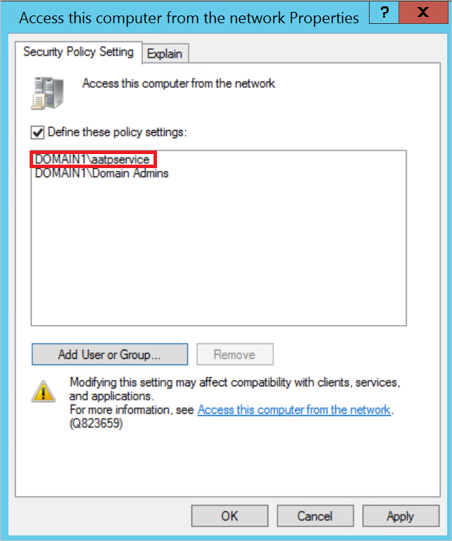

---
# required metadata

title: Configure SAM-R to enable lateral movement path detection in Advanced Threat Analytics
description: Describes how to configure SAM-R to enable lateral movement path detection in Advanced Threat Analytics (ATA)
keywords:
author: batamig
ms.author: bagol
manager: raynew
ms.date: 01/10/2023
ms.topic: conceptual
ms.service: advanced-threat-analytics
ms.technology:
ms.assetid: 7597ed25-87f5-472c-a496-d5f205c9c391

# optional metadata

#ROBOTS:
#audience:
#ms.devlang:
ms.reviewer: itargoet
ms.suite: ems
#ms.tgt_pltfrm:
#ms.custom:

---

# Install ATA - Step 9

[!INCLUDE [Banner for top of topics](includes/banner.md)]

> [!div class="step-by-step"]
> [« Step 8](install-ata-step7.md)

> [!NOTE]
> Before enforcing any new policy, always make sure that your environment remains secure, without impacting application compatibility by first enabling and verifying your proposed changes in audit mode.

## Step 9: Configure SAM-R required permissions

The [lateral movement path](use-case-lateral-movement-path.md) detection relies on queries that identify local admins on specific machines. These queries are performed using the SAM-R protocol, via the ATA Service account created in [Step 2. Connect to AD](install-ata-step2.md).

To ensure that Windows clients and servers allow the ATA service account to perform this SAM-R operation, a modification to your **Group policy** must be made that adds the ATA service account in addition to the configured accounts listed in the **Network access** policy. This group policy should be applied for every device in your organization.

1. Locate the policy:

   - Policy Name: Network access - Restrict clients allowed to make remote calls to SAM
   - Location: Computer configuration, Windows settings, Security settings, Local policies, Security options
  
    

1. Add the ATA service to the list of approved accounts able to perform this action on your modern Windows systems.

    

1. The **ATA Service** (the ATA service created during installation) now has the proper privileges to perform SAM-R in the environment.

 For more information on SAM-R and Group Policy, see [Network access: Restrict clients allowed to make remote calls to SAM](/windows/security/threat-protection/security-policy-settings/network-access-restrict-clients-allowed-to-make-remote-sam-calls).

### Access this computer from the network setting

If you've defined the [Access this computer from the network](/windows/security/threat-protection/security-policy-settings/access-this-computer-from-the-network) setting in any GPO that applies to computers in your domain, you need to add the ATA service account to the list of allowed accounts for that setting:

>[!NOTE]
>The setting is not enabled by default. If you have not enabled it previously, you don't need to modify it to allow Defender for Identity to make remote calls to SAM.

To add the service account, go to the policy and navigate to **Computer Configuration** -> **Policies** -> **Windows Settings** -> **Local Policies** -> **User Right Assignment**. Then open the setting **Access this computer from the network**.

Then add the ATA service account to the list of approved accounts.

> [!div class="step-by-step"]
> [« Step 8](install-ata-step7.md)

## See Also

- [ATA POC deployment guide](/samples/browse/?redirectedfrom=TechNet-Gallery)
- [ATA sizing tool](https://aka.ms/atasizingtool)
- [Check out the ATA forum!](https://social.technet.microsoft.com/Forums/security/home?forum=mata)
- [Configure event collection](configure-event-collection.md)
- [ATA prerequisites](ata-prerequisites.md)
