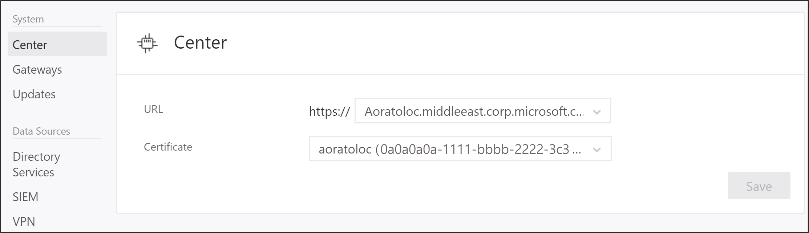
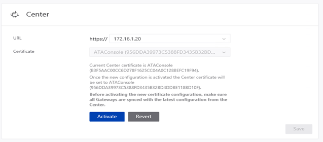

---
# required metadata

title: Change Advanced Threat Analytics ATA Center config
description: Describes how to change the IP address, port, console URL or certificate of your ATA Center.
keywords:
author: batamig
ms.author: bagol
manager: raynew
ms.date: 01/10/2023
ms.topic: conceptual
ms.service: advanced-threat-analytics
ms.technology:

# optional metadata

#ROBOTS:
#audience:
#ms.devlang:
ms.reviewer: bennyl
ms.suite: ems
#ms.tgt_pltfrm:
#ms.custom:

---

# Modifying the ATA Center configuration

[!INCLUDE [Banner for top of topics](includes/banner.md)]

After the initial deployment, modifications to the ATA Center should be made carefully. Use the following procedures when updating the console URL, and the certificate.

## The ATA Console URL

The URL is used in the following scenarios:

- This is the URL used by the ATA Gateways to communicate with the ATA Center.

- Installation of ATA Gateways – When an ATA Gateway is installed, it registers itself with the ATA Center. This registration process is accomplished by connecting to the ATA Console. If you enter an FQDN for the ATA Console URL, ensure that the ATA Gateway can resolve the FQDN to the IP address bound to the ATA Console.

- Alerts – When ATA sends out a SIEM or email alert, it includes a link to the suspicious activity. The host portion of the link is the ATA Console URL setting.

- If you installed a certificate from your internal Certification Authority (CA), match the URL to the subject name in the certificate. This prevents users from getting a warning message when connecting to the ATA Console.

- Using an FQDN for the ATA Console URL allows you to modify the IP address that is used by ATA Console without breaking previous alerts  or downloading the ATA Gateway package again. You only need to update the DNS with the new IP address.

1. Make sure the new URL you want to use resolves to the IP address of the ATA Console.

1. In the ATA settings, under **Center**, enter the new URL. At this point, the ATA Center service still uses the original URL. 

    

   > [!NOTE]
   > If you entered a custom IP address, you cannot click **Activate** until you installed the IP address on the ATA Center.
    
1. Wait for the ATA Gateways to sync. They now have two potential URLs through which to access the ATA Console. As long as the ATA Gateway can connect using the original URL, it does not try the new one.

1. After all the ATA Gateways synced with the updated configuration, in the Center configuration page, click the **Activate** button to activate the new URL. When you activate the new URL, the ATA Gateways will now use the new URL to access the ATA Center. After connecting to the ATA Center service, the ATA Gateway will pull down the latest configuration and will have only the new URL for the ATA Console. 

    

> [!NOTE]
> - If an ATA Gateway was offline while you activated the new URL, and never got the updated configuration, manually update the configuration JSON file on the ATA Gateway.
> - If you need to deploy a new ATA Gateway after activating the new URL, you need to download the ATA Gateway Setup package again.

## The ATA Center certificate

> [!WARNING]
> - The process of renewing an existing certificate is not supported. The only way to renew a certificate is by creating a new certificate and configuring ATA to use the new certificate.

Replace the certificate by following this process:

1. Before the current certificate expires, create a new certificate and make sure it's installed on the ATA Center server.   It is recommended that you choose a certificate from an internal certificate authority, but it is also possible to create a new self-signed certificate. For more information, see [New-SelfSignedCertificate](/powershell/module/pki/new-selfsignedcertificate?view=win10-ps&preserve-view=true).

1. In the ATA settings, under **Center**, select this newly created certificate. At this point, the ATA Center service is still bound to the original certificate. 

    

1. Wait for the ATA Gateways to sync. They now have two potential certificates that are valid for mutual authentication. As long as the ATA Gateway can connect using the original certificate, it does not try the new one.

1. After all the ATA Gateways synced with the updated configuration, activate the new certificate that the ATA Center service is bound to. When you activate the new certificate, the ATA Center service binds to the new certificate. ATA Gateways now use the new certificate to authenticate with the ATA Center. After connecting to the ATA Center service, the ATA Gateway will pull down the latest configuration and will have only the new certificate for the ATA Center. 

> [!NOTE]
> - If an ATA Gateway was offline while you activated the new certificate, and never got the updated configuration, manually update the configuration JSON file on the ATA Gateway.
> - The certificate that you are using must be trusted by the ATA Gateways.
> - The certificate is also used for the ATA Console, so it should match the ATA Console address to avoid browser warnings.
> - If you need to deploy a new ATA Gateway after activating the new certificate, you need to download the ATA Gateway Setup package again.

 
## See Also
- [Working with the ATA Console](working-with-ata-console.md)
- [Check out the ATA forum!](https://aka.ms/ata-forum)
