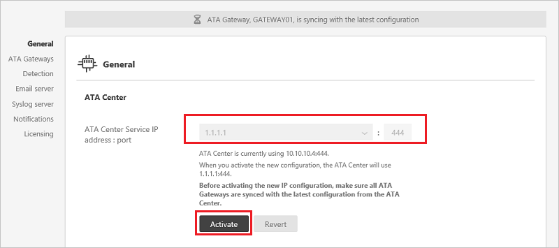

---
# required metadata

title: Change Advanced Threat Analytics ATA Center config | Microsoft Docs
description: Describes how to change the IP address, port, console URL or certificate of your ATA Center.
keywords:
author: rkarlin
ms.author: rkarlin
manager: mbaldwin
ms.date: 6/23/2017
ms.topic: article
ms.prod:
ms.service: advanced-threat-analytics
ms.technology:
ms.assetid: 93b27f15-f7e5-49bb-870a-d81d09dfe9fc

# optional metadata

#ROBOTS:
#audience:
#ms.devlang:
ms.reviewer: bennyl
ms.suite: ems
#ms.tgt_pltfrm:
#ms.custom:

---

*Applies to: Advanced Threat Analytics version 1.8*

# Modifying the ATA Center configuration

After the initial deployment, modifications to the ATA Center should be made carefully. Use the following procedures when updating the IP address and port, the console URL and the certificate.

## The ATA Center IP address

The ATA Gateways locally store the IP address of the ATA Center to which they need to connect. On a regular basis, they connect to the ATA Center and pull down configuration changes. Making a change to how the ATA Gateways connect to the ATA Center is done is two stages.

-   First stage – Update the IP address and port that you want the ATA Center service to use. At this point the ATA Center is still listening on the original IP address and the next time the ATA Gateway syncs its configuration it will have two IP addresses for the ATA Center. As long as the ATA Gateway can connect using the original (first) IP address it will not try the new IP address and port.

-   Second stage – After all the ATA Gateways have synced with the updated configuration, activate the new IP address and port that the ATA Center listens on. When you activate the new IP address the ATA Center service will bind to the new IP address. ATA Gateways will not be able to connect to the original address and now will attempt to connect with the second (new) IP address they have for the ATA Center. After connecting to the ATA Center with the new IP address the ATA Gateway will pull down the latest configuration and will have a single IP address for the ATA Center. (Unless you started the process again.)

> [!NOTE]
> -   If an ATA Gateway was offline during the first stage and never got the updated configuration, you will need to manually update the configuration JSON file on the ATA Gateway.
> -   If the new IP address is installed on the ATA Center server, you can select it from the list of IP addresses when making the change. However, if for some reason you cannot install the IP address on the ATA Center server you can select custom IP address and add it manually. You will not be able to activate the new IP address until the IP address is installed on the server.
> -   If you need to deploy a new ATA Gateway after activating the new IP address, you need to download the ATA Gateway Setup package again.

## The Console URL

The URL is used in the following scenarios:

-   Installation of ATA Gateways – When an ATA Gateway is installed, it registers itself with the ATA Center. This registration process is accomplished by connecting to the ATA Console. If you enter an FQDN for the ATA Console URL, you need to ensure that the ATA Gateway can resolve the FQDN to the IP address that the ATA Console is bound to.

-   Alerts – When ATA sends out a SIEM or email alert, it includes a link to the suspicious activity. The host portion of the link is the ATA Console URL setting.

-   If you installed a certificate from your internal Certification Authority (CA), you will probably want to match the URL to the subject name in the certificate so users will not get a warning message when connecting to the ATA Console.

-   Using an FQDN for the ATA Console URL allows you to modify the IP address that is used by ATA Console without breaking alerts that have been sent out in the past or needing to re-download the ATA Gateway package again. You only need to update the DNS with the new IP address.

> [!NOTE]
> After modifying the ATA Console URL, you should download the ATA Gateway Setup package before installing new ATA Gateways.

## Changing the ATA Center certificate
If your certificate is about to expire and need to be renewed or replaced after installing the new certificate in the local computer store on the ATA Center server, replace the certificate by following this two stage process:

-   First stage – Update the certificate you want the ATA Center service to use. At this point the ATA Center service is still bound to the original certificate. When the ATA Gateways sync their configuration they will have two potential certificates that will be valid for mutual authentication. As long as the ATA Gateway can connect using the original certificate, it will not try the new one.

-   Second stage – After all the ATA Gateways synced with the updated configuration, you can activate the new certificate that the ATA Center service is bound to. When you activate the new certificate, the ATA Center service will bind to the certificate. ATA Gateways will not be able to properly mutually authenticate the ATA Center service and will attempt to authenticate the second certificate. After connecting to the ATA Center service, the ATA Gateway will pull down the latest configuration and will have a single certificate for the ATA Center. (Unless you started the process again.)

> [!NOTE]
> -   If an ATA Gateway was offline during the first stage and never got the updated configuration, you will need to manually update the configuration JSON file on the ATA Gateway.
> -   The certificate that you are using must be trusted by the ATA Gateways.
> -   The certificate is also used for the ATA Console, so it should match the ATA Console address to avoid browser warnings
> -   If you need to deploy a new ATA Gateway after activating the new certificate, you need to download the ATA Gateway Setup package again.

## Changing the ATA Center configuration

1.  Open the ATA Console.

2.  Select the settings option on the toolbar and select **Configuration**.

    

3.  Select **Center**.

4.  Under **Center service IP address : port**, select one of the existing IP addresses or select **Add custom IP address** and enter an IP address.

5.  Click **Save**.

6.  You will see a notification of how many ATA Gateways have synced to the latest configuration.

    

	>[!IMPORTANT]
	>Before activating the new configuration, validate that all the ATA Gateways are synced with the latest configuration. Activating the new configuration before all the ATA Gateways are synced may cause the ATA Gateway to stop functioning as expected. If any of the ATA Gateways are not synced, you will get this error when you click Activate:
	>
	>    

7.  After all the ATA Gateways have synced, click **Activate** to activate the new IP address.

    > [!NOTE]
    > If you entered a custom IP address, you will not be to click **Activate** until you installed the IP address on the ATA Center.

8.  Ensure that all the ATA Gateways are able to sync their configurations after the change was activated. The notification bar will indicate how many ATA Gateways successfully synced their configuration.

>[!div class="step-by-step"]
[Change the ATA Center certificate »](modifying-ata-config-centercert.md)

## See Also
- [Working with the ATA Console](working-with-ata-console.md)
- [Check out the ATA forum!](https://aka.ms/ata-forum)
