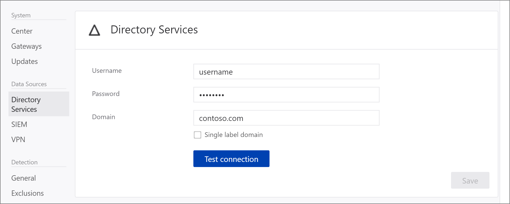

---
# required metadata

title: Change Advanced Threat Analytics config - domain connectivity password
description: Describes how to change the Domain Connectivity Password on the ATA Gateway.
keywords:
author: batamig
ms.author: bagol
manager: raynew
ms.date: 01/10/2023
ms.topic: conceptual
ms.service: advanced-threat-analytics
ms.assetid: 4a25561b-a5ed-44aa-9b72-366976b3c72a

# optional metadata

#ROBOTS:
#audience:
#ms.devlang:
ms.reviewer: bennyl
ms.suite: ems
#ms.tgt_pltfrm:
#ms.custom:

---

# Change ATA configuration - domain connectivity password

[!INCLUDE [Banner for top of topics](includes/banner.md)]

## Change the domain connectivity password

If you modify the Domain Connectivity Password, make sure that the password you enter is correct. If it is not, the ATA Gateway service stops running on the ATA Gateways.

If you suspect that this happened, on the ATA Gateway, look at the Microsoft.Tri.Gateway-Errors.log file for the following errors:
`The supplied credential is invalid.`

To correct this, follow this procedure to update the Domain Connectivity password on the ATA Center:

1. Open the ATA Console on the ATA Center.

1. Select the settings option on the toolbar and select **Configuration**.

    

1. Select **Directory Services**.

    

1. Under **Password**, change the password.

    If the ATA Center has connectivity to the domain, use the **Test Connection** button to validate the credentials

1. Click **Save**.

1. After changing the password, manually check that the ATA Gateway service is running on the ATA Gateway servers.

## See Also
- [Working with the ATA Console](working-with-ata-console.md)
- [Check out the ATA forum!](https://social.technet.microsoft.com/Forums/security/home?forum=mata)
