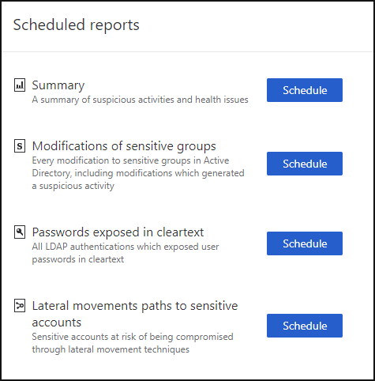
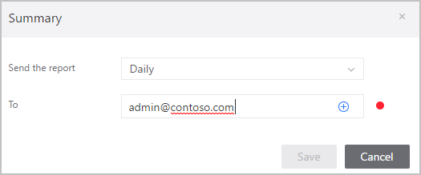

---
# required metadata

title: Working with ATA Reports
description: Describes how you can generate reports in ATA to monitor your network.
keywords:
author: dcurwin
ms.author: dacurwin
manager: dcurwin
ms.date: 01/10/2023
ms.topic: conceptual
ms.service: advanced-threat-analytics
ms.technology:
ms.assetid: 38ea49b5-cd5e-43e5-bc39-5071f759633b

# optional metadata

#ROBOTS:
#audience:
#ms.devlang:
ms.reviewer: bennyl
ms.suite: ems
#ms.tgt_pltfrm:
#ms.custom:

---

# ATA Reports

[!INCLUDE [Banner for top of topics](includes/banner.md)]

The ATA reports section in the console enables you to generate reports that provide you with system status information, both system health and a report of the suspicious activities detected in your environment.

To access the reports page, click the report icon in the menu bar: .
The reports that are available are:

- **Summary report**: The Summary report presents a dashboard of the status in the system. You can view three tabs - one for a **Summary** of what was detected on your network, **Open suspicious activities** that lists the suspicious activities you should take care of, and **Open health issues** that lists ATA system health issues you should take care of. The suspicious activities listed are broken down by type, as are the health issues.

- **Modification of sensitive groups**: This report lists every time a modification is made to sensitive groups (such as admins).

- **Passwords exposed in cleartext**: Some services use the LDAP non-secure protocol to send account credentials in plain text. This can even happen for sensitive accounts. Attackers monitoring network traffic can catch and then reuse these credentials for malicious purposes. This report lists all source computer and account passwords that ATA detected as being sent in clear text.

- **Lateral movement paths to sensitive accounts**: This report lists the sensitive accounts that are exposed via lateral movement paths. For more information, see [Lateral movement paths](use-case-lateral-movement-path.md)

There are two ways to generate a report: either on demand or by scheduling a report to be sent to your email periodically.

To generate a report on demand:

1. In the ATA console menu bar, click the report icon in the menu bar: .

1. Under either your selected report type, set the **From** and **To** dates and click **Download**.
 

To set a scheduled report:

1. In the **Reports** page, click **Set scheduled reports**, or in the ATA Console configuration page, under Notifications and Reports, click **Scheduled reports**.

    

   > [!NOTE]
   > The daily reports are designed to be sent shortly after midnight, UTC.

1. Click **Schedule** next to your selected report type, to set the frequency and email address for delivery of the reports, and click the plus sign next to the email addresses to add them, and click **Save**.

    

> [!NOTE]
> Scheduled reports are delivered by email and can only be sent if you have already configured an email server under **Configuration** and then, under **Notifications and Reports**, select **Mail server**.

## See Also

- [ATA prerequisites](ata-prerequisites.md)
- [ATA capacity planning](ata-capacity-planning.md)
- [Configure event collection](configure-event-collection.md)
- [Configuring Windows event forwarding](configure-event-collection.md)
- [Check out the ATA forum!](https://social.technet.microsoft.com/Forums/security/home?forum=mata)
