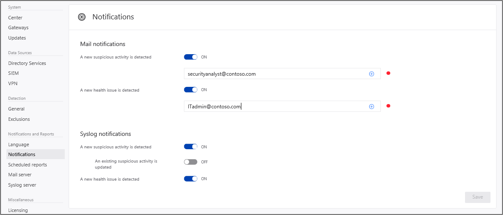

---
# required metadata

title: Set Advanced Threat Analytics notifications
description: Describes how to set ATA alerts so you are notified when suspicious activities are detected.
keywords:
author: batamig
ms.author: bagol
manager: raynew
ms.date: 01/10/2023
ms.topic: conceptual
ms.service: advanced-threat-analytics
ms.assetid: 14cb7513-5dc8-49cb-b3e0-94f469c443dd

# optional metadata

#ROBOTS:
#audience:
#ms.devlang:
ms.reviewer: bennyl
ms.suite: ems
#ms.tgt_pltfrm:
#ms.custom:

---

# Set ATA Notifications

[!INCLUDE [Banner for top of topics](includes/banner.md)]

ATA can notify you when it detects a suspicious activity, either by email or by using ATA event forwarding and forwarding the event to your SIEM/syslog server. Before selecting which notifications you want to receive, you have to [set up your email server and your Syslog server](setting-syslog-email-server-settings.md).

> [!NOTE]
> - Email notifications include a link that takes the user directly to the suspicious activity that was detected. The host name portion of the link is taken from the setting of the ATA Console URL on the ATA Center page. By default, the ATA Console URL is the IP address selected during the installation  of the ATA Center. If you are going to configure email notifications, it is recommended to use an FQDN as the ATA Console URL.
> - Notifications are sent from the ATA Center to either the SMTP server and the Syslog server.

To receive notifications, set the following parameters:

1. In the ATA Console, select the settings option on the toolbar and select **Configuration**.
    
    
    
1. Under the **Notifications & Reports** section, select **Notifications**.
1. Under **Mail notifications**, specify which notifications should be sent via email - new suspicious activities and new health issues. You can set a separate email address for the suspicious activities to be sent to and for the health alerts so that, for example, suspicious activity notifications can be sent to your security analyst and your health alert notifications can be sent to your IT admin.
    
    > [!NOTE]
    > Email alerts for suspicious activities are only sent when the suspicious activity is created.

1. Under **Syslog notifications**, specify which notifications should be sent to your Syslog server - new suspicious activities, updated suspicious activities, and new health issues.
1. Click **Save**.
    
    

## See Also
[Check out the ATA forum!](https://social.technet.microsoft.com/Forums/security/home?forum=mata)
