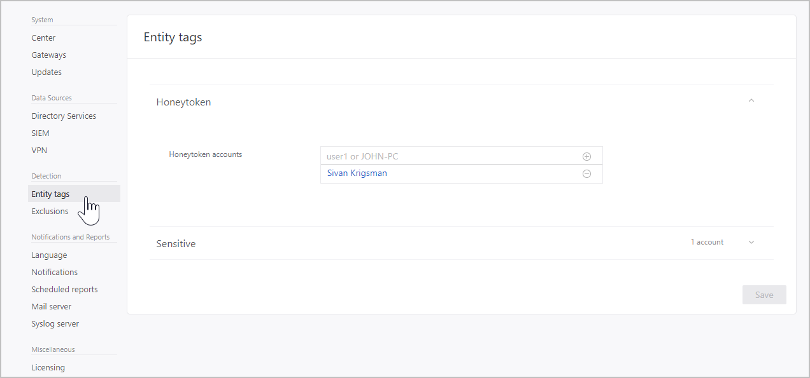

---
# required metadata

title: Tag sensitive accounts with ATA
description: Describes how to tag sensitive accounts using Advanced Threat Analytics (ATA) 
keywords:
author: dcurwin
ms.author: dacurwin
manager: dcurwin
ms.date: 01/10/2023
ms.topic: conceptual
ms.prod: advanced-threat-analytics
ms.technology:
ms.assetid: 40a1c5c4-b8d6-477c-8ae5-562b37661624

# optional metadata

#ROBOTS:
#audience:
#ms.devlang:
ms.reviewer: bennyl
ms.suite: ems
#ms.tgt_pltfrm:
#ms.custom:

---

# Tag sensitive accounts

[!INCLUDE [Banner for top of topics](includes/banner.md)]

You can manually tag groups or accounts as sensitive to enhance detections. It is important to make sure this is updated because some ATA detections, such as sensitive group modification detection and lateral movement path, rely on which groups and accounts are considered sensitive. Previously, ATA automatically considered an entity *sensitive* if it was a member of a specific list of groups. You can now manually tag other users or groups as sensitive, such as board members, company executives, director of sales, etc., and ATA will consider them sensitive.

1. In the ATA console, click the **Configuration** cog in the menu bar.

1. Under **Detection,** click **Entity tags**.

    

1. In the **Sensitive** section, type the name of the **Sensitive accounts** and **Sensitive groups** and then click **+** sign to add them.

    

1. Click **Save**.

1. Go to the entity profile page by clicking on the entity name. Here you will be able to see why the entity is considered sensitive - whether it is because of membership in a group or because of manual tagging as sensitive.

## Sensitive groups

The following list of groups are considered Sensitive by ATA. Any entity that is a member of these groups is considered sensitive:

- Administrators
- Power Users
- Account Operators
- Server Operators
- Print Operators
- Backup Operators
- Replicators
- Remote Desktop Users 
- Network Configuration Operators 
- Incoming Forest Trust Builders
- Domain Admins
- Domain Controllers
- Group Policy Creator Owners 
- read-only Domain Controllers 
- Enterprise Read-only Domain Controllers 
- Schema Admins 
- Enterprise Admins
     
## See also
[Check out the ATA forum!](https://social.technet.microsoft.com/Forums/security/home?forum=mata)
