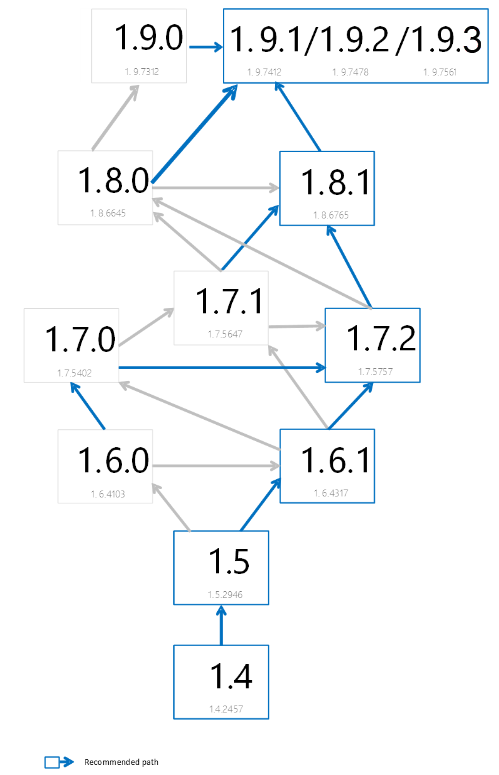

---
# required metadata

title: Advanced Threat Analytics recommended upgrade path
description: Provides instructions for upgrading your Advanced Threat Analytics (ATA) version.
keywords:
author: batamig
ms.author: bagol
manager: raynew
ms.date: 01/10/2023
ms.topic: conceptual
ms.service: advanced-threat-analytics
ms.technology:
ms.assetid: 88720401-1fb2-4353-ad39-32bc0088f0de

# optional metadata

#ROBOTS:
#audience:
#ms.devlang:
ms.reviewer: bennyl
ms.suite: ems
#ms.tgt_pltfrm:
#ms.custom:

---
# Recommended upgrade path for ATA

[!INCLUDE [Banner for top of topics](includes/banner.md)]

This article provides information about available Advanced Threat Analytics versions and how to upgrade ATA depending on which version you have running.

## ATA versions

|Version|Build #|
|----|----|
|1.6|1.6.4103|
|1.6 Update 1|1.6.4317|
|1.7|1.7.5402|
|1.7 Update 1|1.7.5647|
|1.7 Update 2|1.7.5757|
|1.8|1.8.6645|
|1.8 Update 1|1.8.6765|
|1.9|1.9.7312|
|1.9 Update 1|1.9.7412|
|1.9 Update 2|1.9.7478|
|1.9 Update 3|1.9.7576|

## Upgrade paths

Refer to the upgrade path diagram to determine the correct upgrade path for your current installation.

## See Also

- [ATA prerequisites](ata-prerequisites.md)
- [ATA capacity planning](ata-capacity-planning.md)
- [Configure event collection](configure-event-collection.md)
- [Configuring Windows event forwarding](configure-event-collection.md)
- [Check out the ATA forum!](https://social.technet.microsoft.com/Forums/security/home?forum=mata)
