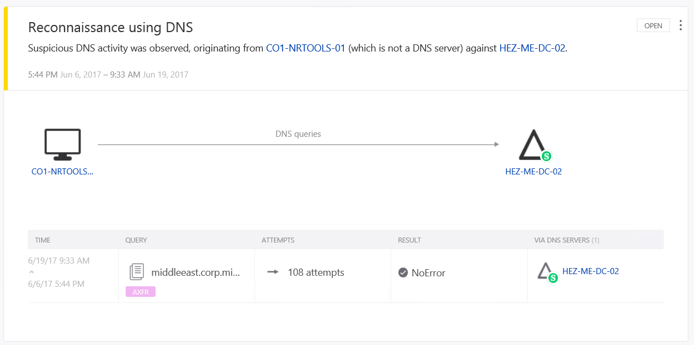
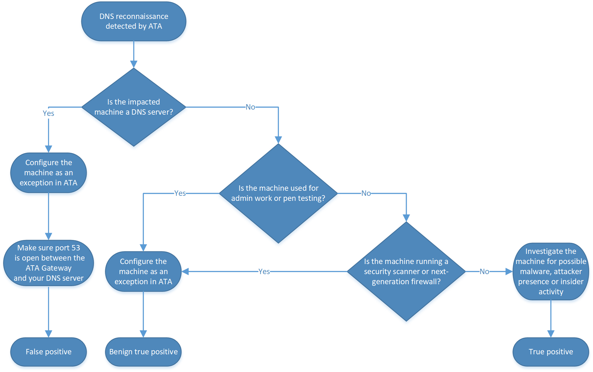

---
# required metadata

title: Investigating reconnaisance using DNS | Microsoft Docs
description: This article describes reconnaissance using DNS and provides investigation instructions when this threat is detected by ATA.
keywords:
author: rkarlin
ms.author: rkarlin
manager: mbaldwin
ms.date: 7/4/2017
ms.topic: article
ms.prod:
ms.service: advanced-threat-analytics
ms.technology:
ms.assetid: 1d186a96-ef70-4787-aa64-c03d1db94ce0

# optional metadata

#ROBOTS:
#audience:
#ms.devlang:
ms.reviewer: bennyl
ms.suite: ems
#ms.tgt_pltfrm:
#ms.custom:

---

*Applies to: Advanced Threat Analytics version 1.7*

# Investigating reconnaissance using DNS

If ATA detects **Reconnaissance using DNS** on your network and alerts you about it, use this article to help you investigate the alert and understand how to remediate the problem.

## What is reconnaissance using DNS?

The **Reconnaissance using DNS** alert indicates that suspicious Domain Name System (DNS) queries are being made from an unusual host to perform reconnaissance on your internal network.

The Domain Name System (DNS) is a service implemented as a hierarchical, distributed database that provides resolution of host names and domain names. The names in a DNS database form a hierarchical tree structure called the domain namespace.
For an adversary, your DNS contains valuable information for mapping an internal network, including a list of all the servers and often all the clients mapped to their IP addresses. Furthermore, this information is of value because it lists host names which are often descriptive in a given network environment. By retrieving this information, an adversary can better prioritize their efforts on the relevant entities during a campaign. Tools such as [Nmap](https://nmap.org/), [Fierce](https://github.com/mschwager/fierce), and built-in tools like [Nslookup](https://technet.microsoft.com/library/cc725991(v=ws.11).aspx), provide capabilities for host discovery using DNS reconnaissance.
Detection of reconnaissance using DNS queries from an internal host is a cause for concern and indicative of the possibility of an existing host compromise, a wider network compromise, or the possibility of an insider threat.

## DNS query types

There are several query types in the DNS protocol. ATA detects the AXFR (Transfer) requests and creates an alert when it is seen. This type of query should only come from DNS servers.

## Discovering the attack

When an attacker attempts to perform reconnaissance using DNS, ATA detects it and marks it with medium severity.

 
ATA displays the name of the source machine as well as additional details about the actual DNS query that was performed. For example, there could be multiple attempts being made from the same host.

## Investigating

To investigate reconnaissance using DNS, you first have to determine the cause of the queries. These can be identified in one of the following categories: 
-	True positives – There is an attacker or malicious malware on your network. This could be an attacker who has breached the network perimeter, or an insider threat.
-	Benign true positives – These could be alerts triggered by pen testing, red-team activity, security scanners, next-generation firewall, or IT administrators performing sanctioned activities.
-	False positives – You might get alerts that occur due to a misconfiguration, for example, if UDP port 53 is blocked between the ATA Gateway and your DNS server (or any other network problem).

The following chart helps determine the investigation steps you should take:

 
1.	The first step is to identify the machine the alert originates from, as depicted below:
 
    
2.	Identify what this machine is. Is it a workstation, server, admin workstation, pen-testing station, etc.?
3.	If the computer is a DNS server and has legitimate rights to request a secondary copy of the zone, then it is a false positive. When you find a false positive, use the **Exclude** option so that you won't get this specific alert for this machine anymore.
4. Make sure UDP port 53 is open between the ATA Gateway and your DNS server.
4.	If the machine is used for admin work or pen testing, it is a benign true positive, and the involved machine can also be configured as an exception.
5.	If it is not used for pen testing, check to see if the machine is running a security scanner or next-generation firewall, which can issue DNS requests of the AXFR type.
6.	Finally, if none of these criteria are met, it is possible that the machine is compromised, and it must be fully investigated. 
7.	If the queries are isolated to specific machines and are determined to not be benign, the following steps should be addressed:
    1.	Review available log sources. 
    2.	Conduct host-based analysis. 
    3.	If the activity is not from a suspected user, forensic analysis should be performed on the machine to determine if it has been compromised with malware.

## Post investigation

Malware used to compromise the host can include trojans with backdoor capabilities. In cases where successful lateral movement has been identified from the compromised host, remediation actions should extend to these hosts including changing any passwords and credentials used on the host and any host included in the lateral movement. 

In cases where the victim host cannot be confirmed as clean following remediation steps, or a root cause of the compromise cannot be identified, Microsoft recommends backing up critical data and rebuilding the host machine. Additionally, new or rebuilt hosts should be hardened prior to being placed back on the network to prevent reinfection. 

Microsoft recommends using a professional Incident Response & Recovery team, that can be reached via your Microsoft Account Team, to help detect whether an attacker has deployed methods of persistence in your network.

## Mitigation

Securing an internal DNS server to prevent reconnaissance using DNS from occurring can be accomplished by disabling or restricting zone transfers only to specified IP addresses. For additional information on restricting zone transfers, see the Windows Server Technet article; [Restrict Zone Transfers](https://technet.microsoft.com/library/ee649273(v=ws.10).aspx). Restricted zone transfers can further be locked down by [securing zone transfers with IPsec](https://technet.microsoft.com/library/ee649192(v=ws.10).aspx). Modifying Zone Transfers is one task among a checklist that should be addressed for [securing your DNS servers from both internal and external attacks](https://technet.microsoft.com/library/cc770432(v=ws.11).aspx).

## See Also
- [Working with suspicious activities](working-with-suspicious-activities.md)
- [Check out the ATA forum!](https://social.technet.microsoft.com/Forums/security/home?forum=mata)
