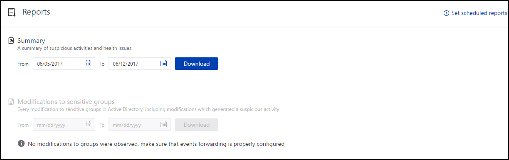
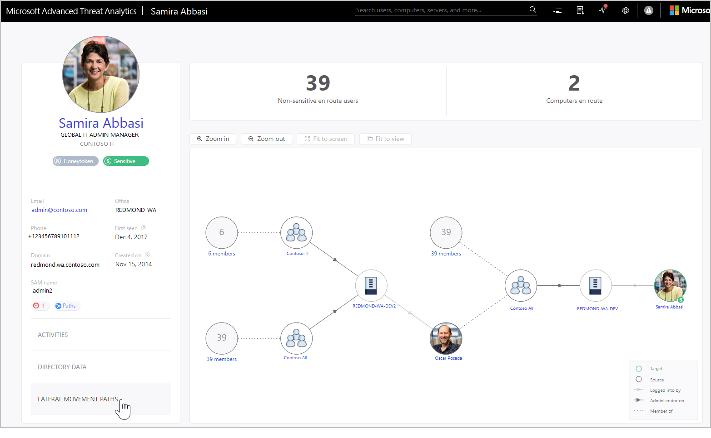

---
# required metadata

title: Investigate lateral movement path attacks with ATA
description: This article describes how to detect lateral movement path attacks with Advanced Threat Analytics (ATA).
keywords:
author: batamig
ms.author: bagol
manager: raynew
ms.date: 01/10/2023
ms.topic: conceptual
ms.service: advanced-threat-analytics
ms.technology:
ms.assetid: 710f01bd-c878-4406-a7b2-ce13f98736ea

# optional metadata

#ROBOTS:
#audience:
#ms.devlang:
#ms.tgt_pltfrm:
#ms.custom:

---

# Investigate lateral movement paths with ATA

[!INCLUDE [Banner for top of topics](includes/banner.md)]

Even when you do your best to protect your sensitive users, and your admins have complex passwords that they change frequently, their machines are hardened, and their data is stored securely, attackers can still use lateral movement paths to access sensitive accounts. In lateral movement attacks, the attacker takes advantage of instances when sensitive users sign in to a machine where a non-sensitive user has local rights. Attackers can then move laterally, accessing the less sensitive user and then moving across the computer to gain credentials for the sensitive user.

## What is a lateral movement path?

Lateral movement is when an attacker uses non-sensitive accounts to gain access to sensitive accounts. This can be done using the methods described in the [Suspicious activity guide](suspicious-activity-guide.md). Attackers use lateral movement to identify the administrators in your network and learn which machines they can access. With this information, and further moves, the attacker can take advantage of the data on your domain controllers.

ATA enables you to take preemptive action on your network to prevent attackers from succeeding at lateral movement.

## Discovery your at-risk sensitive accounts

To discover which sensitive accounts in your network are vulnerable because of their connection to non-sensitive accounts or resources, in a specific timeframe, follow these steps:

1. In the ATA console menu, select the reports icon .

1. Under **Lateral movements paths to sensitive accounts**, if there are no lateral movement paths found, the report is grayed out. If there are lateral movement paths, then the dates of the report automatically select the first date when there is relevant data.

    

1. Select **Download**.

1. The Excel file that is created provides you with details about your sensitive accounts at risk. The **Summary** tab provides graphs that detail the number of sensitive accounts, computers, and averages for at-risk resources. The **Details** tab provides a list of the sensitive accounts that you should be concerned about. Note that the paths are paths that existed previously, and may not be available today.

## Investigate

Now that you know which sensitive accounts are at risk, you can deep dive in ATA to learn more and take preventative measures.

1. In the ATA console, search for the Lateral movement badge that's added to the entity profile when the entity is in a lateral movement path  or . This is available if there was a lateral movement path in the last two days.

1. In the user profile page that opens, select the **Lateral movement paths** tab.

1. The graph that is displayed provides a map of the possible paths to the sensitive user. The graph shows connections that have been made over the last two days.

1. Review the graph to see what you can learn about exposure of your sensitive user's credentials. For example, in this map, you can follow the **Logged into by** gray arrows to see where Samira signed in with their privileged credentials. In this case, Samira's sensitive credentials were saved on the computer REDMOND-WA-DEV. Then, see which other users signed in to which computers that created the most exposure and vulnerability. You can see this by looking at the **Administrator on** black arrows to see who has admin privileges on the resource. In this example, everyone in the group **Contoso All** has the ability to access user credentials from that resource.

    

## Preventative best practices

- The best way to prevent lateral movement is to make sure that sensitive users use their administrator credentials only when they sign in to hardened computers where there is no non-sensitive user who has admin rights on the same computer. In the example, make sure that if Samira needs access to REDMOND-WA-DEV, they sign in with a username and password other than their admin credentials, or remove the Contoso All group from the local administrators group on REDMOND-WA-DEV.

- It is also recommended that you make sure that no one has unnecessary local administrative permissions. In the example, check to see if everyone in Contoso All really needs admin rights on REDMOND-WA-DEV.

- Make sure people only have access to necessary resources. In the example, Oscar Posada significantly widens Samira's exposure. Is it necessary that they be included in the group **Contoso All**? Are there subgroups that you could create to minimize exposure?

> [!TIP]
> If activity is not detected during the last two days, the graph does not appear, but the lateral movement path report is still available to provide information about lateral movement paths over the last 60 days.

> [!TIP]
> For instructions about how to set your servers to allow ATA to perform the SAM-R operations needed for lateral movement path detection, [configure SAM-R](install-ata-step9-samr.md).

## See also

- [Work with suspicious activities](working-with-suspicious-activities.md)
- [Check out the ATA forum!](https://social.technet.microsoft.com/Forums/security/home?forum=mata)
