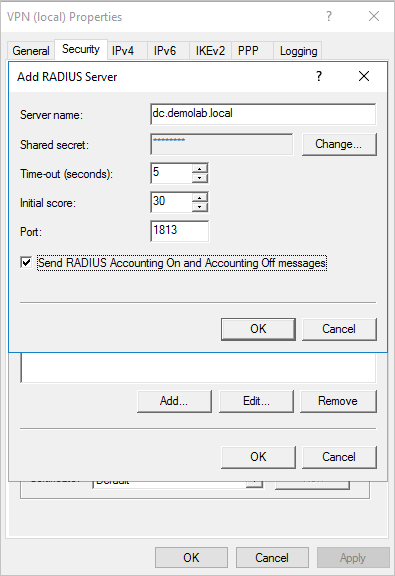
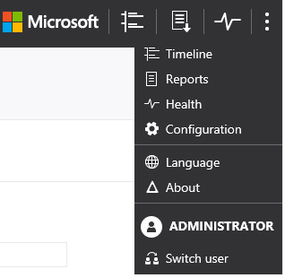
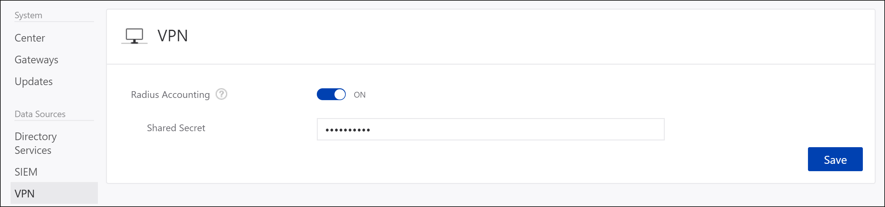
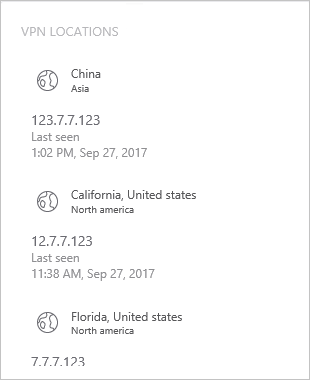

---
# required metadata

title: Install Advanced Threat Analytics - Step 7
description: In this step of installing ATA, you integrate your VPN.
keywords:
author: dcurwin
ms.author: dacurwin
manager: dcurwin
ms.date: 01/10/2023
ms.topic: conceptual
ms.service: advanced-threat-analytics
ms.technology:
ms.assetid: e0aed853-ba52-46e1-9c55-b336271a68e7

# optional metadata

#ROBOTS:
#audience:
#ms.devlang:
ms.reviewer: bennyl
ms.suite: ems
#ms.tgt_pltfrm:
#ms.custom:

---

# Install ATA - Step 7

[!INCLUDE [Banner for top of topics](includes/banner.md)]

> [!div class="step-by-step"]
> [« Step 5](install-ata-step5.md)
> [Step 8 »](install-ata-step7.md)

## Step 7. Integrate VPN

Microsoft Advanced Threat Analytics (ATA) version 1.8 and higher can collect accounting information from VPN solutions. When configured, the user's profile page includes information from the VPN connections, such as the IP addresses and locations where connections originated. This complements the investigation process by providing additional information on user activity. The call to resolve an external IP address to a location is anonymous. No personal identifier is sent in this call.

ATA integrates with your VPN solution by listening to RADIUS accounting events forwarded to the ATA Gateways. This mechanism is based on standard RADIUS Accounting ([RFC 2866](https://tools.ietf.org/html/rfc2866)), and the following VPN vendors are supported:

- Microsoft
- F5
- Cisco ASA

> [!IMPORTANT]
> As of September 2019, the Advanced Threat Analytics VPN geo-location service responsible for detecting VPN locations now exclusively supports TLS 1.2. Make sure your ATA Center is configured to support TLS 1.2, as versions 1.1 and 1.0 are no longer be supported.

## Prerequisites

To enable VPN integration, make sure you set the following parameters:

- Open port UDP 1813 on your ATA Gateways and ATA Lightweight Gateways.

- The ATA Center must be able to access *ti.ata.azure.com* using HTTPS (port 443) so that it can query the location of incoming IP addresses.

The example below uses Microsoft Routing and Remote Access Server (RRAS) to describe the VPN configuration process.

If you're using a third-party VPN solution, consult their documentation for instructions on how to enable RADIUS Accounting.

## Configure RADIUS Accounting on the VPN system

Perform the following steps on your RRAS server.

1. Open the Routing and Remote Access console.
1. Right-click the server name and click **Properties**.
1. In the **Security** tab, under **Accounting provider**, select **RADIUS Accounting** and click **Configure**.

    

1. In the **Add RADIUS Server** window, type the **Server name** of the closest ATA Gateway or ATA Lightweight Gateway. Under **Port**, make sure the default of 1813 is configured. Click **Change** and type a new shared secret string of alphanumeric characters that you can remember. You need to fill it out later in your ATA Configuration. Check the **Send RADIUS Account On and Accounting Off messages** box and then click **OK** on all open dialog boxes.

    

### Configure VPN in ATA

ATA collects VPN data and identifies when and where credentials are being used via VPN and integrates that data into your investigation. This provides additional information to help you investigate alerts reported by ATA.

To configure VPN data in ATA:

1. In the ATA console, open the ATA Configuration page and go to **VPN**.

    

1. Turn on **Radius Accounting**, and type the **Shared Secret** you configured previously on your RRAS VPN Server. Then click **Save**.

    

After this is enabled, all ATA Gateways and Lightweight Gateways listen on port 1813 for RADIUS accounting events.

Your setup is complete, and you can now see VPN activity in the users' profile page:

After the ATA Gateway receives the VPN events and sends them to the ATA Center for processing, the ATA Center needs access to *ti.ata.azure.com* using HTTPS (port 443) to be able to resolve the external IP addresses in the VPN events to their geographic location.

> [!div class="step-by-step"]
> [« Step 6](install-ata-step5.md)
> [Step 8 »](install-ata-step7.md)

## See also

- [ATA POC deployment guide](/samples/browse/?redirectedfrom=TechNet-Gallery)
- [ATA sizing tool](https://aka.ms/aatpsizingtool)
- [Check out the ATA forum!](https://social.technet.microsoft.com/Forums/security/home?forum=mata)
- [Configure event collection](configure-event-collection.md)
- [ATA prerequisites](ata-prerequisites.md)
