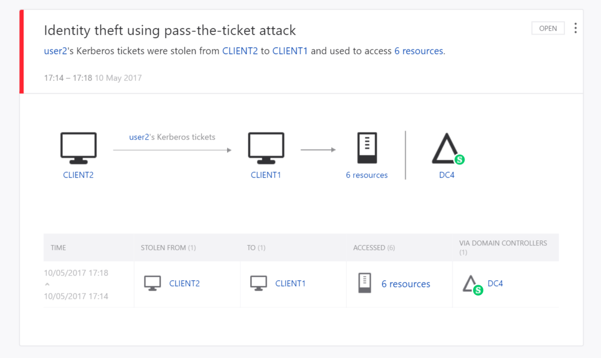
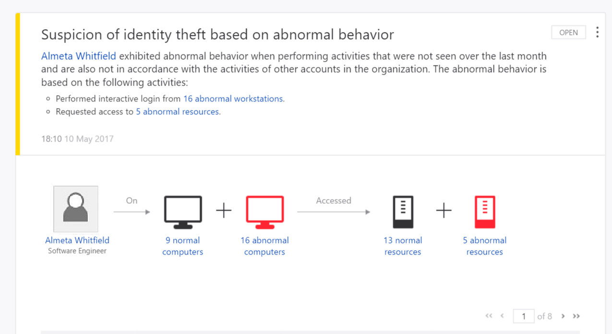
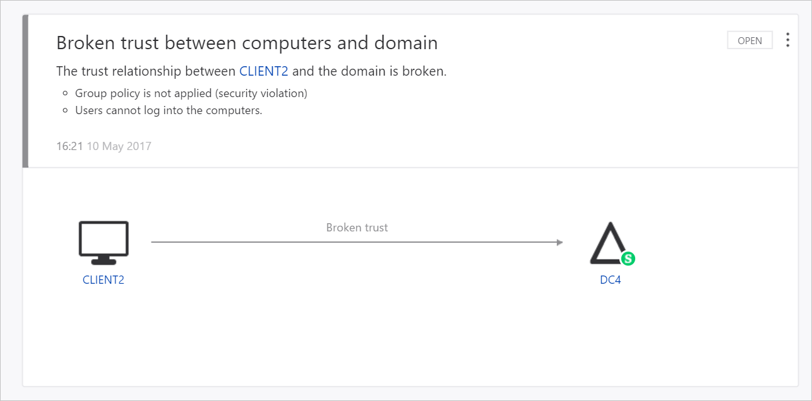

---
# required metadata

title: What is Microsoft Advanced Threat Analytics (ATA)?
description: Explains what Microsoft Advanced Threat Analytics (ATA) is and what kinds of suspicious activities it can detect
keywords:
author: dcurwin
ms.author: dacurwin
manager: dcurwin
ms.date: 02/17/2021
ms.topic: conceptual
ms.prod: advanced-threat-analytics
ms.technology:
ms.assetid: 283e7b4e-996a-4491-b7f6-ff06e73790d2

# optional metadata

#ROBOTS:
#audience:
#ms.devlang:
ms.reviewer: bennyl
ms.suite: ems
#ms.tgt_pltfrm:
#ms.custom:

---

# What is Advanced Threat Analytics?

[!INCLUDE [Banner for top of topics](includes/banner.md)]

Advanced Threat Analytics (ATA) is an on-premises platform that helps protect your enterprise from multiple types of advanced targeted cyber attacks and insider threats.

> [!NOTE]
> **Support lifecycle**
>
> The final release of ATA is [generally available](https://support.microsoft.com/help/4568997/update-3-for-microsoft-advanced-threat-analytics-1-9). ATA Mainstream Support ended on January 12, 2021. Extended Support will continue until January 2026. For more information, read [our blog](https://techcommunity.microsoft.com/t5/security-compliance-and-identity/end-of-mainstream-support-for-advanced-threat-analytics-january/ba-p/1539181).

## How ATA works

ATA leverages a proprietary network parsing engine to capture and parse network traffic of multiple protocols (such as Kerberos, DNS, RPC, NTLM, and others) for authentication, authorization, and information gathering. This information is collected by ATA via:

- Port mirroring from Domain Controllers and DNS servers to the ATA Gateway and/or
- Deploying an ATA Lightweight Gateway (LGW) directly on Domain Controllers

ATA takes information from multiple data-sources, such as logs and events in your network, to learn the behavior of users and other entities in the organization, and builds a behavioral profile about them.
ATA can receive events and logs from:

- SIEM Integration
- Windows Event Forwarding (WEF)
- Directly from the Windows Event Collector (for the Lightweight Gateway)

For more information on ATA architecture, see [ATA Architecture](ata-architecture.md).

## What does ATA do?

ATA technology detects multiple suspicious activities, focusing on several phases of the cyber-attack kill chain including:

- Reconnaissance, during which attackers gather information on how the environment is built, what the different assets are, and which entities exist. Typically, this is where attackers build plans for their next phases of attack.
- Lateral movement cycle, during which an attacker invests time and effort in spreading their attack surface inside your network.
- Domain dominance (persistence), during which an attacker captures the information that allows them to resume their campaign using various sets of entry points, credentials, and techniques. 

These phases of a cyber attack are similar and predictable, no matter what type of company is under attack or what type of information is being targeted.
ATA searches for three main types of attacks: Malicious attacks, abnormal behavior, and security issues and risks.

**Malicious attacks** are detected deterministically, by looking for the full list of known attack types including:

- Pass-the-Ticket (PtT)
- Pass-the-Hash (PtH)
- Overpass-the-Hash
- Forged PAC (MS14-068)
- Golden Ticket
- Malicious replications
- Reconnaissance
- Brute Force
- Remote execution

For a complete list of the detections and their descriptions, see [What Suspicious Activities Can ATA detect?](ata-threats.md). 

ATA detects these suspicious activities and surfaces the information in the ATA Console including a clear view of Who, What, When and How. As you can see, by monitoring this simple, user-friendly dashboard, you are alerted that ATA suspects a Pass-the-Ticket attack was attempted on Client 1 and Client 2 computers in your network.

 

**Abnormal behavior** is detected by ATA using behavioral analytics and leveraging Machine Learning to uncover questionable activities and abnormal behavior in users and devices in your network, including:

- Anomalous logins
- Unknown threats
- Password sharing
- Lateral movement
- Modification of sensitive groups

You can view suspicious activities of this type in the ATA Dashboard. In the following example, ATA alerts you when a user accesses four computers that are not ordinarily accessed by this user, which could be a cause for alarm.

  

ATA also detects **security issues and risks**, including:

- Broken trust
- Weak protocols
- Known protocol vulnerabilities

You can view suspicious activities of this type in the ATA Dashboard. In the following example, ATA is letting you know that there is a broken trust relationship between a computer in your network and the domain.

  

## Known issues

- If you update to ATA 1.7 and immediately to ATA 1.8, without first updating the ATA Gateways, you cannot migrate to ATA 1.8. It is necessary to first update all of the Gateways to version 1.7.1 or 1.7.2 before updating the ATA Center to version 1.8.

- If you select the option to perform a full migration, it may take a very long time, depending on the database size. When you are selecting your migration options, the estimated time is displayed - make note of this before you decide which option to select. 

## What's next?

- For more information about how ATA fits into your network: [ATA architecture](ata-architecture.md)

- To get started deploying ATA: [Install ATA](install-ata-step1.md)

## See also

- [ATA suspicious activity playbook](https://aka.ms/ataplaybook)
- [Check out the ATA forum!](https://social.technet.microsoft.com/Forums/security/home?forum=mata)
