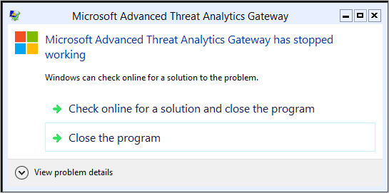

---
# required metadata

title: What's new in ATA version 1.8
description: Lists what was new in ATA version 1.8 along with known issues
keywords:
author: dcurwin
ms.author: dacurwin
manager: dcurwin
ms.date: 9/03/2017
ms.topic: conceptual
ms.prod: advanced-threat-analytics
ms.technology:
ms.assetid: 9592d413-df0e-4cec-8e03-be1ae00ba5dc

# optional metadata

#ROBOTS:
#audience:
#ms.devlang:
ms.reviewer:
ms.suite: ems
#ms.tgt_pltfrm:
#ms.custom:

---

# What's new in ATA version 1.8

The latest update version of ATA can be [downloaded from the Download Center](https://www.microsoft.com/download/details.aspx?id=55536).

These release notes provide information about updates, new features, bug fixes and known issues in this version of Advanced Threat Analytics.

## New & updated detections

- Unusual protocol implementation was improved to be able to detect WannaCry malware.

- NEW! **Abnormal modification of sensitive groups**  
As part of the privilege escalation phase, attackers modify groups with high privileges to gain access to sensitive resources. ATA now detects when there's an abnormal change in an elevated group.
- NEW! **Suspicious authentication failures** (Behavioral brute force)  
Attackers attempt to use brute force on credentials to compromise accounts. ATA now raises an alert when abnormal failed authentication behavior is detected.

- **Remote execution attempt – WMI exec**  
Attackers can attempt to control your network by running code remotely on your domain controller. ATA has enhanced the remote execution detection to include detection of WMI methods to run code remotely.

- Reconnaissance using directory service queries  
This detection was enhanced to be able to catch queries against a single sensitive entity and to reduce the number of false positives that were generated in the previous version. If you disabled this in version 1.7, installing version 1.8 will now automatically enable it.

- Kerberos Golden Ticket activity  
ATA 1.8 includes an additional technique to detect golden ticket attacks.
  - ATA now detects suspicious activities in which the Golden ticket lifetime has expired. If a Kerberos ticket is used for more than the allowed lifetime, ATA will detect it as a suspicious activity that a Golden ticket has likely been created.
- Enhancements were made to the following detections to remove known false positives:
  - Privilege escalation detection  (forged PAC)
  - Encryption downgrade activity (Skeleton Key)
  - Unusual protocol implementation
  - Broken trust

## Improved triage of suspicious activities

- NEW! ATA 1.8 enables you to run the following actions suspicious activities during the triage process:
  - **Exclude entities** from raising future suspicious activities to prevent ATA from alerting when it detects benign true positives (such as an admin running remote code or detecting security scanners).
  - **Suppress recurring** suspicious activities from alerting.
  - **Delete suspicious activities** from the attack time line.
- The process for following up on suspicious activity alerts is now more efficient. The suspicious activities time line was redesigned. In ATA 1.8, you will be able to see many more suspicious activities on a single screen, containing better information for triage and investigation purposes.

## New reports to help you investigate

- NEW! The **Summary report** was added to enable you to see all the summarized data from ATA, including suspicious activities, health issues and more. You can even  define a customized report that is automatically generated on a recurring basis.
- NEW! The **Sensitive groups report** was added to enable you to see all the changes made in sensitive groups over a certain period.

## Infrastructure improvements

- ATA Center performance was enhanced. In ATA 1.8 the ATA Center can handle more than 1M packets per second.
- The ATA Lightweight Gateway can now read events locally, without the need to configure event forwarding.
- You can now separately configure email for health alerts and suspicious activities.

## Security improvements

- NEW! **Single-sign-on for ATA management**. ATA supports single sign-on integrated with Windows authentication - if you've already logged onto your computer, ATA will use that token to log you into the ATA Console. You can also log in using a smartcard. Silent installation scripts for the ATA Gateway and ATA Lightweight Gateway now use the logged on user's context, without the need to provide credentials.
- Local System privileges were removed from the ATA Gateway process, so you can now use virtual accounts (available on stand-alone ATA Gateways only), managed service accounts and group managed service accounts to run the ATA Gateway process.
- Auditing logs for ATA Center and Gateways were added and all actions are now logged in the Windows Event Log.
- Support was added for KSP Certificates for the ATA Center.

## Additional changes

- The option to add notes was removed from Suspicious Activities
- Recommendations for mitigating Suspicious Activities were removed from the Suspicious Activities time line.
- Starting with ATA version 1.8 the ATA Gateways and Lightweight Gateways are managing their own certificates and need no administrator interaction to manage them.

## Known issues

> [!WARNING]
> In order to avoid these known issues please update or deploy using the 1.8 update 1.

### ATA Gateway on Windows Server Core

**Symptoms**: Upgrading an ATA Gateway to 1.8 on Windows Server 2012R2 Core with .Net framework 4.7 may fail with the error: *Microsoft Advanced Threat Analytics Gateway has stopped working*.



On Windows Server 2016 Core you may not see the error, but the process will fail when you try to install, and events 1000 and 1001 (process crash) will be logged in the application Event Log on the server.

**Description**: There is a problem with the .NET framework 4.7 that causes applications that uses WPF technology (such as ATA) to fail to load. [See KB 4034015](https://support.microsoft.com/help/4034015/wpf-window-can-t-be-loaded-after-you-install-the-net-framework-4-7-on) for more information.

**Workaround**: Uninstall .Net 4.7 [See KB 3186497](https://support.microsoft.com/help/3186497/the-net-framework-4-7-offline-installer-for-windows) to revert the .NET version to .NET 4.6.2 and then update your ATA Gateway to version 1.8. After the upgrade of ATA you can reinstall .NET 4.7.  There will be an update to correct this problem in a future release.

### Lightweight Gateway event log permissions

**Symptoms**: When you upgrade ATA to version 1.8, apps or services that were previously granted permissions to access the Security Event Log may lose the permissions.

**Description**: In order to make ATA easier to deploy, ATA 1.8 accesses your Security Event Log directly, without necessitating Windows Event Forwarding configuration. At the same time, ATA runs as a low-permission local service to maintain tighter security. In order to provide access for ATA to read the events, the ATA service grants itself permissions to the Security Event Log. When this happens, permissions previously set for other services may be disabled.

**Workaround**: Run the following Windows PowerShell script. This removes the incorrectly added permissions in the registry from ATA, and adds them via a different API. This may restore permissions for other apps. If it does not, they will need to be restored manually. There will be an update to correct this problem in a future release.

```powershell
$ATADaclEntry = "(A;;0x1;;;S-1-5-80-1717699148-1527177629-2874996750-2971184233-2178472682)"
  try {
    $SecurityDescriptor = Get-ItemProperty -Path HKLM:\SYSTEM\CurrentControlSet\Services\Eventlog\Security -Name CustomSD
    $ATASddl = "O:BAG:SYD:" + $ATADaclEntry
    if($SecurityDescriptor.CustomSD -eq $ATASddl) {
      Remove-ItemProperty -Path HKLM:\SYSTEM\CurrentControlSet\Services\Eventlog\Security -Name CustomSD
    }
  }
  catch
  {
    # registry key does not exist
  }

$EventLogConfiguration = New-Object -TypeName System.Diagnostics.Eventing.Reader.EventLogConfiguration("Security")
$EventLogConfiguration.SecurityDescriptor = $EventLogConfiguration.SecurityDescriptor + $ATADaclEntry
$EventLogConfiguration.SaveChanges()
```

### Proxy interference

**Symptoms**: After upgrading to ATA 1.8 the ATA Gateway service may fail to start. In the ATA error log you may see the following exception:
*System.Net.Http.HttpRequestException: An error occurred while sending the request. ---> System.Net.WebException: The remote server returned an error: (407) Proxy Authentication Required.*

**Description**: Starting from ATA 1.8, the ATA Gateway communicates with the ATA Center using the http protocol. If the machine on which you installed the ATA Gateway uses a proxy server to connect to the ATA Center, it can break this communication.

**Workaround**: Disable the use of a proxy server on the ATA Gateway service account. There will be an update to correct this problem in a future release.

### Report settings reset

**Symptoms**: Any settings that were made to the scheduled reports are cleared when you update to 1.8 update 1.

**Description**: Updating to 1.8 update 1 from 1.8 resets the reports schedule settings.

**Workaround**: Before updating to 1.8 update 1, make a copy of the report settings and reenter them, this can also be done via a script, for more information, see [Export and Import the ATA Configuration](ata-configuration-file.md).

## See Also

[Check out the ATA forum!](https://social.technet.microsoft.com/Forums/security/home?forum=mata)

[Update ATA to version 1.8 - migration guide](ata-update-1.8-migration-guide.md)
