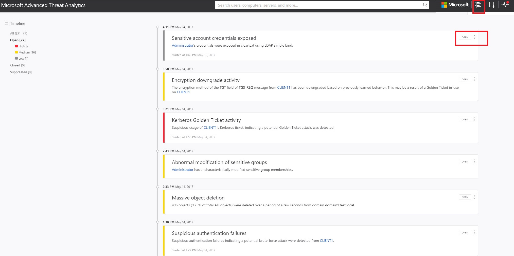
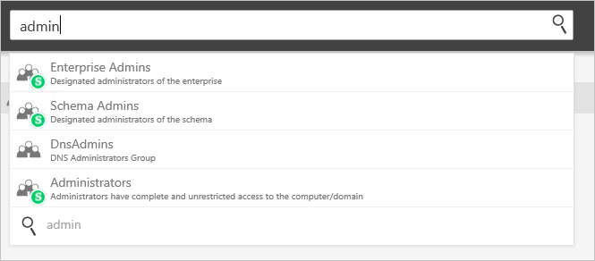
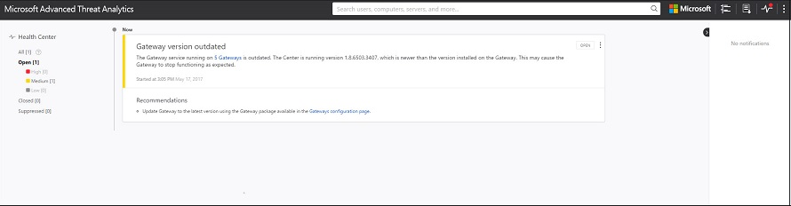

---
# required metadata

title: Understanding the Advanced Threat Analytics console
description: Describes how to log into the ATA console and the components of the console
keywords:
author: dcurwin
ms.author: dacurwin
manager: dcurwin
ms.date: 01/10/2023
ms.topic: conceptual
ms.prod: advanced-threat-analytics
ms.technology:
ms.assetid: 1bf264d9-9697-44b5-9533-e1c498da4f07

# optional metadata

#ROBOTS:
#audience:
#ms.devlang:
ms.reviewer: bennyl
ms.suite: ems
#ms.tgt_pltfrm:
#ms.custom:

---

# Working with the ATA Console

[!INCLUDE [Banner for top of topics](includes/banner.md)]

Use the ATA console to monitor and respond to suspicious activity detected by ATA.

Typing the `?` key provides keyboard shortcuts for ATA Portal accessibility. 

## Enabling access to the ATA Console
To successfully log in to the ATA Console, you have to log in with a user who was assigned the proper ATA role to access the ATA Console. 
For more information about role-based access control (RBAC) in ATA, see [Working with ATA role groups](ata-role-groups.md).

## Logging into the ATA Console

>[!NOTE]
 > Starting with ATA 1.8, the log in process to the ATA Console is accomplished using single sign-on.

1. In the ATA Center server, click the **Microsoft ATA Console** icon on the desktop or open a browser and browse to the ATA Console.

    

   >[!NOTE]
   > You can also open a browser from either the ATA Center or the ATA Gateway and browse to the IP address you configured in the ATA Center installation for the ATA Console.    

1. If the computer on which the ATA Center is installed and the computer from which you are trying to access the ATA Console are both domain joined, ATA supports single sign-on integrated with Windows authentication - if you've already logged on to your computer, ATA uses that token to log you into the ATA Console. You can also log in using a smartcard. Your permissions in ATA correspond with your [administrator role](ata-role-groups.md).

   > [!NOTE]
   > Make sure to log on to the computer from which you want to access the ATA Console using your ATA admin username and password. Alternatively, you can run your browser as a different user or log out of Windows and log on with your ATA admin user. To prompt the ATA Console to ask for credentials, access the console using an IP address and you are prompted to enter credentials.

1. To log in using SSO, make sure the ATA console site is defined as a local intranet site in your browser and that you access it using a shortname or a localhost.

> [!NOTE]
> In addition to logging each suspicious activity and health alert, every configuration change you make in the ATA Console is audited in the Windows Event Log on the ATA Center machine, under **Applications and services log** and then **Microsoft ATA**. Each login to the ATA console is audited as well.    Configuration affecting the ATA Gateway is also logged in the Windows Event Log of the ATA Gateway machine. 

## The ATA Console

The ATA Console provides you a quick view of all suspicious activities in chronological order. It enables you to drill into details of any activity and perform actions based on those activities. The console also displays alerts and notifications to highlight problems with the ATA network or new activities that are deemed suspicious.

These are the key elements of the ATA console.

### Attack time line

This is the default landing page you are taken to when you log in to the ATA Console. By default, all open suspicious activities are shown on the attack time line. You can filter the attack time line to show All, Open, Dismissed or Suppressed suspicious activities. You can also see the severity assigned to each activity.

For more information, see [Working with suspicious activities](working-with-suspicious-activities.md).

### Notification bar

When a new suspicious activity is detected, the notification bar opens automatically on the right-hand side. If there are new suspicious activities since the last time you logged in, the notification bar will open after you have successfully logged in. You can click the arrow on the right at any time to access the notification bar.

### What's new

After a new version of ATA is released, the **What's new** window appears in the top right to let you know what was added in the latest version. It also provides you with a link to the version download.

### Filtering panel

You can filter which suspicious activities are displayed in the attack time line or displayed in the entity profile suspicious activities tab based on Status and Severity.

### Search bar

In the top menu, you can find a search bar. You can search for a specific user, computer, or groups in ATA. To give it a try, just start typing.

### Health Center

The Health Center provides you with alerts when something isn't working properly in your ATA deployment.

Any time your system encounters a problem, such as a connectivity error or a disconnected ATA Gateway, the Health Center icon lets you know by displaying a red dot. 

### Sensitive groups

The following list of groups are considered **Sensitive** by ATA. Any entity that is a member of these groups is considered sensitive:

- Enterprise Read Only Domain Controllers 
- Domain Admins 
- Domain Controllers 
- Schema Admins,
- Enterprise Admins 
- Group Policy Creator Owners 
- Read Only Domain Controllers 
- Administrators  
- Power Users  
- Account Operators  
- Server Operators   
- Print Operators,
- Backup Operators,
- Replicators 
- Remote Desktop Users 
- Network Configuration Operators 
- Incoming Forest Trust Builders 
- DNS Admins 

### Mini profile

If you hover your mouse over an entity, anywhere in the console where there is a single entity presented, such as a user, or a computer, a mini profile automatically opens displaying the following information if available:

- Name

- Picture

- Email

- Telephone

- Number of suspicious activities by severity

## See Also
[Check out the ATA forum!](https://social.technet.microsoft.com/Forums/security/home?forum=mata)
