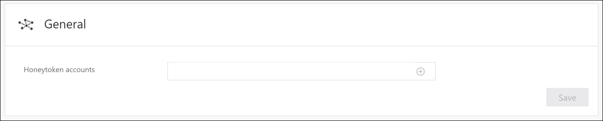
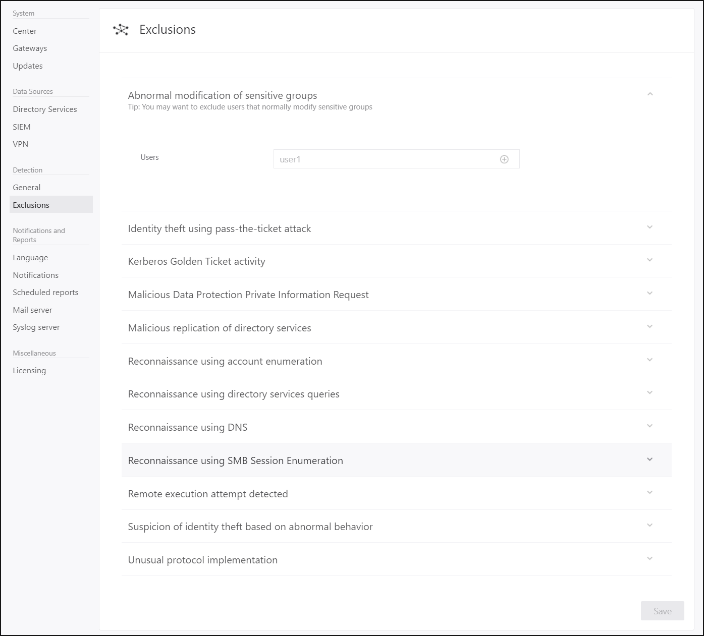

---
# required metadata

title: Set Advanced Threat Analytics detection settings | Microsoft Docs
description: Describes how to configure a list of IP addresses and subnets that have unusual circumstances and that should be handle differently than other entities on your network
keywords:
author: rkarlin
ms.author: rkarlin
manager: mbaldwin
ms.date: 07/3/2017
ms.topic: article
ms.prod:
ms.service: advanced-threat-analytics
ms.technology:
ms.assetid: f4f2ae30-4849-4a4f-8f6d-bfe99a32c746

# optional metadata

#ROBOTS:
#audience:
#ms.devlang:
ms.reviewer: bennyl
ms.suite: ems
#ms.tgt_pltfrm:
#ms.custom:

---

*Applies to: Advanced Threat Analytics version 1.8*

# Working with ATA Detection Settings
The **Detection** configuration page lets you set a list of IP addresses and subnets that have unusual circumstances and should be handled slightly differently than other entities on your network.

## Setting up detection
In the **Detection** section you can define the following items:

-   **General** – Enables you to set your **Honeytoken account SIDs**. This is a user account that should have no network activities. This account will be configured as the ATA Honeytoken user. If someone attempts to use this user account ATA will create a suspicious activity and is an indication of malicious activity. To configure the Honeytoken user you will need the SID of the user account, not the user name.

>[!NOTE]
> You can find the SID of the user on the *Account Info* tab of the user's profile in the ATA console.

**Detection Exclusions** - You can exclude IP addresses, users and computers (depending on which are relevant) from the following detections. If you enter an exclusion in one of these lists, ATA will exclude that IP address, user or computer from this specific type of detected activity.

-   Abnormal modification of sensitive groups
- Identity using pass-the-ticket attack
- Kerberos Golden Ticket activity 
- Malicious Data Protection Private Information Request
- Malicious replication of directory services
- Reconnaissance using account renumeration
- Reconnaissance using directory services queries
- Reconnaissance using DNS
Reconnaissance using SMB Session Enumeration
- Remote execution attempt detected
Suspicion of identity theft based on abnormal behavior
Unusual protocol implementation

## See Also
- [Working with suspicious activities](working-with-suspicious-activities.md)
- [Modifying ATA configuration](modifying-ata-center-configuration.md)
- [Check out the ATA forum!](https://social.technet.microsoft.com/Forums/security/home?forum=mata)
