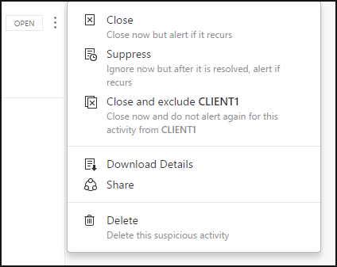

---
# required metadata

title: Working with suspicious activities in Advanced Threat Analytics
description: Describes how to review suspicious activities identified by ATA
keywords:
author: batamig
ms.author: bagol
manager: raynew
ms.date: 01/10/2023
ms.topic: conceptual
ms.service: advanced-threat-analytics
ms.assetid: 44d7c899-816c-4f7f-91d3-84a09d291a24

# optional metadata

#ROBOTS:
#audience:
#ms.devlang:
ms.reviewer: bennyl
ms.suite: ems
#ms.tgt_pltfrm:
#ms.custom:

---

# Working with Suspicious Activities

[!INCLUDE [Banner for top of topics](includes/banner.md)]

This article explains the basics of how to work with Advanced Threat Analytics.

## Review suspicious activities on the attack time line
After logging in to the ATA Console, you are automatically taken to the open **Suspicious Activities Time Line**. Suspicious activities are listed in chronological order with the newest suspicious activities on the top of the time line.
Each suspicious activity has the following information:

- Entities involved, including users, computers, servers, domain controllers, and resources.

- Times and time frame of the suspicious activities.

- Severity of the suspicious activity, High, Medium, or Low.

- Status: Open, closed, or suppressed.

- Ability to

    - Share the suspicious activity with other people in your organization via email.

    - Export the suspicious activity to Excel.

> [!NOTE]
> - When you hover your mouse over a user or computer, an entity mini-profile is displayed that provides additional information about the entity and includes the number of suspicious activities that the entity is linked to.
> - If you click on an entity, it takes you to the entity profile of the user or computer.

## Filter suspicious activities list
To filter the suspicious activities list:

1. In the **Filter by** pane on the left side of the screen, select one of the following options: **All**, **Open**, **Closed**, or **Suppressed**.

1. To further filter the list, select **High**, **Medium**, or **Low**.

**Suspicious activity severity**

-   **Low**

    Indicates suspicious activities that can lead to attacks designed for malicious users or software to gain access to organizational data.

-   **Medium**

    Indicates suspicious activities that can put specific identities at risk for more severe attacks that could result in identity theft or privileged escalation

-   **High**

    Indicates suspicious activities that can lead to identity theft, privilege escalation, or other high-impact attacks

## Remediating suspicious activities
You can change the status of a suspicious activity by clicking the current status of the suspicious activity and selecting one of the following **Open**, **Suppressed**, **Closed**, or **Deleted**.
To do this, click the three dots at the top right corner of a specific suspicious activity to reveal the list of available actions.

**Suspicious activity status**

- **Open**: All new suspicious activities appear in this list.

- **Close**: Is used to track suspicious activities that you identified, researched, and fixed for mitigated.

  > [!NOTE]
  > If the same activity is detected again within a short period of time, ATA may reopen a closed activity.

- **Suppress**: Suppressing an activity means you want to ignore it for now, and only be alerted again if there's a new instance. This means that if there's a similar alert ATA doesn't reopen it. But if the alert stops for seven days, and is then seen again, you are alerted again.

- **Delete**: If you Delete an alert, it is deleted from the system, from the database and you will NOT be able to restore it. After you click delete, you'll be able to delete all suspicious activities of the same type.

- **Exclude**: The ability to exclude an entity from raising more of a certain type of alerts. For example, you can set ATA to exclude a specific entity (user or computer) from alerting again for a certain type of suspicious activity, such as a specific admin who runs remote code or a security scanner that does DNS reconnaissance. In addition to being able to add exclusions directly on the Suspicious activity as it is detected in the time line, you can also go to the Configuration page to **Exclusions**, and for each suspicious activity you can manually add and remove excluded entities or subnets (for example for Pass-the-Ticket). 
  > [!NOTE]
  > The configuration pages can only be modified by ATA admins.

## See also

- [ATA suspicious activity playbook](https://aka.ms/ataplaybook)
- [Check out the ATA forum!](https://social.technet.microsoft.com/Forums/security/home?forum=mata)
- [Modifying ATA configuration](modifying-ata-center-configuration.md)
