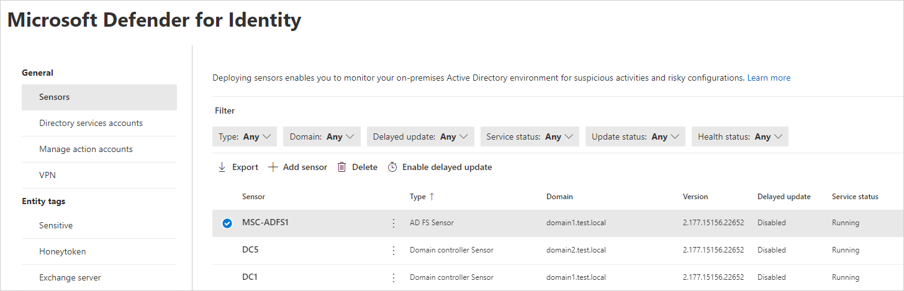

# Microsoft Defender for Identity on Active Directory Federation Services (AD FS)

Defender for Identity protects the Active Directory Federation Services (AD FS) in your environment by detecting on-premises attacks against AD FS servers. This article provides you with a quick reference guide for installing Microsoft Defender for Identity on your Active Directory Federation Services servers.

## Server specifications

The Defender for Identity sensor supports installation on Active Directory Federation Services (AD FS) servers, as shown in the following table:

| Operating System Version | Server  with Desktop Experience | Server  Core | Nano  Server |
| ------------------------ | ------------------------------- | ------------ | ------------ |
| Windows Server 2016      | ✔                               | ✔           | ❌           |
| Windows Server 2019      | ✔                               | ✔           | ❌           |
| Windows Server 2022      | ✔                               | ✔           | ❌           |

>[!NOTE]
> The Defender for Identity sensor is supported only on the Federation servers. It is not required on the Web Application Proxy (WAP) servers.

For hardware requirements, see [Defender for Identity server specifications](prerequisites.md#server-specifications).

## Network requirements

For sensors running on AD FS servers to communicate with the Defender for Identity cloud service, you must open port 443 in your firewalls and proxies to `<your-instance-name>sensorapi.atp.azure.com`, for example *contoso-corpsensorapi.atp.azure.com*. For more information see [Configure endpoint proxy and Internet connectivity settings for your Microsoft Defender for Identity sensor](configure-proxy.md)

## AD FS Windows Event logs

For sensors running on AD FS servers, configure the auditing level to **Verbose** using the following command:

```powershell
Set-AdfsProperties -AuditLevel Verbose
```

For information on how to configure the auditing level, see [Event auditing information for AD FS](/windows-server/identity/ad-fs/troubleshooting/ad-fs-tshoot-logging#event-auditing-information-for-ad-fs-on-windows-server-2016). The following events should be tracked:

- 1202 - The Federation Service validated a new credential
- 1203 - The Federation Service failed to validate a new credential
- 4624 - An account was successfully logged on
- 4625 - An account failed to log on

## AD FS database permissions

For sensors running on AD FS servers to have access to the AD FS database, you need to grant read (db_datareader) permissions on it for the relevant [Directory Services Account](directory-service-accounts.md) configured.
If you have more than one AD FS server, then this should be performed on all of them as the database permissions are not replicated between them.

>[!NOTE]
> If the AD FS database runs on a dedicated SQL server and not the local AD FS server, and you are using a group managed service account (gMSA) as the [Directory Services Account (DSA)](directory-service-accounts.md#types-of-dsa-accounts), make sure you grant the SQL server the required [permissions to retrieve the gMSA's password](directory-service-accounts.md#granting-the-permissions-to-retrieve-the-gmsa-accounts-password).

### How do I grant access to the AD FS database via TSQL or PowerShell?

Instead of using SQL Server Management Studio, you can grant access to the AD FS database either through TSQL or through PowerShell. For example, if you're using the Windows Internal Database (WID) or an external SQL server, these commands can be helpful.

To grant access for the sensor to the AD FS database using TSQL:

 ```tsql
USE [master]
CREATE LOGIN [DOMAIN1\triservice] FROM WINDOWS WITH DEFAULT_DATABASE=[master]
USE [AdfsConfigurationV4]
CREATE USER [DOMAIN1\triservice] FOR LOGIN [DOMAIN1\triservice]
ALTER ROLE [db_datareader] ADD MEMBER [DOMAIN1\triservice]
GRANT CONNECT TO [DOMAIN1\triservice]
GRANT SELECT TO [DOMAIN1\triservice]
GO
```

To grant access for the sensor to the AD FS database using PowerShell:

```powershell
$ConnectionString = 'server=\\.\pipe\MICROSOFT##WID\tsql\query;database=AdfsConfigurationV4;trusted_connection=true;'
$SQLConnection= New-Object System.Data.SQLClient.SQLConnection($ConnectionString)
$SQLConnection.Open()
$SQLCommand = $SQLConnection.CreateCommand()
$SQLCommand.CommandText = @"
USE [master]; 
CREATE LOGIN [DOMAIN1\triservice] FROM WINDOWS WITH DEFAULT_DATABASE=[master];
USE [AdfsConfigurationV4]; 
CREATE USER [DOMAIN1\triservice] FOR LOGIN [DOMAIN1\triservice]; 
ALTER ROLE [db_datareader] ADD MEMBER [DOMAIN1\triservice]; 
GRANT CONNECT TO [DOMAIN1\triservice]; 
GRANT SELECT TO [DOMAIN1\triservice];
"@
$SqlDataReader = $SQLCommand.ExecuteReader()
$SQLConnection.Close()
```

>[!NOTE]
>
> - **[DOMAIN1\triservice]** - the directory services user of the workspace
> - **AdfsConfigurationV4** - the name of the AD FS database (may vary)
> - **server=\.\pipe\MICROSOFT##WID\tsql\query** - the connection string to the database if you are using WID
> - If you don't know your AD FS connection string, see [To acquire the SQL connection string](/windows-server/identity/ad-fs/troubleshooting/ad-fs-tshoot-sql#to-acquire-the-sql-connection-string).

## Installing the sensor

### Prerequisites

 For sensor installations on Active Directory Federation Services (AD FS) servers, configure the SQL server to allow the *Directory service* account (**Configuration** > **Directory services** > **Username**) *connect*, *log in*, *read*, and *select* permissions to the **AdfsConfiguration** database.

### Installing the Microsoft Defender for Identity sensor on AD FS

For information on installing the Microsoft Defender for Identity sensor on AD FS sensor, see [Install the Defender for Identity sensor](install-sensor.md).

### Post-installation steps for AD FS servers

>[!NOTE]
> During the sensor installation on an AD FS server (sensor version 2.202 or above) the closest domain controller will automatically be selected on installation. This can be checked or configured post-installation using the steps detailed below.

Use the following steps to configure Defender for Identity once you've completed the installation of the sensor on an AD FS server.

1. In [Microsoft 365 Defender](https://security.microsoft.com), go to **Settings** and then **Identities**.

    

1. Select the **Sensors** page, which displays all of your Defender for Identity sensors.

    

1. Select the sensor you installed on the AD FS server.
1. In the pane that opens, in the **Domain Controller (FQDN)** field, enter the FQDN of the resolver domain controllers, then select the plus icon **(+)**, and then select **Save**.  

    

    Initializing the sensor may take a couple of minutes, at which time the AD FS sensor service status should change from **stopped** to **running**.

## AD FS Frequently asked questions

### Do we need to install both the Defender for Identity sensor and the Defender for Endpoint sensor on domain controllers or Active Directory Federation Services (AD FS) servers?

If you use both products, then to protect both the server and Active Directory, the two sensors must be installed.

## See also

- [Directory Service account recommendations](/defender-for-identity/directory-service-accounts)
- [Microsoft Defender for Identity Directory Service account recommendations](directory-service-accounts.md)
