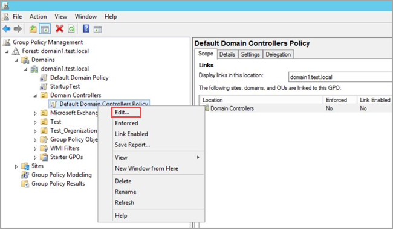
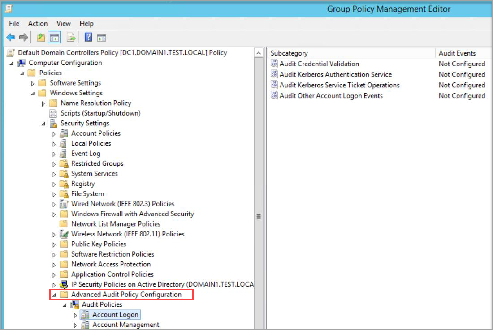
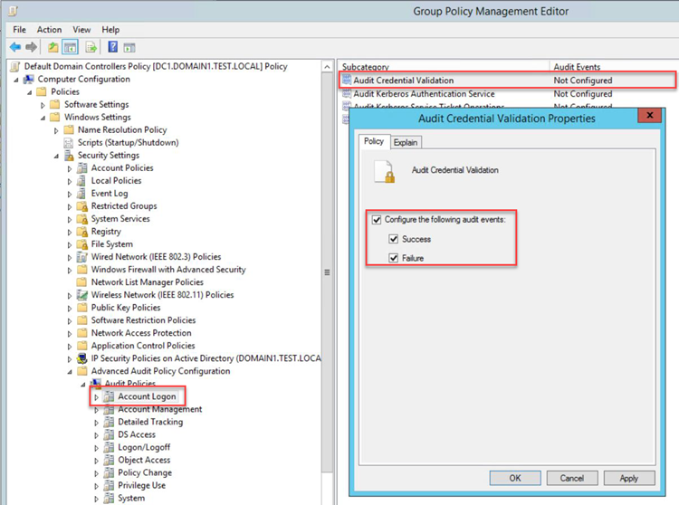
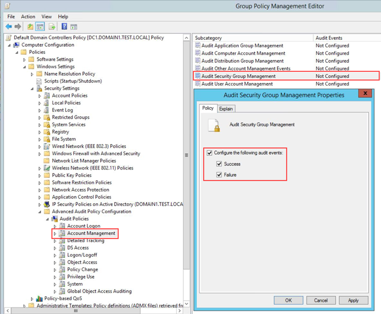

---
# required metadata

title: Azure Advanced Threat Protection Advanced Audit Policy check
description: This article provides an overview of Azure ATP's Advanced Audit Policy check.
keywords:
author: shsagir
ms.author: shsagir
manager: rkarlin
ms.date: 04/07/2019
ms.topic: conceptual
ms.collection: M365-security-compliance
ms.service: azure-advanced-threat-protection
ms.assetid: ab1e8dd9-a6c2-4c68-89d5-343b8ec56142

# optional metadata

#ROBOTS:
#audience:
#ms.devlang:
ms.reviewer: itargoet
ms.suite: ems
#ms.tgt_pltfrm:
#ms.custom:

---

# Azure ATP Advanced Audit Policy check

Azure ATP detection relies on specific Windows Event Logs for visibility in certain scenarios, such as NTLM logons, security group modifications, and similar events. For the correct events to be audited and included in the Windows Event Log, your domain controllers require accurate Advanced Audit Policy settings. Incorrect Advanced Audit Policy settings leave critical events out of your logs, and result in incomplete Azure ATP coverage.

To make it easier to verify the current status of each of your domain controller’s Advanced Audit Policies, Azure ATP automatically checks your existing Advanced Audit Policies and issues health alerts for policy settings that require modification. Each health alert provides specific details of the domain controller, the problematic policy as well as remediation suggestions.

Advanced Security Audit Policy is enabled via **Default Domain Controllers Policy** GPO. These audit events are recorded on the domain controller's Windows Events. 

## Modify audit policies 

Modify the Advanced Audit Policies of your domain controller using the following instructions:

1. Log in to the Server as **Domain Administrator**.
2. Load the Group Policy Management Editor from **Server Manager** > **Tools** > **Group Policy Management**. 
3. Expand the **Domain Controllers Organizational Units**, right click on **Default Domain Controllers Policy** and select **Edit**. 

    

4. From the window that opens, go to **Computer Configuration** > **Policies** > **Windows Settings** > **Security Settings** > **Advanced Audit Policy Configuration**.

    

5. Go to Account Logon, double click on **Audit Credential Validation** and select **Configure the following audit events** for both success and failure events. 

    

6. Go to Account Management, double click on **Audit Security Group Management** and select **Configure the following audit events** for both success and failure events.

    

    > [!NOTE]
    > If you choose to use local policy, make sure to add the **Account Logon** and **Account Management** audit logs in your local policy. If you are configuring the advanced audit policy, make sure to force the [audit policy subcategory](https://docs.microsoft.com/windows/security/threat-protection/security-policy-settings/audit-force-audit-policy-subcategory-settings-to-override).
    
    > [!NOTE] 
    > If you use a policy other than then default domain controller policy to apply the advanced audit policy settings, the resulting Azure ATP health alert can be ignored. 

7. After applying via GPO, the new events are visible under your **Windows Event logs**.

## See Also
- [Azure ATP prerequisites](atp-prerequisites.md)
- [Configure event collection](configure-event-collection.md)
- [Configuring Windows event forwarding](configure-event-forwarding.md)
- [Check out the Azure ATP forum!](https://aka.ms/azureatpcommunity)
