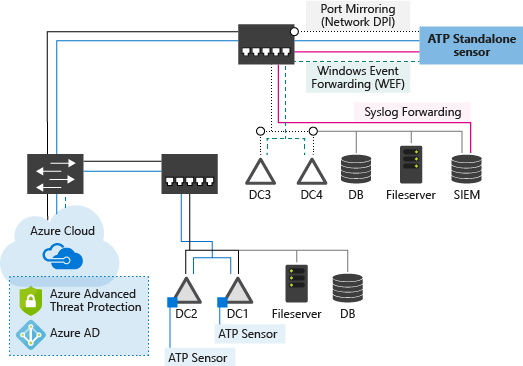

---
# required metadata

title: Azure Advanced Threat Protection architecture | Microsoft Docs
description: Describes the architecture of Azure Advanced Threat Analytics (ATP)
keywords:
author: rkarlin
ms.author: rkarlin
manager: mbaldwin
ms.date: 2/21/2018
ms.topic: article
ms.prod:
ms.service: azure-advanced-threat-protection
ms.technology:
ms.assetid: 90f68f2c-d421-4339-8e49-1888b84416e6

# optional metadata

#ROBOTS:
#audience:
#ms.devlang:
ms.reviewer: itargoet
ms.suite: ems
#ms.tgt_pltfrm:
#ms.custom:

---

*Applies to: Azure Advanced Threat Protection*

# Azure ATP Architecture
The Azure Advanced Threat Protection architecture is detailed in this diagram:

Azure ATP monitors your domain controller network traffic by utilizing port mirroring to an Azure ATP standalone sensor using physical or virtual switches. If you deploy the Azure ATP sensor directly on your domain controllers, it removes the requirement for port mirroring. In addition, Azure ATP can leverage Windows events (forwarded directly from your domain controllers or from a SIEM server) and analyze the data for attacks and threats. Azure ATP receives parsed traffic from the Azure ATP standalone sensor and Azure ATP sensor. It then performs profiling, runs deterministic detection, and runs machine learning and behavioral algorithms to learn about your network, enable detection of anomalies and warn you of suspicious activities.

This section describes the flow of network and event capturing and drills down to describe the functionality of the main components of ATP: the Azure ATP standalone sensor, Azure ATP sensor (which has the same core functionality as the Azure ATP standalone sensor), and the Azure ATP cloud service. 

## Azure ATP Components
Azure ATP consists of the following components:

-	**Azure ATP workspace management portal**  
The Azure ATP workspace management portal allows you to create workspaces and enables integration with other Microsoft services.

> [!NOTE]
> Only the sensors from a single Active Directory forest can connect to a single workspace.

-	**Azure ATP workspace portal**  
The Azure ATP workspace portal receives data from ATP sensors and standalone sensors. It monitors, manages, and investigates threats in your environment.

-   **Azure ATP sensor** 
The Azure ATP sensor is installed directly on your domain controllers and monitors their traffic directly, without the need for a dedicated server or configuration of port mirroring. 

-   **Azure ATP standalone sensor** 
The Azure ATP standalone sensor is installed on a dedicated server that monitors the traffic from your domain controllers using either port mirroring or a network TAP. It is an alternative to the Azure ATP sensor.

## Deployment options
You can deploy Azure ATP using the following combination of sensors:

-	**Using only Azure ATP sensors** 
Your Azure ATP deployment can contain only Azure ATP sensors: The Azure ATP sensors are deployed on each domain controller and no additional servers or port mirroring configuration is necessary.

-	**Using only Azure ATP standalone sensors**  
Your Azure ATP deployment can contain only Azure ATP standalone sensors, without any Azure ATP sensors: All the domain controllers must be configured to enable port mirroring to an Azure ATP standalone sensor or network TAPs must be in place.

-	**Using both Azure ATP standalone sensors and Azure ATP sensors** 
Your Azure ATP deployment includes both Azure ATP standalone sensors and Azure ATP sensors. The Azure ATP sensors are installed on some of your domain controllers (for example, all domain controllers in your branch sites). At the same time, other domain controllers are monitored by Azure ATP standalone sensors (for example, the larger domain controllers in your main data centers).

### Azure ATP workspace management portal

The Azure ATP workspace management portal enables you to:

-	Create and manage Azure ATP workspaces

-	Integrate with other Microsoft security services

Set your main workspace as **Primary**. Only one workspace can be set as primary. Setting a workspace as primary effects integrations - you can only integrate Azure ATP with Windows Defender ATP for your primary workspace. You can change which workspace is Primary later, but in order to do so, you have to remove any integrations already set for the current primary workspace.

### Azure ATP workspace portal

The Azure ATP workspace enables you to manage the following Azure ATP functionality:

-   Manage Azure ATP sensor and standalone sensor configuration settings

-   View data received from Azure ATP standalone sensors and Azure ATP sensors 

-   Monitor detected suspicious activities based on behavioral machine learning algorithms to detect abnormal behavior and deterministic algorithms to detect advanced attacks based on the attack kill chain

-   Optional: the workspace management portal can be configured to send emails and events when suspicious activities or health events are detected.

|||
|-|-|
|Entity Receiver|Receives batches of entities from all Azure ATP sensors and Azure ATP standalone sensors.|
|Network Activity Processor|Processes all the network activities within each batch received. For example, matching between the various Kerberos steps performed from potentially different computers|
|Entity Profiler|Profiles all the Unique Entities according to the traffic and events. For example, Azure ATP updates the list of logged-on computers for each user profile.|
|Azure ATP workspace management portal|Manages your Azure ATP workspaces.|
|Azure ATP workspace portal|The Azure ATP workspace is used to configure Azure ATP and monitor suspicious activities detected by Azure ATP on your network. The Azure ATP workspace is not dependent on the Azure ATP sensor and runs even when the Azure ATP sensor service is stopped. |
|Detectors|The Detectors use machine learning algorithms and deterministic rules to find suspicious activities and abnormal user behavior in your network.|

Consider the following criteria when deciding how many Azure ATP workspaces to deploy on your network:

-   One Azure ATP workspace can monitor a single Active Directory forest. If you have more than one Active Directory forest, you need a minimum of one Azure ATP cloud service per Active Directory forest.

## Azure ATP sensor and Azure ATP standalone sensor

The **Azure ATP sensor** and **Azure ATP sensor** both have the same core functionality:

-   Capture and inspect domain controller network traffic. This is port mirrored traffic for Azure ATP standalone sensors and local traffic of the domain controller in Azure ATP sensors. 

-   Receive Windows events either directly from the domain controllers (for ATP sensors) or from SIEM or Syslog servers (for ATP standalone sensors)

-  Receive RADIUS accounting information from your VPN provider

-   Retrieve data about users and computers from the Active Directory domain

-   Perform resolution of network entities (users, groups, and computers)

-   Transfer relevant data to the Azure ATP cloud service

-   Monitor multiple domain controllers from a single Azure ATP standalone sensor, or monitor a single domain controller for an Azure ATP sensor.

The Azure ATP standalone sensor receives network traffic and Windows Events from your network and processes it in the following main components:

|||
|-|-|
|Network Listener|The Network Listener captures network traffic and parses the traffic. This is a CPU-heavy task, so  it is especially important to check [Azure ATP Prerequisites](atp-prerequisites.md) when planning your Azure ATP sensor or Azure ATP standalone sensor.|
|Event Listener|The Event Listener captures and parses Windows Events forwarded from a SIEM server on your network.|
|Windows Event Log Reader|The Windows Event Log Reader reads and parses Windows Events forwarded to the Azure ATP standalone sensor's Windows Event Log from the domain controllers.|
|Network Activity Translator | Translates parsed traffic into a logical representation of the traffic used by Azure ATP (NetworkActivity).
|Entity Resolver|The Entity Resolver takes the parsed data (network traffic and events) and resolves it data with Active Directory to find account and identity information. It is then matched with the IP addresses found in the parsed data. The Entity Resolver inspects the packet headers efficiently, to enable parsing of authentication packets for machine names, properties, and identities. The Entity Resolver combines the parsed authentication packets with the data in the actual packet.|
|Entity Sender|The Entity Sender sends the parsed and matched data to the Azure ATP cloud service.|

## Azure ATP sensor features

The following features work differently depending on whether you are running an Azure ATP standalone sensor or an Azure ATP sensor.

-	The Azure ATP sensor can read events locally, without the need to configure event forwarding.

-	**Domain synchronizer candidate** 
The domain synchronizer candidate is responsible for synchronizing all entities from a specific Active Directory domain proactively (similar to the mechanism used by the domain controllers themselves for replication). One sensor is chosen randomly, from the list of candidates, to serve as the domain synchronizer.   
If the synchronizer is offline for more than 30 minutes, another candidate is chosen instead. If there is no domain synchronizer available for a specific domain, Azure ATP is able to proactively synchronize entities and their changes, however Azure ATP retrieves new entities as they are detected in the monitored traffic. 
 If there is no domain synchronizer available, and you search for an entity that did not have any traffic related to it, no search results are displayed.  
By default, all Azure ATP standalone sensors are synchronizer candidates.  
Azure ATP sensors are not synchronizer candidates by default.

-	**Resource limitations** 
The Azure ATP sensor includes a monitoring component that evaluates the available compute and memory capacity on the domain controller on which it is running. The monitoring process runs every 10 seconds and dynamically updates the CPU and memory utilization quota on the Azure ATP sensor process to make sure that at any given point in time, the domain controller has at least 15% of free compute and memory resources.  
No matter what happens on the domain controller, this process always frees up resources to make sure the domain controller's core functionality is not affected.  
If this causes the Azure ATP sensor to run out of resources, only partial traffic is monitored and the monitoring alert "Dropped port mirrored network traffic" appears in the Health page.

The following table provides an example of a domain controller with enough compute resource available to allow for a larger quota then is currently needed, so that all traffic is monitored:

> [!div class="mx-tableFixed"]
||||||
|-|-|-|-|-|
|Active Directory (Lsass.exe)|Azure ATP sensor (Microsoft.Tri.sensor.exe)|Miscellaneous (other processes) |Azure ATP sensor quota|Is sensor dropping traffic?|
|30%|20%|10%|45%|No|

If Active Directory needs more computing power, the quota needed by the Azure ATP sensor is reduced. In the following example, The Azure ATP sensor needs more than the allocated quota and drops some of the traffic (monitoring only partial traffic):

> [!div class="mx-tableFixed"]
||||||
|-|-|-|-|-|
|Active Directory (Lsass.exe)|Azure ATP sensor (Microsoft.Tri.sensor.exe)|Miscellaneous (other processes) |Azure ATP sensor quota|Is sensor dropping traffic?|
|60%|15%|10%|15%|Yes|

## Your network components
In order to work with Azure ATP, make sure to check that the following components are set up.

### Port mirroring
If you are using Azure ATP standalone sensors, you have to set up port mirroring for the domain controllers that are monitored and set the Azure ATP standalone sensor as the destination using the physical or virtual switches. Another option is to use network TAPs. Azure ATP works if some but not all of your domain controllers are monitored, but detections are less effective.

While port mirroring mirrors all the domain controller network traffic to the Azure ATP standalone sensor, only a small percentage of that traffic is then sent, compressed, to the Azure ATP cloud service for analysis.

Your domain controllers and the Azure ATP standalone sensors can be physical or virtual. For more information, see [Configure port mirroring](configure-port-mirroring.md).

### Events
To enhance Azure ATP detection of Pass-the-Hash, Brute Force, Modification to sensitive groups, creation of suspicious services, modifications to Honey Tokens, Azure ATP needs the following Windows events: 4776, 4732, 4733, 4728, 4729, 4756, 4757, and 7045. These can either be read automatically by the Azure ATP sensor or in case the Azure ATP sensor is not deployed, it can be forwarded to the Azure ATP standalone sensor in one of two ways, by configuring the Azure ATP standalone sensor to listen for SIEM events or by [Configuring Windows Event Forwarding](configure-event-forwarding.md).

-   Configuring the Azure ATP standalone sensor to listen for SIEM events  Configure your SIEM to forward specific Windows events to ATP. Azure ATP supports a number of SIEM vendors. For more information, see [Configure event forwarding](configure-event-forwarding.md).

-   Configuring Windows Event Forwarding Another way Azure ATP can get your events is by configuring your domain controllers to forward Windows events 4776, 4732, 4733, 4728, 4729, 4756, 4757, and 7045 to your Azure ATP standalone sensor. This is especially useful if you don't have a SIEM or if your SIEM is not currently supported by ATP. For more information about Windows Event Forwarding in ATP, see [Configuring Windows event forwarding](configure-event-forwarding.md). This only applies to physical Azure ATP standalone sensors - not to the Azure ATP sensor.

## See Also
- [Azure ATP prerequisites](atp-prerequisites.md)
- [Azure ATP sizing tool](http://aka.ms/trisizingtool)
- [Azure ATP capacity planning](atp-capacity-planning.md)
- [Configure event forwarding](configure-event-forwarding.md)
- [Configuring Windows event forwarding](configure-event-forwarding.md)

- - [Check out the ATP forum!](https://aka.ms/azureatpcommunity)
