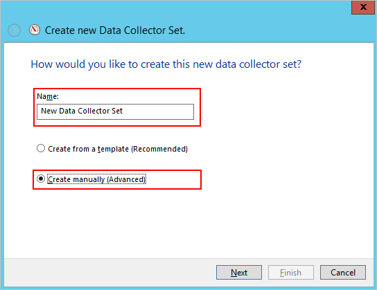

---
# required metadata

title: Planning your Azure Advanced Threat Protection deployment quickstart | Microsoft Docs
description: Helps you plan your deployment and decide how many Azure ATP servers will be needed to support your network
author: mlottner
ms.author: mlottner
ms.date: 11/05/2019
ms.topic: quickstart
ms.collection: M365-security-compliance
ms.service: azure-advanced-threat-protection

# optional metadata

#ROBOTS:
#audience:
#  ms.devlang:
# ms.reviewer: itargoet
# ms.suite: ems
#ms.tgt_pltfrm:
#ms.custom:

---

# Quickstart: Plan capacity for Azure ATP

In this quickstart, you determine how many Azure ATP sensors and standalone sensors you need.

## Prerequisites

- Download the [Azure ATP Sizing Tool](https://aka.ms/aatpsizingtool).
- Review the [Azure ATP architecture](atp-architecture.md) article.
- Review the [Azure ATP prerequisites](atp-prerequisites.md) article. 

## Use the sizing tool

The recommended and simplest way to determine capacity for your Azure ATP deployment is to use the Azure ATP Sizing Tool. If you're unable to use the tool, you can manually gather traffic information. For more information the manual method, see the [Domain controller traffic estimator](#manual-sizing) section at the bottom of this article.

1. Run the Azure ATP Sizing Tool, **TriSizingTool.exe**, from the zip file you downloaded. 
2. When the tool finishes running, open the Excel file results.
3. In the Excel file, locate and click on the **Azure ATP Summary** sheet. The other sheet isn't needed since it's for Azure ATA planning.
   

4. Locate the **Busy Packets/sec** field in the Azure ATP sensor table in the results Excel file and make a note of it.
5. Choose your sensor type. Use the information in the [Choosing the right sensor type](#choosing-the-right-sensor-type-for-your-deployment) section to determine which sensor or sensors you would like to use. Keep your **Busy Packets/sec** in mind when choosing the sensor type.
6. Match your **Busy Packets/sec** field to the **PACKETS PER SECOND** field in the [Azure ATP sensor table](#sizing) section of this article. Use the fields to determine the memory and CPU that will be used by the sensor.

## Choosing the right sensor type for your deployment

In an Azure ATP deployment any combination of the Azure ATP sensor types is supported:

- Only Azure ATP sensors
- Only Azure ATP standalone sensors
- A combination of both

When deciding the sensor deployment type, consider the following benefits:

|Sensor type|Benefits|Cost|Deployment topology|Domain controller use|
|----|----|----|----|-----|
|Azure ATP sensor|Doesn't require a dedicated server and port-mirroring configuration|Lower|Installed on the domain controller|Supports up to 100,000 packets per second|
|Azure ATP standalone sensor|The out of band deployment makes it harder for attackers to discover Azure ATP is present|Higher|Installed alongside the domain controller (out of band)|Supports up to 100,000 packets per second|

Consider the following issues when deciding how many Azure ATP standalone sensors to deploy:

- **Active Directory forests and domains** - Azure ATP can monitor traffic from multiple domains within multiple Active Directory forests, for each Azure ATP instance you create.

- **Port Mirroring** - Port mirroring considerations might require you to deploy multiple Azure ATP standalone sensors per data center or branch site.

- **Capacity** - An Azure ATP standalone sensor can support monitoring multiple domain controllers, depending on the amount of network traffic of the domain controllers being monitored.

##  Azure ATP sensor and standalone sensor sizing 

An Azure ATP sensor can support the monitoring of a domain controller based on the amount of network traffic the domain controller generates. The following table is an estimate. The final amount that the sensor parses is dependent on the amount of traffic and the distribution of traffic.

The following CPU and memory capacity refers to the **sensor's own consumption**, not the domain controller capacity.

|Packets per second*|CPU (cores)**|Memory (GB)|
|----|----|-----|
|0-1k|0.25|2.50|
|1k-5k|0.75|6.00|
|5k-10k|1.00|6.50|
|10k-20k|2.00|9.00|
|20k-50k|3.50|9.50|
|50k-75k |3.50|9.50|
|75k-100k|3.50|9.50|
|

** This includes physical cores, not hyper-threaded cores. 

When determining sizing, note the following items: 

- Total number of cores that the sensor service will use. It's recommended that you don't work with hyper-threaded cores. Working with hyper-threaded cores can result in Azure ATP sensor health issues. 
- Total amount of memory that the sensor service will use.
- If the domain controller doesn't have the resources required by the Azure ATP sensor, domain controller performance isn't affected. However, the Azure ATP sensor might not operate as expected.
- When running as a virtual machine, all memory is required to be allocated to the virtual machine at all times.
- For optimal performance, set the **Power Option** of the Azure ATP sensor to **High Performance**.
- A minimum of 2 cores is required. A minimum of 6 GB of space is required, 10 GB is recommended, including space needed for the Azure ATP binaries and logs.

### Dynamic memory

> [!NOTE] 
> When running as a virtual machine (VM) all memory is required to be allocated to VM at all times. 

|VM running on|Description|
|------------|-------------|
|Hyper-V|Ensure that **Enable Dynamic Memory** is not enabled for the VM.|
|VMWare|Ensure that the amount of memory configured and the reserved memory are the same, or select the following option in the VM setting – **Reserve all guest memory (All locked)**.|
|Other virtualization host|Refer to the vendor supplied documentation on how to ensure that memory is fully allocated to the VM at all times. |
|

When running as a virtual machine, shut down the server before creating a new checkpoint to avoid potential database corruption.

##  Domain controller traffic estimation

If for some reason you can't use the Azure ATP Sizing Tool, manually gather the packet/sec counter information from all your domain controllers. Gather the information for 24 hours with a low collection interval, approximately 5 seconds. Then, for each domain controller, calculate the daily average and the busiest period (15 minutes) average. The following sections present the instruction for how to collect the packets/sec counter from one domain controller.

There are various tools that you can use to discover the average packets per second of your domain controllers. If you don't have any tools that track this counter, you can use Performance Monitor to gather the required information.

To determine packets per second, do the following steps on each domain controller:

1.  Open Performance Monitor.

    

2.  Expand **Data Collector Sets**.

    

3.  Right click **User Defined** and select **New** &gt; **Data Collector Set**.

    

4.  Enter a name for the collector set and select **Create Manually (Advanced)**.

5.  Under **What type of data do you want to include?** select  **Create data logs, and Performance counter**.

    

6.  Under **Which performance counters would you like to log**, click **Add**.

7.  Expand **Network Adapter** and select **Packets/sec** and select the proper instance. If you aren't sure, you can select **&lt;All instances&gt;** and click **Add** and **OK**.

    > [!NOTE]
    > To perform this operation in a command line, run `ipconfig /all` to see the name of the adapter and configuration.

    

8.  Change the **Sample interval** to **five seconds**.

9. Set the location where you want the data to be saved.

10. Under **Create the data collector set**,  select **Start this data collector set now**, and click **Finish**.

    You should now see the data collector set you created with a green triangle indicating that it's working.

11. After 24 hours, stop the data collector set, by right-clicking the data collector set and selecting **Stop**.

    

12. In File Explorer, browse to the folder where the .blg file was saved and double-click it to open it in Performance Monitor.

13. Select the Packets/sec counter, and record the average and maximum values.

    

## Next steps

In this quickstart, you determined how many Azure ATP sensors and standalone sensors you need. You also determined sizing for the sensors. Continue to the next quickstart to create an Azure ATP instance.

> [!div class="nextstepaction"]
> [Create your Azure ATP instance](install-atp-step1.md)

## Join the Community

Have more questions, or an interest in discussing Azure ATP and related security with others? Join the [Azure ATP Community](https://aka.ms/azureatpcommunity) today!
