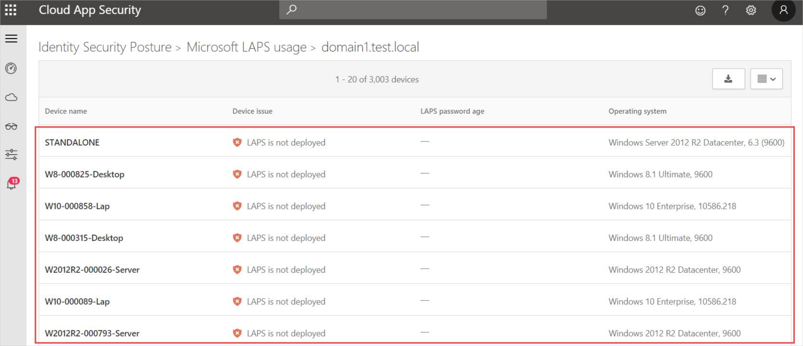

---
# required metadata

title: Azure Advanced Threat Protection LAPS usage assessments
description: This article provides an overview of Azure ATP's LAPS usage identity security posture assessment report.
keywords:
author: shsagir
ms.author: shsagir
manager: rkarlin
ms.date: 05/20/2020
ms.topic: conceptual
ms.collection: M365-security-compliance
ms.service: azure-advanced-threat-protection
ms.assetid: 2fe62047-75ef-4b2e-b4aa-72860e39b4e4

# optional metadata

#ROBOTS:
#audience:
#ms.devlang:
ms.reviewer: itargoet
ms.suite: ems
#ms.tgt_pltfrm:
#ms.custom:

---

# Security assessment: LAPS usage

## What are is Microsoft LAPS?

Microsoft’s "Local Administrator Password Solution" (LAPS) provides management of local administrator account passwords for domain-joined computers. Passwords are randomized and stored in Active Directory (AD), protected by ACLs, so only eligible users can read it or request its reset.

## What risk does not implementing LAPS pose to an organization?

LAPS provide a solution to the issue of using a common local account with an identical password on every computer in a domain. LAPS resolve this issue by setting a different, rotated random password for the common local administrator account on every computer in the domain.

LAPS simplifies password management while helping customers implement additional recommended defenses against cyberattacks. In particular, the solution mitigates the risk of lateral escalation that results when customers use the same administrative local account and password combination on their computers. LAPS stores the password for each computer’s local administrator account in AD, secured in a confidential attribute in the computer’s corresponding AD object. The computer can update its own password data in AD, and domain administrators can grant read access to authorized users or groups, such as workstation helpdesk administrators.

## How do I use this security assessment?

1. Use the report table to discover which of your domains have some (or all) compatible Windows devices that are not protected by LAPS, or that have not had their LAPS managed password changed in the last 60 days.
1. For domains that are partially protected, select the relevant row to view the list of devices not protected by LAPS in that domain.
    
1. Take appropriate action on those devices by downloading, installing and configuring or troubleshooting [Microsoft LAPS](https://go.microsoft.com/fwlink/?linkid=2104282) using the documentation provided in the download.
    

## See Also

- [Check out the Azure ATP forum!](https://aka.ms/azureatpcommunity)
