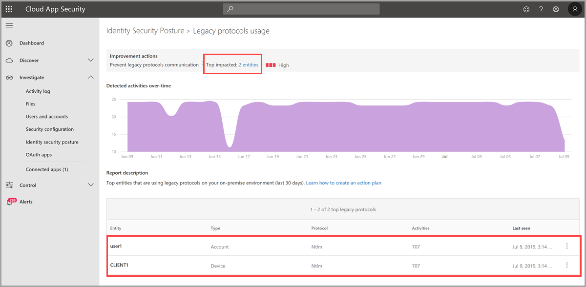

---
# required metadata

title: Azure Advanced Threat Protection legacy protocols identity security posture assessment | Microsoft Docs
description: This article provides an overview of Azure ATP's legacy protocol identification security posture assessment report.
keywords:
author: mlottner
ms.author: mlottner
manager: rkarlin
ms.date: 07/08/2019
ms.topic: conceptual
ms.collection: M365-security-compliance
ms.service: azure-advanced-threat-protection
ms.assetid: 6597b8c7-f83e-43c6-8149-fb4a914a845b

# optional metadata

#ROBOTS:
#audience:
#ms.devlang:
ms.reviewer: itargoet
ms.suite: ems
#ms.tgt_pltfrm:
#ms.custom:

---

# Security assessment: Prevent legacy protocol implementation - Preview
 
## What are legacy protocols?

With all of the standard work enterprises perform to protect their infrastructure using patching and server hardening, one area that often remains overlooked is legacy protocol retirement. Without reducing legacy protocol exposure, credential theft remains relatively easy to accomplish. 

Most legacy protocols were drafted and created before today's security needs existed, and built before modern enterprise security requirements became clear. However, legacy protocols remain unchanged, and are easily transformed into vulnerable access points in every modern organization. 

## What risks do retained legacy protocols introduce? 

Modern cyber-attacks methods often make specific use of legacy protocols in their attack and often utilize them to target organizations that have yet to implement the proper mitigation. 

Attack Surface Reduction can be achieved by disabling support for insecure legacy protocols such as: 

- TLS 1.0 & 1.1 (As well as all versions of SSL)
- Server Message Block v1 (SMBv1)
- LanMan (LM) / NTLMv1
- Digest Authentication

To retire the use of legacy protocols, your organization must first discover which internal entities and applications rely on them. The **Legacy protocols usage** assessment report table surfaces the top discovered entities using legacy protocols (for now, NTLMv1). Using the report, you can immediately review any top impacted entities and take action on them, stopping use of these protocols and eventually, disabling them altogether. To learn more about the dangers of using legacy protocols, see [Stop using LAN manager and NTLMv1!](https://blogs.technet.microsoft.com/miriamxyra/2017/11/07/stop-using-lan-manager-and-ntlmv1/).

## How do I use this security assessment? 
1. Use the report table to discover which of your top discovered entities are using legacy protocols.  
     
1. Take appropriate action on those entities to discover dependencies, stop legacy protocol use and eventually, [disable the protocols completely](https://blogs.technet.microsoft.com/miriamxyra/2017/11/07/stop-using-lan-manager-and-ntlmv1/). 

## Next steps
- [Azure ATP activities filtering in Cloud App Security](atp-activities-filtering-mcas.md)
- [Check out the Azure ATP forum!](https://aka.ms/azureatpcommunity)
